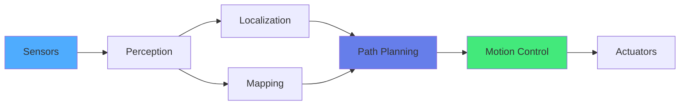
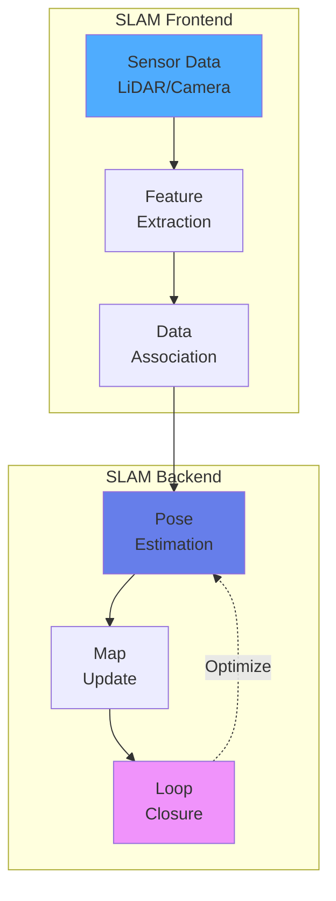
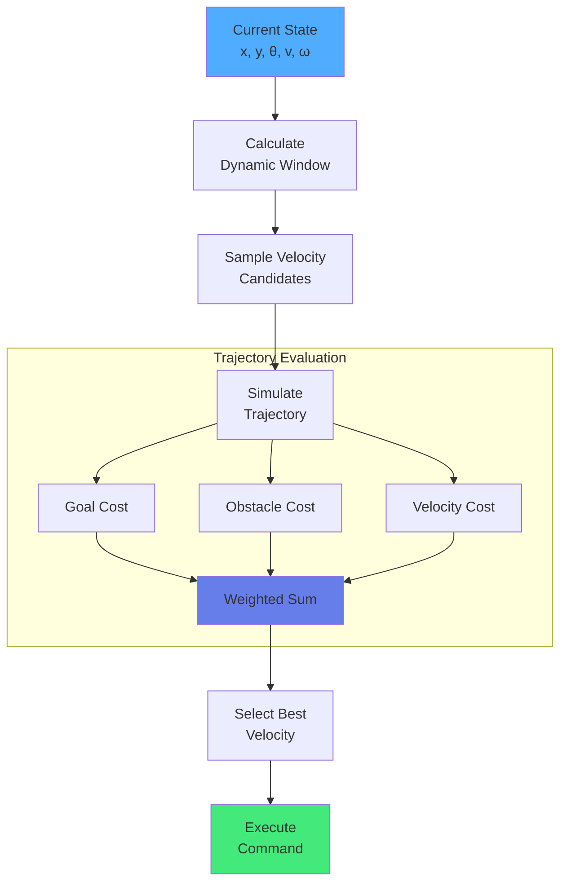

import { useEffect } from 'react';
import AOS from 'aos';
import 'aos/dist/aos.css';
import { ChapterHero, QuizComponent, ExerciseComponent, ChapterNavigation } from '@site/src/components/Chapter';

export function NavigationChapter({ children }) {
  useEffect(() => {
    AOS.init({ duration: 800, easing: 'ease-in-out', once: true, offset: 150 });
  }, []);
  return <div>{children}</div>;
}

<NavigationChapter>

<ChapterHero title="Autonomous Navigation" subtitle="Enabling Robots to Navigate Complex Environments" icon="🗺️" />

## Overview

Autonomous navigation enables robots to move intelligently from point A to B while avoiding obstacles, adapting to dynamic environments, and maintaining awareness of their location. This fundamental capability combines perception, planning, localization, and control into a unified system essential for mobile robots, self-driving cars, drones, and humanoid robots operating in real-world environments.

### Key Components

**1. Localization**: Determining the robot's position and orientation in the environment using sensor fusion from GPS, wheel odometry, IMU, visual landmarks, or SLAM techniques. Accurate localization is critical—a robot that doesn't know where it is cannot navigate safely.

**2. Mapping**: Building and maintaining environmental representations such as:
- **Occupancy grids**: Probabilistic 2D/3D grids marking occupied/free space
- **Topological maps**: Graph-based representations with nodes (landmarks) and edges (paths)
- **Semantic maps**: Object-level understanding (doors, chairs, walls)
- **Metric maps**: Precise geometric representations with coordinates

**3. Path Planning**: Finding optimal collision-free paths from start to goal using graph search or sampling-based algorithms:
- **A\***: Heuristic-guided graph search with optimality guarantees
- **Dijkstra**: Exhaustive graph search without heuristics
- **RRT (Rapidly-exploring Random Trees)**: Sampling-based for high-dimensional spaces
- **RRT\***: Asymptotically optimal variant of RRT

**4. Obstacle Avoidance**: Real-time collision avoidance responding to dynamic obstacles:
- **Dynamic Window Approach (DWA)**: Evaluates velocity commands within robot dynamics
- **Vector Field Histogram (VFH)**: Creates potential fields from sensor data
- **Artificial Potential Fields**: Attractive goal forces and repulsive obstacle forces

**5. Behavior Planning**: High-level decision making for complex scenarios like lane changes, parking, intersection navigation, and human-robot interaction in crowded spaces.



### SLAM: Simultaneous Localization and Mapping

**SLAM** solves the fundamental chicken-and-egg problem of robotics: to build a map you need to know your location, but to localize yourself you need a map. SLAM algorithms simultaneously estimate both the robot's trajectory and the environment structure from sensor observations.

**SLAM Problem Formulation:**

Given:
- Robot poses: x₁, x₂, ..., xₜ
- Landmark positions: m₁, m₂, ..., mₙ
- Sensor observations: z₁, z₂, ..., zₜ
- Control inputs: u₁, u₂, ..., uₜ

Estimate: Posterior distribution p(x₁:ₜ, m | z₁:ₜ, u₁:ₜ)



**Popular SLAM Algorithms:**

**1. EKF-SLAM (Extended Kalman Filter SLAM)**

EKF-SLAM represents both the robot's pose and the map as a joint Gaussian distribution, updating this belief using Extended Kalman Filter equations at each time step. This approach is mathematically elegant and works well for small environments with a limited number of landmarks. The main advantage is its solid theoretical foundation based on probabilistic estimation theory. However, it suffers from quadratic computational complexity O(n²) in the number of landmarks, making it impractical for large-scale environments. Additionally, the linearization of nonlinear motion and observation models can introduce errors that accumulate over time.

**2. FastSLAM (Particle Filter SLAM)**

FastSLAM takes a different approach by using a particle filter to represent the distribution over possible robot trajectories, where each particle maintains its own independent map estimate. This method can handle non-Gaussian distributions and multi-modal uncertainties that arise in real-world scenarios. With logarithmic complexity O(M log N) where M is the number of particles, FastSLAM scales better than EKF-SLAM for large environments. The trade-off is that accurate representation of the posterior distribution requires a large number of particles, which increases memory requirements and can still be computationally demanding.

**3. Graph-Based SLAM**

Graph-based SLAM formulates the SLAM problem as an optimization over a graph structure, where robot poses and landmarks are represented as nodes, and observations between them form edges (constraints). The algorithm builds this graph incrementally as the robot explores, then optimizes the entire graph structure using least squares methods to find the configuration that best satisfies all constraints. Popular implementations include Google's Cartographer and the GTSAM (Georgia Tech Smoothing and Mapping) library. This approach is highly effective for loop closure - when the robot revisits a previously mapped area, the graph optimization redistributes error across the entire trajectory, producing globally consistent maps.

**4. ORB-SLAM (Visual SLAM)**

ORB-SLAM is a feature-based visual SLAM system that uses ORB (Oriented FAST and Rotated BRIEF) features for tracking, mapping, and place recognition. It provides real-time tracking, mapping, and relocalization capabilities, making it robust to camera motion and viewpoint changes. The system includes loop closure detection using a bag-of-words approach, which allows it to recognize previously visited locations and correct drift. ORB-SLAM is particularly accurate and works with monocular, stereo, or RGB-D cameras, making it versatile for different robotic platforms. The main limitation is that it requires textured environments with sufficient visual features; it struggles in feature-poor scenes like blank walls or uniform surfaces.

**5. LiDAR-based SLAM**

LiDAR-based SLAM systems like Google's Cartographer and LOAM (LiDAR Odometry and Mapping) use laser range finders to build high-precision maps of the environment. LiDAR provides accurate distance measurements regardless of lighting conditions, making these systems work reliably in darkness, fog, or challenging illumination where cameras fail. The point cloud data from LiDAR enables precise 3D reconstruction of environments. However, LiDAR hardware is significantly more expensive than cameras, and these systems can be sensitive to dynamic objects in the environment that violate the static world assumption underlying most SLAM algorithms.

### Path Planning Algorithms

**A\* Search Algorithm:**

A\* is the gold standard for grid-based path planning, combining Dijkstra's guarantees with heuristic guidance.

**Algorithm:**
```python
import heapq
import numpy as np

class AStarPlanner:
    def __init__(self, occupancy_grid, resolution=0.1):
        """
        occupancy_grid: 2D numpy array (0=free, 1=occupied)
        resolution: meters per cell
        """
        self.grid = occupancy_grid
        self.resolution = resolution
        self.height, self.width = occupancy_grid.shape

    def heuristic(self, a, b):
        """Euclidean distance heuristic"""
        return np.sqrt((b[0] - a[0])**2 + (b[1] - a[1])**2)

    def get_neighbors(self, node):
        """8-connected grid neighbors"""
        neighbors = []
        for dx, dy in [(-1,0), (1,0), (0,-1), (0,1),
                       (-1,-1), (-1,1), (1,-1), (1,1)]:
            x, y = node[0] + dx, node[1] + dy
            if 0 <= x < self.height and 0 <= y < self.width:
                if self.grid[x, y] == 0:  # Free space
                    cost = 1.414 if abs(dx) + abs(dy) == 2 else 1.0
                    neighbors.append(((x, y), cost))
        return neighbors

    def plan(self, start, goal):
        """A* search from start to goal"""
        open_set = []
        heapq.heappush(open_set, (0, start))
        came_from = {}
        g_score = {start: 0}
        f_score = {start: self.heuristic(start, goal)}

        while open_set:
            current = heapq.heappop(open_set)[1]

            if current == goal:
                return self.reconstruct_path(came_from, current)

            for neighbor, cost in self.get_neighbors(current):
                tentative_g = g_score[current] + cost

                if neighbor not in g_score or tentative_g < g_score[neighbor]:
                    came_from[neighbor] = current
                    g_score[neighbor] = tentative_g
                    f_score[neighbor] = tentative_g + self.heuristic(neighbor, goal)
                    heapq.heappush(open_set, (f_score[neighbor], neighbor))

        return None  # No path found

    def reconstruct_path(self, came_from, current):
        path = [current]
        while current in came_from:
            current = came_from[current]
            path.append(current)
        return path[::-1]
```

**Dynamic Window Approach (DWA):**

DWA computes collision-free velocity commands by simulating trajectories within the robot's dynamic constraints.

```python
class DWAPlanner:
    def __init__(self, max_speed=1.0, max_yawrate=40.0,
                 max_accel=0.2, max_dyawrate=40.0,
                 dt=0.1, predict_time=3.0):
        self.max_speed = max_speed  # m/s
        self.max_yawrate = np.deg2rad(max_yawrate)  # rad/s
        self.max_accel = max_accel  # m/s²
        self.max_dyawrate = np.deg2rad(max_dyawrate)  # rad/s²
        self.dt = dt
        self.predict_time = predict_time
        self.v_resolution = 0.01
        self.yawrate_resolution = np.deg2rad(1.0)

    def calc_dynamic_window(self, state):
        """Calculate achievable velocity space"""
        vs = [0, self.max_speed, -self.max_yawrate, self.max_yawrate]

        # Dynamic window from current velocity
        vd = [state[3] - self.max_accel * self.dt,
              state[3] + self.max_accel * self.dt,
              state[4] - self.max_dyawrate * self.dt,
              state[4] + self.max_dyawrate * self.dt]

        # Intersection of velocity space and dynamic window
        dw = [max(vs[0], vd[0]), min(vs[1], vd[1]),
              max(vs[2], vd[2]), min(vs[3], vd[3])]
        return dw

    def predict_trajectory(self, state, v, yawrate):
        """Predict robot trajectory"""
        trajectory = np.array(state)
        x, y, theta = state[0], state[1], state[2]
        time = 0

        while time <= self.predict_time:
            x += v * np.cos(theta) * self.dt
            y += v * np.sin(theta) * self.dt
            theta += yawrate * self.dt
            trajectory = np.vstack([trajectory, [x, y, theta, v, yawrate]])
            time += self.dt

        return trajectory

    def calc_obstacle_cost(self, trajectory, obstacles):
        """Calculate cost based on distance to obstacles"""
        min_dist = float('inf')
        for point in trajectory:
            for obs in obstacles:
                dist = np.linalg.norm(point[:2] - obs[:2])
                if dist < min_dist:
                    min_dist = dist

        return 1.0 / min_dist if min_dist < 2.0 else 0.0

    def calc_to_goal_cost(self, trajectory, goal):
        """Cost based on distance to goal"""
        dx = goal[0] - trajectory[-1, 0]
        dy = goal[1] - trajectory[-1, 1]
        return np.sqrt(dx**2 + dy**2)
```



---

## Exercises

<ExerciseComponent
  exercise={{
    id: 'nav-ex1',
    title: 'Grid-Based Path Length',
    objective: 'Calculate path length in grid world',
    instructions: 'Robot moves from (0,0) to (5,5) on grid. Path: (0,0)→(1,0)→(2,0)→(2,1)→(3,1)→(4,1)→(5,1)→(5,2)→(5,3)→(5,4)→(5,5). Each cell is 0.5m. Calculate total distance.',
    expectedOutcome: 'Total distance: 5.0 meters',
    hints: ['Count horizontal and vertical moves', 'Each move = 0.5m'],
    solution: 'horizontal = 5 moves, vertical = 5 moves. Total = 10 * 0.5m = 5.0m',
    difficulty: 'easy',
    estimatedTime: 5
  }}
/>

<ExerciseComponent
  exercise={{
    id: 'nav-ex2',
    title: 'Obstacle Detection Range',
    objective: 'Calculate safe stopping distance',
    instructions: 'Robot travels at 2 m/s with reaction time 0.3s and deceleration 3 m/s². Calculate minimum obstacle detection range.',
    expectedOutcome: 'Minimum range: 1.27 meters',
    hints: ['Distance = reaction_dist + braking_dist', 'Use v²=2as for braking'],
    solution: 'reaction_dist = 2*0.3 = 0.6m; braking_dist = 4/(2*3) = 0.67m; total = 1.27m',
    difficulty: 'medium',
    estimatedTime: 10
  }}
/>

---

## Quiz

<QuizComponent
  questions={[
    { id: 'nav-q1', question: 'What problem does SLAM solve?', options: [{ label: 'A', value: 'option-a', text: 'Only mapping' }, { label: 'B', value: 'option-b', text: 'Simultaneously building a map while determining robot position' }, { label: 'C', value: 'option-c', text: 'Only localization' }, { label: 'D', value: 'option-d', text: 'Path planning' }], correctAnswer: 'option-b', explanation: 'SLAM simultaneously solves localization and mapping, enabling robots to build maps without prior knowledge of their position.' },
    { id: 'nav-q2', question: 'Which algorithm is commonly used for global path planning?', options: [{ label: 'A', value: 'option-a', text: 'PID controller' }, { label: 'B', value: 'option-b', text: 'A* search algorithm' }, { label: 'C', value: 'option-c', text: 'Kalman filter' }, { label: 'D', value: 'option-d', text: 'YOLO' }], correctAnswer: 'option-b', explanation: 'A* is a heuristic search algorithm that efficiently finds optimal paths in grid-based or graph representations.' },
    { id: 'nav-q3', question: 'What is the Dynamic Window Approach used for?', options: [{ label: 'A', value: 'option-a', text: 'Mapping' }, { label: 'B', value: 'option-b', text: 'Real-time local obstacle avoidance' }, { label: 'C', value: 'option-c', text: 'Localization' }, { label: 'D', value: 'option-d', text: 'Image processing' }], correctAnswer: 'option-b', explanation: 'DWA evaluates velocity commands within the robot\'s dynamic constraints to find safe, goal-directed motion in real-time.' },
    { id: 'nav-q4', question: 'What is an occupancy grid?', options: [{ label: 'A', value: 'option-a', text: 'A type of sensor' }, { label: 'B', value: 'option-b', text: 'A 2D/3D discretized map showing occupied and free space' }, { label: 'C', value: 'option-c', text: 'A navigation algorithm' }, { label: 'D', value: 'option-d', text: 'A robot component' }], correctAnswer: 'option-b', explanation: 'Occupancy grids divide space into cells, each storing the probability of being occupied, providing a probabilistic environmental representation.' },
    { id: 'nav-q5', question: 'Why is localization important for navigation?', options: [{ label: 'A', value: 'option-a', text: 'To save power' }, { label: 'B', value: 'option-b', text: 'To know the robot\'s position for accurate path following and obstacle avoidance' }, { label: 'C', value: 'option-c', text: 'To improve vision' }, { label: 'D', value: 'option-d', text: 'To reduce cost' }], correctAnswer: 'option-b', explanation: 'Accurate localization is essential for robots to follow planned paths, avoid obstacles, and reach target locations reliably.' }
  ]}
/>

### Sensor Fusion for Localization

Robust navigation requires fusing multiple sensors to overcome individual sensor limitations:

**Sensor Fusion Pipeline:**
- **Prediction**: Use motion model to predict next state from control inputs
- **Update**: Correct prediction using sensor measurements
- **Fusion**: Combine measurements from multiple sensors (GPS, IMU, wheel odometry, vision)

**Extended Kalman Filter (EKF) Localization:**

```python
class EKFLocalization:
    def __init__(self):
        self.x = np.zeros((4, 1))  # State: [x, y, yaw, v]
        self.P = np.eye(4)  # Covariance
        self.Q = np.diag([0.1, 0.1, np.deg2rad(1.0), 1.0])**2  # Process noise
        self.R = np.diag([1.0, 1.0])**2  # Measurement noise (GPS)

    def motion_model(self, x, u, dt):
        """Predict state from control input u = [v, yaw_rate]"""
        F = np.array([[1, 0, 0, 0],
                      [0, 1, 0, 0],
                      [0, 0, 1, 0],
                      [0, 0, 0, 0]])

        B = np.array([[dt * np.cos(x[2, 0]), 0],
                      [dt * np.sin(x[2, 0]), 0],
                      [0, dt],
                      [1, 0]])

        x = F @ x + B @ u
        return x

    def observation_model(self, x):
        """Predict measurement from state (GPS observes x, y)"""
        H = np.array([[1, 0, 0, 0],
                      [0, 1, 0, 0]])
        z = H @ x
        return z

    def predict(self, u, dt):
        """EKF prediction step"""
        # Jacobian of motion model
        yaw = self.x[2, 0]
        jF = np.array([[1, 0, -dt * u[0] * np.sin(yaw), dt * np.cos(yaw)],
                       [0, 1, dt * u[0] * np.cos(yaw), dt * np.sin(yaw)],
                       [0, 0, 1, 0],
                       [0, 0, 0, 1]])

        self.x = self.motion_model(self.x, u, dt)
        self.P = jF @ self.P @ jF.T + self.Q

    def update(self, z):
        """EKF update step with GPS measurement z = [x, y]"""
        H = np.array([[1, 0, 0, 0],
                      [0, 1, 0, 0]])

        z_pred = self.observation_model(self.x)
        y = z - z_pred  # Innovation
        S = H @ self.P @ H.T + self.R  # Innovation covariance
        K = self.P @ H.T @ np.linalg.inv(S)  # Kalman gain

        self.x = self.x + K @ y
        self.P = (np.eye(len(self.x)) - K @ H) @ self.P
```

**Occupancy Grid Mapping:**

Occupancy grids represent the environment as a probabilistic grid where each cell stores p(occupied).

```python
class OccupancyGridMapper:
    def __init__(self, width, height, resolution):
        self.resolution = resolution  # meters per cell
        self.width = width  # cells
        self.height = height
        # Log-odds representation for numerical stability
        self.grid = np.zeros((height, width))
        self.l_occ = np.log(0.7 / 0.3)  # Log-odds for occupied
        self.l_free = np.log(0.3 / 0.7)  # Log-odds for free

    def update(self, robot_pose, scan_ranges, scan_angles):
        """Update grid with laser scan"""
        x_robot, y_robot, theta = robot_pose

        for r, angle in zip(scan_ranges, scan_angles):
            if r < 0.1 or r > 10.0:  # Invalid range
                continue

            # Endpoint in world frame
            abs_angle = theta + angle
            x_end = x_robot + r * np.cos(abs_angle)
            y_end = y_robot + r * np.sin(abs_angle)

            # Ray tracing: mark cells along ray as free
            cells = self.bresenham(x_robot, y_robot, x_end, y_end)
            for cx, cy in cells[:-1]:
                if 0 <= cx < self.width and 0 <= cy < self.height:
                    self.grid[cy, cx] += self.l_free

            # Mark endpoint as occupied
            cx, cy = self.world_to_grid(x_end, y_end)
            if 0 <= cx < self.width and 0 <= cy < self.height:
                self.grid[cy, cx] += self.l_occ

    def world_to_grid(self, x, y):
        """Convert world coordinates to grid indices"""
        cx = int(x / self.resolution)
        cy = int(y / self.resolution)
        return cx, cy

    def bresenham(self, x0, y0, x1, y1):
        """Bresenham's line algorithm for ray tracing"""
        cells = []
        gx0, gy0 = self.world_to_grid(x0, y0)
        gx1, gy1 = self.world_to_grid(x1, y1)

        dx = abs(gx1 - gx0)
        dy = abs(gy1 - gy0)
        sx = 1 if gx0 < gx1 else -1
        sy = 1 if gy0 < gy1 else -1
        err = dx - dy

        while True:
            cells.append((gx0, gy0))
            if gx0 == gx1 and gy0 == gy1:
                break
            e2 = 2 * err
            if e2 > -dy:
                err -= dy
                gx0 += sx
            if e2 < dx:
                err += dx
                gy0 += sy

        return cells

    def get_probability_grid(self):
        """Convert log-odds to probability"""
        return 1.0 - 1.0 / (1.0 + np.exp(self.grid))
```

## Summary

Autonomous navigation is the cornerstone of mobile robotics, integrating localization, mapping, planning, and control into a unified system. SLAM algorithms like EKF-SLAM, FastSLAM, and ORB-SLAM enable robots to explore and map unknown environments while tracking their location. Path planning algorithms such as A\* provide optimal global paths, while reactive methods like DWA handle dynamic obstacles in real-time. Sensor fusion through Extended Kalman Filters combines multiple sensor modalities for robust localization. Occupancy grid mapping provides probabilistic environmental representations. Modern autonomous systems combine these techniques with deep learning for perception, creating robust navigation capabilities in complex, dynamic real-world environments.

<ChapterNavigation
  previousChapter={{
    url: '/docs/hri',
    title: 'Chapter 9: Human-Robot Interaction'
  }}
  nextChapter={{
    url: '/docs/simulation',
    title: 'Chapter 11: Simulation & Digital Twins'
  }}
/>

</NavigationChapter>
