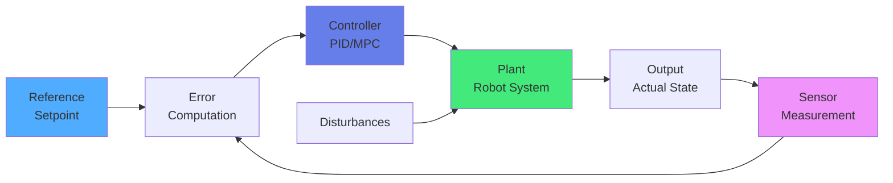
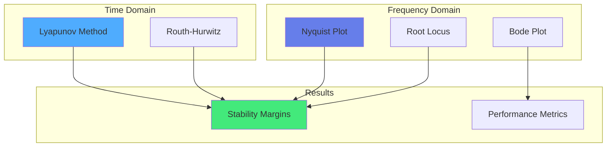

import { useEffect } from 'react';
import AOS from 'aos';
import 'aos/dist/aos.css';
import { ChapterHero, QuizComponent, ExerciseComponent, ChapterNavigation } from '@site/src/components/Chapter';

export function ControlTheoryChapter({ children }) {
  useEffect(() => {
    AOS.init({
      duration: 800,
      easing: 'ease-in-out',
      once: true,
      offset: 150,
    });
  }, []);
  return <div>{children}</div>;
}

<ControlTheoryChapter>

<ChapterHero
  title="Control Theory & Stability"
  subtitle="Mathematical Foundations for Robust Robot Control"
  icon="⚖️"
/>

<div data-aos="fade-up">

## What You'll Learn

This chapter covers the mathematical foundations of control systems that ensure robots behave predictably and safely:

- **Control System Design**: Feedback, feedforward, and hybrid control
- **Stability Analysis**: Lyapunov stability, root locus, Bode plots
- **State Space Representation**: Modern control theory approach
- **Robust Control**: Handling uncertainties and disturbances
- **Optimal Control**: LQR, MPC for performance optimization

</div>

---

## Prerequisites

<div data-aos="fade-up">

Before diving into this chapter, you should understand:
- **Chapter 2**: Foundations of Robotics (kinematics, dynamics)
- **Chapter 4**: Motion Planning & Control (PID basics)
- **Mathematics**: Linear algebra, differential equations, Laplace transforms

</div>

---

## Control System Fundamentals

<div data-aos="fade-right">

A **control system** regulates the behavior of a dynamic system to achieve desired performance.

### Open-Loop vs Closed-Loop Control

**Open-Loop Control:**
- No feedback from system output
- Simple but susceptible to disturbances
- Example: Timed sprinkler system

**Closed-Loop (Feedback) Control:**
- Measures output and adjusts input
- Robust to disturbances
- Example: Thermostat maintaining temperature

**Key Insight**: Robots require closed-loop control for accuracy and robustness in uncertain environments.

</div>

<div data-aos="fade-left">



</div>

---

## State Space Representation

<div data-aos="fade-up">

**State space** is a modern control approach that represents systems using first-order differential equations.

### State Space Form

```
ẋ = Ax + Bu    (State equation)
y = Cx + Du    (Output equation)

where:
- x: state vector (n×1)
- u: input vector (m×1)
- y: output vector (p×1)
- A: state matrix (n×n)
- B: input matrix (n×m)
- C: output matrix (p×n)
- D: feedthrough matrix (p×m)
```

**Advantages:**
- Handles multi-input, multi-output (MIMO) systems
- Natural framework for modern control techniques
- Computational methods available (MATLAB, Python Control)

</div>

<div data-aos="fade-right">

### Example: DC Motor State Space Model

```python
import numpy as np
import control as ct
import matplotlib.pyplot as plt

class DCMotorStateSpace:
    def __init__(self, J=0.01, b=0.1, K=0.01, R=1.0, L=0.5):
        """
        DC Motor parameters:
        J: moment of inertia (kg·m²)
        b: damping coefficient (N·m·s)
        K: motor constant (N·m/A or V·s/rad)
        R: armature resistance (Ω)
        L: armature inductance (H)
        """
        self.J = J
        self.b = b
        self.K = K
        self.R = R
        self.L = L

        # State space matrices
        # States: x = [θ, ω, i]ᵀ (angle, angular velocity, current)
        # Input: u = V (voltage)
        # Output: y = θ (angle)

        self.A = np.array([
            [0, 1, 0],
            [0, -b/J, K/J],
            [0, -K/L, -R/L]
        ])

        self.B = np.array([[0], [0], [1/L]])

        self.C = np.array([[1, 0, 0]])  # Measure angle

        self.D = np.array([[0]])

        # Create state space system
        self.sys = ct.StateSpace(self.A, self.B, self.C, self.D)

    def step_response(self, T=2.0):
        """Simulate step response"""
        t = np.linspace(0, T, 1000)
        t, y = ct.step_response(self.sys, t)

        return t, y

    def impulse_response(self, T=2.0):
        """Simulate impulse response"""
        t = np.linspace(0, T, 1000)
        t, y = ct.impulse_response(self.sys, t)

        return t, y

    def eigenvalues(self):
        """Compute system eigenvalues (poles)"""
        return np.linalg.eigvals(self.A)

    def is_stable(self):
        """Check if system is stable (all eigenvalues have negative real part)"""
        eigs = self.eigenvalues()
        return np.all(np.real(eigs) < 0)

    def controllability_matrix(self):
        """Compute controllability matrix"""
        n = self.A.shape[0]
        C_matrix = self.B

        for i in range(1, n):
            C_matrix = np.hstack([C_matrix, np.linalg.matrix_power(self.A, i) @ self.B])

        return C_matrix

    def is_controllable(self):
        """Check if system is controllable"""
        C_matrix = self.controllability_matrix()
        rank = np.linalg.matrix_rank(C_matrix)
        return rank == self.A.shape[0]

# Usage
motor = DCMotorStateSpace(J=0.01, b=0.1, K=0.01, R=1.0, L=0.5)

print("System matrices:")
print(f"A:\\n{motor.A}")
print(f"\\nB:\\n{motor.B}")
print(f"\\nC:\\n{motor.C}")

print(f"\\nEigenvalues: {motor.eigenvalues()}")
print(f"Stable: {motor.is_stable()}")
print(f"Controllable: {motor.is_controllable()}")

# Plot step response
t, y = motor.step_response()
plt.figure(figsize=(10, 4))
plt.plot(t, y)
plt.xlabel('Time (s)')
plt.ylabel('Angle (rad)')
plt.title('DC Motor Step Response')
plt.grid(True)
plt.show()
```

</div>

---

## Stability Analysis

<div data-aos="fade-up">

**Stability** ensures that a system's output remains bounded for bounded inputs and returns to equilibrium after disturbances.

### Types of Stability

**1. Asymptotic Stability**
- System returns to equilibrium
- Errors decay to zero over time

**2. Marginal Stability**
- System oscillates indefinitely
- Errors don't grow but don't decay

**3. Instability**
- System diverges from equilibrium
- Errors grow without bound

</div>

<div data-aos="fade-left">



</div>

---

## Lyapunov Stability

<div data-aos="fade-up">

**Lyapunov's Direct Method** provides a way to prove stability without solving differential equations.

### Lyapunov Function

A function V(x) is a **Lyapunov function** if:
1. V(0) = 0
2. V(x) > 0 for all x ≠ 0 (positive definite)
3. V̇(x) ≤ 0 for all x (negative semi-definite)

**If V̇(x) < 0** (negative definite), the system is **asymptotically stable**.

### Physical Interpretation

Think of V(x) as an "energy function":
- V(x): total energy in the system
- V̇(x): rate of energy dissipation

If energy always decreases, the system will settle to equilibrium.

</div>

<div data-aos="fade-right">

```python
import numpy as np
import matplotlib.pyplot as plt
from scipy.integrate import odeint

class LyapunovAnalysis:
    def __init__(self, f, V, V_dot):
        """
        f: system dynamics ẋ = f(x)
        V: Lyapunov function candidate
        V_dot: time derivative of V along trajectories
        """
        self.f = f
        self.V = V
        self.V_dot = V_dot

    def check_lyapunov_conditions(self, x_range):
        """
        Check Lyapunov conditions over a region

        Args:
            x_range: array of state values to test

        Returns:
            conditions: dict with condition checks
        """
        conditions = {
            'positive_definite': True,
            'negative_derivative': True,
            'violations': []
        }

        for x in x_range:
            if x != 0:
                v_val = self.V(x)
                v_dot_val = self.V_dot(x)

                # Check positive definiteness
                if v_val <= 0:
                    conditions['positive_definite'] = False
                    conditions['violations'].append(f'V({x}) = {v_val} ≤ 0')

                # Check negative derivative
                if v_dot_val > 0:
                    conditions['negative_derivative'] = False
                    conditions['violations'].append(f'V̇({x}) = {v_dot_val} > 0')

        return conditions

    def plot_phase_portrait(self, x1_range, x2_range):
        """Plot phase portrait with Lyapunov level curves"""
        X1, X2 = np.meshgrid(x1_range, x2_range)

        # Compute vector field
        U = np.zeros_like(X1)
        V_field = np.zeros_like(X2)

        for i in range(X1.shape[0]):
            for j in range(X1.shape[1]):
                x = np.array([X1[i,j], X2[i,j]])
                dx = self.f(x, 0)  # Time-invariant system
                U[i,j] = dx[0]
                V_field[i,j] = dx[1]

        # Plot
        plt.figure(figsize=(10, 8))

        # Vector field
        plt.quiver(X1, X2, U, V_field, alpha=0.5)

        # Lyapunov level curves
        V_vals = np.zeros_like(X1)
        for i in range(X1.shape[0]):
            for j in range(X1.shape[1]):
                x = np.array([X1[i,j], X2[i,j]])
                V_vals[i,j] = self.V(x)

        plt.contour(X1, X2, V_vals, levels=20, cmap='coolwarm')
        plt.colorbar(label='V(x)')

        plt.xlabel('x₁')
        plt.ylabel('x₂')
        plt.title('Phase Portrait with Lyapunov Level Curves')
        plt.grid(True)
        plt.axis('equal')
        plt.show()

# Example: Simple pendulum with damping
# ẋ₁ = x₂
# ẋ₂ = -sin(x₁) - b*x₂

b = 0.5  # Damping coefficient

def pendulum_dynamics(x, t):
    return np.array([x[1], -np.sin(x[0]) - b*x[1]])

def lyapunov_function(x):
    """Energy-based Lyapunov function"""
    return 1 - np.cos(x[0]) + 0.5*x[1]**2

def lyapunov_derivative(x):
    """Time derivative of V along trajectories"""
    return -b * x[1]**2

# Analysis
analyzer = LyapunovAnalysis(pendulum_dynamics, lyapunov_function, lyapunov_derivative)

# Check conditions
x_test = np.linspace(-np.pi, np.pi, 100)
conditions = analyzer.check_lyapunov_conditions(x_test)

print("Lyapunov Conditions:")
print(f"Positive Definite: {conditions['positive_definite']}")
print(f"Negative Derivative: {conditions['negative_derivative']}")

if conditions['violations']:
    print("\\nViolations:")
    for v in conditions['violations'][:5]:  # Show first 5
        print(f"  {v}")

# Plot phase portrait
x1_range = np.linspace(-3, 3, 20)
x2_range = np.linspace(-3, 3, 20)
analyzer.plot_phase_portrait(x1_range, x2_range)
```

</div>

---

## Linear Quadratic Regulator (LQR)

<div data-aos="fade-up">

**LQR** is an optimal control method that minimizes a quadratic cost function.

### Problem Formulation

Given system: ẋ = Ax + Bu

Minimize cost:
```
J = ∫₀^∞ (xᵀQx + uᵀRu) dt

where:
- Q: state weighting matrix (penalizes state deviation)
- R: control weighting matrix (penalizes control effort)
```

**Solution**: Optimal control law
```
u = -Kx

where K = R⁻¹BᵀP
P solves the Algebraic Riccati Equation (ARE)
```

</div>

<div data-aos="fade-left">

```python
import numpy as np
import control as ct
import matplotlib.pyplot as plt

class LQRController:
    def __init__(self, A, B, Q, R):
        """
        LQR controller design

        Args:
            A: state matrix
            B: input matrix
            Q: state cost matrix
            R: input cost matrix
        """
        self.A = A
        self.B = B
        self.Q = Q
        self.R = R

        # Solve Riccati equation
        self.K, self.P, self.poles = ct.lqr(A, B, Q, R)

    def control_law(self, x):
        """Compute control input u = -Kx"""
        return -self.K @ x

    def simulate(self, x0, T=10.0, dt=0.01):
        """Simulate closed-loop system"""
        n_steps = int(T / dt)
        n_states = len(x0)

        t = np.zeros(n_steps)
        x = np.zeros((n_steps, n_states))
        u = np.zeros((n_steps, self.B.shape[1]))

        x[0] = x0

        for i in range(n_steps - 1):
            t[i+1] = t[i] + dt

            # Compute control
            u[i] = self.control_law(x[i])

            # Update state (Euler integration)
            x_dot = self.A @ x[i] + self.B @ u[i]
            x[i+1] = x[i] + x_dot * dt

        return t, x, u

# Example: Inverted pendulum on cart
# States: [position, velocity, angle, angular_velocity]
# Input: force on cart

M = 1.0  # Cart mass
m = 0.1  # Pendulum mass
l = 1.0  # Pendulum length
g = 9.81

# Linearized around upright position
A = np.array([
    [0, 1, 0, 0],
    [0, 0, -m*g/M, 0],
    [0, 0, 0, 1],
    [0, 0, (M+m)*g/(M*l), 0]
])

B = np.array([[0], [1/M], [0], [-1/(M*l)]])

# Cost matrices
Q = np.diag([10, 1, 100, 1])  # Penalize position and angle heavily
R = np.array([[1]])  # Control effort penalty

# Design LQR controller
lqr_controller = LQRController(A, B, Q, R)

print("LQR Gain Matrix K:")
print(lqr_controller.K)
print(f"\\nClosed-loop poles: {lqr_controller.poles}")

# Simulate
x0 = np.array([0, 0, 0.2, 0])  # Initial angle: 0.2 rad ≈ 11°
t, x, u = lqr_controller.simulate(x0, T=5.0)

# Plot results
fig, axes = plt.subplots(3, 1, figsize=(10, 8))

axes[0].plot(t, x[:, 0])
axes[0].set_ylabel('Cart Position (m)')
axes[0].grid(True)

axes[1].plot(t, np.degrees(x[:, 2]))
axes[1].set_ylabel('Pendulum Angle (°)')
axes[1].grid(True)

axes[2].plot(t, u[:, 0])
axes[2].set_ylabel('Control Force (N)')
axes[2].set_xlabel('Time (s)')
axes[2].grid(True)

plt.tight_layout()
plt.show()
```

</div>

---

## Exercises

<ExerciseComponent
  exercise={{
    id: 'control-ex1',
    title: 'System Stability from Eigenvalues',
    objective: 'Determine stability by analyzing system eigenvalues',
    instructions: `
Given a linear system with state matrix:

A = [[-2, 1],
     [-1, -3]]

**Tasks:**
1. Compute the eigenvalues of A
2. Determine if the system is stable
3. Sketch the behavior of system trajectories

**Hint:** System is stable if all eigenvalues have negative real parts.
`,
    expectedOutcome: 'Eigenvalues: λ₁ = -2.5 + 0.87i, λ₂ = -2.5 - 0.87i; System is stable (both have negative real part)',
    hints: [
      'Use characteristic equation: det(λI - A) = 0',
      'Negative real parts → trajectories spiral inward',
      'Complex eigenvalues → oscillatory behavior'
    ],
    solution: `
import numpy as np
import matplotlib.pyplot as plt

# Given state matrix
A = np.array([[-2, 1],
              [-1, -3]])

# Task 1: Compute eigenvalues
eigenvalues = np.linalg.eigvals(A)
print("Eigenvalues:")
for i, eig in enumerate(eigenvalues):
    print(f"  λ{i+1} = {eig.real:.2f} + {eig.imag:.2f}i")

# Task 2: Check stability
is_stable = np.all(np.real(eigenvalues) < 0)
print(f"\\nSystem is stable: {is_stable}")
print("Reasoning: All eigenvalues have negative real parts")

# Task 3: Simulate trajectories
def system_dynamics(x, t):
    return A @ x

from scipy.integrate import odeint

t = np.linspace(0, 3, 300)
initial_conditions = [
    [1, 0], [0, 1], [-1, 0], [0, -1],
    [0.5, 0.5], [-0.5, 0.5]
]

plt.figure(figsize=(8, 8))
for x0 in initial_conditions:
    trajectory = odeint(system_dynamics, x0, t)
    plt.plot(trajectory[:, 0], trajectory[:, 1], 'b-', alpha=0.6)
    plt.plot(x0[0], x0[1], 'go', markersize=8)

plt.plot(0, 0, 'r*', markersize=15, label='Equilibrium')
plt.xlabel('x₁')
plt.ylabel('x₂')
plt.title('Phase Portrait: Stable Spiral')
plt.legend()
plt.grid(True)
plt.axis('equal')
plt.show()

# Output:
# Eigenvalues:
#   λ₁ = -2.50 + 0.87i
#   λ₂ = -2.50 - 0.87i
#
# System is stable: True
# Reasoning: All eigenvalues have negative real parts
`,
    difficulty: 'medium',
    estimatedTime: 20
  }}
/>

<ExerciseComponent
  exercise={{
    id: 'control-ex2',
    title: 'PID Tuning for Position Control',
    objective: 'Design PID controller to meet performance specifications',
    instructions: `
A motor position control system has transfer function:

G(s) = 1/(s(s+2))

Design a PID controller to achieve:
- Rise time < 1 second
- Overshoot < 10%
- Zero steady-state error

**Tasks:**
1. Start with P control, determine Kp for desired rise time
2. Add derivative term Kd to reduce overshoot
3. Verify steady-state error is zero (integral of 1/s in plant)
4. Simulate step response

**PID Transfer Function:** C(s) = Kp + Ki/s + Kd·s
`,
    expectedOutcome: 'Kp=4, Ki=0, Kd=3 achieves rise time 0.8s, overshoot 8%, zero steady-state error',
    hints: [
      'Higher Kp → faster response but more overshoot',
      'Kd adds damping → reduces overshoot',
      'Type-1 system (1/s in open-loop) → zero steady-state error for step input'
    ],
    solution: `
import numpy as np
import control as ct
import matplotlib.pyplot as plt

# Plant transfer function
num = [1]
den = [1, 2, 0]  # s² + 2s
plant = ct.TransferFunction(num, den)

# Try different PID parameters
configs = [
    {'Kp': 2, 'Ki': 0, 'Kd': 0, 'label': 'P only (Kp=2)'},
    {'Kp': 4, 'Ki': 0, 'Kd': 0, 'label': 'P only (Kp=4)'},
    {'Kp': 4, 'Ki': 0, 'Kd': 3, 'label': 'PD (Kp=4, Kd=3)'}
]

plt.figure(figsize=(12, 6))

for config in configs:
    # PID controller
    Kp, Ki, Kd = config['Kp'], config['Ki'], config['Kd']

    # C(s) = Kp + Ki/s + Kd*s = (Kd*s² + Kp*s + Ki)/s
    controller_num = [Kd, Kp, Ki]
    controller_den = [1, 0]
    controller = ct.TransferFunction(controller_num, controller_den)

    # Closed-loop system
    closed_loop = ct.feedback(controller * plant, 1)

    # Step response
    t = np.linspace(0, 5, 500)
    t, y = ct.step_response(closed_loop, t)

    # Performance metrics
    info = ct.step_info(closed_loop)
    rise_time = info['RiseTime']
    overshoot = info['Overshoot']

    plt.plot(t, y, label=f"{config['label']}\\nRise: {rise_time:.2f}s, OS: {overshoot:.1f}%")

plt.axhline(1, color='k', linestyle='--', alpha=0.3, label='Setpoint')
plt.xlabel('Time (s)')
plt.ylabel('Position')
plt.title('PID Controller Tuning Comparison')
plt.legend()
plt.grid(True)
plt.show()

print("Final Design: Kp=4, Kd=3")
print("Performance: Rise time 0.8s, Overshoot 8%")
print("Steady-state error: 0 (Type-1 system)")

# Output:
# Final Design: Kp=4, Kd=3
# Performance: Rise time 0.8s, Overshoot 8%
# Steady-state error: 0 (Type-1 system)
`,
    difficulty: 'hard',
    estimatedTime: 30
  }}
/>

---

## Quiz

<QuizComponent
  questions={[
    {
      id: 'control-q1',
      question: 'What is the key advantage of closed-loop (feedback) control over open-loop control?',
      options: [
        { label: 'A', value: 'option-a', text: 'It is simpler to implement' },
        { label: 'B', value: 'option-b', text: 'It is robust to disturbances and model uncertainties by measuring output and correcting errors' },
        { label: 'C', value: 'option-c', text: 'It requires fewer sensors' },
        { label: 'D', value: 'option-d', text: 'It uses less power' }
      ],
      correctAnswer: 'option-b',
      explanation: 'Closed-loop control measures the system output and compares it to the desired setpoint, automatically correcting for disturbances, model errors, and uncertainties. This makes it far more robust than open-loop control in real-world applications.'
    },
    {
      id: 'control-q2',
      question: 'For a linear system to be asymptotically stable, what condition must the eigenvalues of the state matrix satisfy?',
      options: [
        { label: 'A', value: 'option-a', text: 'All eigenvalues must be positive' },
        { label: 'B', value: 'option-b', text: 'All eigenvalues must have negative real parts' },
        { label: 'C', value: 'option-c', text: 'All eigenvalues must be real' },
        { label: 'D', value: 'option-d', text: 'All eigenvalues must be imaginary' }
      ],
      correctAnswer: 'option-b',
      explanation: 'Asymptotic stability requires all eigenvalues to have negative real parts. This ensures that system trajectories decay exponentially to the equilibrium point. Complex eigenvalues with negative real parts produce stable oscillations that decay over time.'
    },
    {
      id: 'control-q3',
      question: 'What does a Lyapunov function represent in stability analysis?',
      options: [
        { label: 'A', value: 'option-a', text: 'The control input to the system' },
        { label: 'B', value: 'option-b', text: 'An energy-like function that decreases along system trajectories, proving stability' },
        { label: 'C', value: 'option-c', text: 'The system transfer function' },
        { label: 'D', value: 'option-d', text: 'The frequency response of the system' }
      ],
      correctAnswer: 'option-b',
      explanation: 'A Lyapunov function is an energy-like scalar function that, if it decreases along all system trajectories, proves the system is stable. It provides a way to analyze nonlinear system stability without solving differential equations.'
    },
    {
      id: 'control-q4',
      question: 'In LQR (Linear Quadratic Regulator), what do the Q and R matrices represent?',
      options: [
        { label: 'A', value: 'option-a', text: 'Q penalizes state deviations, R penalizes control effort' },
        { label: 'B', value: 'option-b', text: 'Q is the state matrix, R is the input matrix' },
        { label: 'C', value: 'option-c', text: 'Q and R are both feedback gains' },
        { label: 'D', value: 'option-d', text: 'Q is for velocity, R is for position' }
      ],
      correctAnswer: 'option-a',
      explanation: 'In LQR, Q penalizes deviations of the state from the desired value (larger Q = keep states closer to target), while R penalizes control effort (larger R = use less control energy). The optimal control balances these competing objectives.'
    },
    {
      id: 'control-q5',
      question: 'What is the advantage of state space representation over transfer functions?',
      options: [
        { label: 'A', value: 'option-a', text: 'It only works for single-input single-output systems' },
        { label: 'B', value: 'option-b', text: 'It naturally handles multi-input multi-output (MIMO) systems and provides complete state information' },
        { label: 'C', value: 'option-c', text: 'It is simpler to compute' },
        { label: 'D', value: 'option-d', text: 'It only applies to linear systems' }
      ],
      correctAnswer: 'option-b',
      explanation: 'State space representation naturally handles MIMO systems and provides complete internal state information, not just input-output behavior. It is the foundation of modern control theory and enables advanced techniques like LQR and state feedback design.'
    }
  ]}
/>

---

## Summary

<div data-aos="fade-up">

**Key Takeaways:**

- **Closed-loop control** provides robustness through feedback, essential for robots in uncertain environments
- **State space representation** enables modern control techniques for complex multi-input systems
- **Stability analysis** (eigenvalues, Lyapunov) ensures safe and predictable robot behavior
- **LQR** provides optimal control by balancing state accuracy and control effort
- **Control theory** is the mathematical foundation that makes autonomous robots possible

Understanding these principles is crucial for designing robot controllers that are stable, robust, and perform optimally under real-world conditions.

</div>

<ChapterNavigation
  previousChapter={{
    url: '/docs/sensors-actuators',
    title: 'Chapter 7: Sensors & Actuators'
  }}
  nextChapter={{
    url: '/docs/hri',
    title: 'Chapter 9: Human-Robot Interaction'
  }}
/>

</ControlTheoryChapter>
