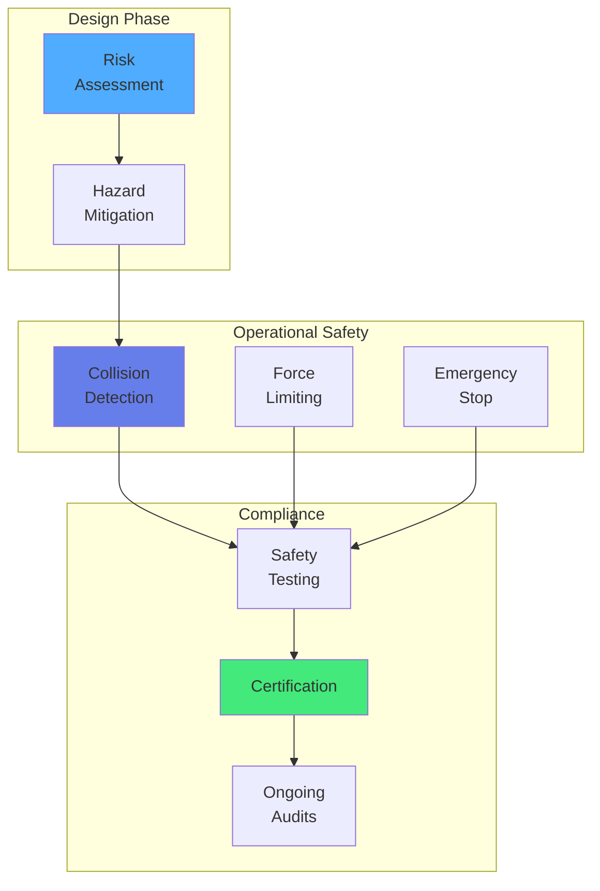

import { useEffect } from 'react';
import AOS from 'aos';
import 'aos/dist/aos.css';
import { ChapterHero, QuizComponent, ExerciseComponent, ChapterNavigation } from '@site/src/components/Chapter';

export function EthicsChapter({ children }) {
  useEffect(() => {
    AOS.init({ duration: 800, easing: 'ease-in-out', once: true, offset: 150 });
  }, []);
  return 
{children}
;
}

<EthicsChapter>

<ChapterHero title="Ethics & Safety in Physical AI" subtitle="Responsible Development of Robotic Systems" icon="⚖️" />

## Overview

As robots become more capable and autonomous, ethical and safety considerations become paramount. This chapter explores the responsibilities of robot developers and the societal implications of physical AI.

### Key Ethical Principles

**1. Safety First**: Robots must not harm humans through action or inaction (Asimov's First Law).

**2. Transparency**: Decision-making processes should be understandable and auditable.

**3. Privacy**: Robots with sensors must respect personal data and privacy.

**4. Fairness**: Robots should not discriminate based on protected characteristics.

**5. Accountability**: Clear responsibility chain when robots cause harm.

### Safety Standards

**ISO 10218**: Industrial robot safety
- Risk assessment requirements
- Protective measures
- Emergency stop systems

**ISO 15066**: Collaborative robot safety
- Power and force limiting
- Safety-rated monitored stop
- Speed and separation monitoring

**ISO 13482**: Personal care robot safety
- Covers service robots in human environments
- Addresses physical and psychological safety

### Ethical Dilemmas

**Trolley Problem for Robots**: In unavoidable accident scenarios, how should robots decide who to protect?

**Job Displacement**: Automation may eliminate jobs—how do we ensure economic fairness?

**Privacy vs Security**: Surveillance robots improve safety but threaten privacy.

**Autonomy and Control**: How much autonomy should robots have? Who is liable for autonomous robot actions?

**Bias in AI**: Robot perception and decision-making may inherit biases from training data.

### Privacy Considerations

Robots with cameras, microphones, and sensors collect vast amounts of personal data:

**Best Practices:**
- **Data minimization**: Collect only necessary data
- **Encryption**: Secure data transmission and storage
- **Consent**: Inform users about data collection
- **Anonymization**: Remove personally identifiable information
- **Right to deletion**: Allow users to delete their data

---

## Exercises

<ExerciseComponent
  exercise={{
    id: 'ethics-ex1',
    title: 'Safety Risk Assessment',
    objective: 'Identify safety hazards',
    instructions: 'List 5 potential safety hazards for a home-cleaning robot and mitigation strategies for each.',
    expectedOutcome: 'Stairs (cliff detection), Pets (obstacle avoidance), Cables (tangle detection), Children (safety stops), Privacy (local processing)',
    hints: ['Think about physical hazards', 'Consider vulnerable populations', 'Privacy concerns with cameras'],
    solution: '1. Falling down stairs → Cliff sensors. 2. Colliding with pets → Vision-based detection. 3. Cable entanglement → Cable detection sensors. 4. Child safety → Padded design, force limits. 5. Privacy → On-device processing, no cloud upload.',
    difficulty: 'medium',
    estimatedTime: 15
  }}
/>

<ExerciseComponent
  exercise={{
    id: 'ethics-ex2',
    title: 'Privacy Impact Analysis',
    objective: 'Evaluate privacy implications',
    instructions: 'A home robot has cameras and microphones. Propose 3 technical measures to protect user privacy.',
    expectedOutcome: 'Local processing, encryption, user control over recording',
    hints: ['Where is data processed?', 'How is data protected?', 'Who controls the data?'],
    solution: '1. Edge computing (process locally, no cloud). 2. End-to-end encryption for any transmitted data. 3. Physical camera shutters and record/mute buttons for user control.',
    difficulty: 'easy',
    estimatedTime: 10
  }}
/>

---

## Quiz

<QuizComponent
  questions={[
    { id: 'ethics-q1', question: 'What is the primary principle of robot safety?', options: [{ label: 'A', value: 'option-a', text: 'Robots should be fast' }, { label: 'B', value: 'option-b', text: 'Robots must not harm humans through action or inaction' }, { label: 'C', value: 'option-c', text: 'Robots should be expensive' }, { label: 'D', value: 'option-d', text: 'Robots should work alone' }], correctAnswer: 'option-b', explanation: 'The fundamental safety principle (Asimov\'s First Law) is that robots must not harm humans, either through their actions or by failing to act when harm could be prevented.' },
    { id: 'ethics-q2', question: 'What does ISO 15066 govern?', options: [{ label: 'A', value: 'option-a', text: 'Industrial automation' }, { label: 'B', value: 'option-b', text: 'Collaborative robot safety standards including force limits and human-robot contact' }, { label: 'C', value: 'option-c', text: 'Software quality' }, { label: 'D', value: 'option-d', text: 'Robot vision' }], correctAnswer: 'option-b', explanation: 'ISO 15066 specifies safety requirements for collaborative robots (cobots), including maximum permissible contact forces and safety strategies for human-robot collaboration.' },
    { id: 'ethics-q3', question: 'Why is transparency important in robot decision-making?', options: [{ label: 'A', value: 'option-a', text: 'To make robots faster' }, { label: 'B', value: 'option-b', text: 'To enable auditing, accountability, and trust in robot actions' }, { label: 'C', value: 'option-c', text: 'To reduce costs' }, { label: 'D', value: 'option-d', text: 'To improve battery life' }], correctAnswer: 'option-b', explanation: 'Transparent decision-making allows humans to understand, trust, and audit robot actions, essential for accountability when things go wrong.' },
    { id: 'ethics-q4', question: 'What is the main privacy concern with home robots?', options: [{ label: 'A', value: 'option-a', text: 'They use too much power' }, { label: 'B', value: 'option-b', text: 'Cameras and microphones constantly collect personal data in private spaces' }, { label: 'C', value: 'option-c', text: 'They are too expensive' }, { label: 'D', value: 'option-d', text: 'They move too slowly' }], correctAnswer: 'option-b', explanation: 'Home robots equipped with cameras and microphones continuously collect audio-visual data in private spaces, raising significant privacy concerns that must be addressed through technical and policy measures.' },
    { id: 'ethics-q5', question: 'Who should be liable when an autonomous robot causes injury?', options: [{ label: 'A', value: 'option-a', text: 'Only the robot owner' }, { label: 'B', value: 'option-b', text: 'It depends on context: manufacturer defects, operator negligence, or software bugs require different accountability' }, { label: 'C', value: 'option-c', text: 'Only the manufacturer' }, { label: 'D', value: 'option-d', text: 'No one, robots are tools' }], correctAnswer: 'option-b', explanation: 'Liability for robot-caused harm depends on the source: manufacturing defects (manufacturer), improper use (operator), or autonomous decision errors (complex, evolving legal framework). Clear accountability frameworks are essential.' }
  ]}
/>

## Summary

Ethics and safety are not afterthoughts but fundamental requirements for responsible robot development. Safety standards like ISO 15066 provide frameworks for human-robot collaboration. Privacy, transparency, fairness, and accountability must be designed into systems from the start. As robots become more autonomous, we must balance innovation with protection of human rights, safety, and dignity.

<ChapterNavigation
  previousChapter={{
    url: '/docs/manipulation',
    title: 'Chapter 13: Grasping & Manipulation'
  }}
  nextChapter={null}
/>

</EthicsChapter>
