import { useEffect } from 'react';
import AOS from 'aos';
import 'aos/dist/aos.css';
import { ChapterHero, QuizComponent, ExerciseComponent, ChapterNavigation } from '@site/src/components/Chapter';

export function FoundationsChapter({ children }) {
  useEffect(() => {
    AOS.init({
      duration: 800,
      easing: 'ease-in-out',
      once: true,
      offset: 150,
    });
  }, []);
  return <div>{children}</div>;
}

<FoundationsChapter>

<ChapterHero
  title="Foundations of Robotics"
  subtitle="Building Blocks of Intelligent Machines"
  icon="🤖"
/>

<div data-aos="fade-up">

## What You'll Learn

In this chapter, we'll explore the fundamental building blocks that make robots possible:

- **Robot Anatomy**: Understanding sensors, actuators, and controllers
- **Kinematics & Dynamics**: How robots move and interact with forces
- **Coordinate Systems**: Spatial reasoning and reference frames
- **Control Theory**: Feedback loops and system stability
- **Classification**: Different types of robots and their applications

</div>

---

## Prerequisites

<div data-aos="fade-up">

Before diving into this chapter, you should have completed:
- **Chapter 1**: Introduction to Physical AI (understanding of embodied intelligence and sensorimotor loops)

</div>

---

## The Evolution of Robotics

<div data-aos="fade-right">

Robotics has evolved from simple mechanical automata to sophisticated intelligent systems. The field emerged in the 1950s with the first industrial robot, **Unimate**, installed at General Motors in 1961. Since then, robotics has expanded from factory floors to homes, hospitals, and even space.

Modern robotics stands at the intersection of **mechanical engineering**, **electrical engineering**, **computer science**, and **artificial intelligence**. This multidisciplinary nature makes robotics both challenging and exciting—requiring knowledge across diverse domains.

</div>

---

## Robot Anatomy: Core Components

<div data-aos="fade-up">

Every robot, regardless of complexity, consists of three fundamental subsystems:

### 1. Sensors (Perception)

Sensors allow robots to perceive their environment. Common sensor types include:

- **Proprioceptive sensors**: Measure internal state (encoders, IMUs, joint sensors)
- **Exteroceptive sensors**: Measure external world (cameras, LIDAR, ultrasonic sensors)
- **Force/torque sensors**: Detect contact and measure interaction forces

</div>

<div data-aos="fade-left">

### 2. Actuators (Action)

Actuators convert energy into motion. Types include:

- **Electric motors**: DC motors, stepper motors, servo motors (most common in robotics)
- **Hydraulic actuators**: High force applications (construction robots, humanoids)
- **Pneumatic actuators**: Fast, lightweight motion (grippers, soft robots)
- **Smart materials**: Shape memory alloys, piezoelectric actuators

</div>

<div data-aos="fade-up">

### 3. Controllers (Brain)

Controllers process sensor data and command actuators. Modern robots use:

- **Microcontrollers**: Real-time control loops (Arduino, STM32)
- **Single-board computers**: High-level planning (Raspberry Pi, NVIDIA Jetson)
- **Distributed systems**: Multiple processors working together

</div>

---

## Robot Architecture Diagram

<div data-aos="fade-up">


*Figure: Hierarchical control architecture showing the flow from sensing to actuation*

</div>

---

## Kinematics: The Geometry of Motion

<div data-aos="fade-right">

**Kinematics** studies motion without considering forces. For robots, this involves understanding how joint angles relate to end-effector position.

### Forward Kinematics

Given joint angles θ₁, θ₂, ..., θₙ, compute the end-effector position (x, y, z) and orientation (roll, pitch, yaw).

**Example**: A 2-DOF planar robot arm
- Link 1 length: L₁
- Link 2 length: L₂
- Joint angles: θ₁, θ₂

End-effector position:
```
x = L₁·cos(θ₁) + L₂·cos(θ₁ + θ₂)
y = L₁·sin(θ₁) + L₂·sin(θ₁ + θ₂)
```

</div>

<div data-aos="fade-left">

### Inverse Kinematics

The **inverse problem**: Given desired end-effector position, find joint angles. This is typically harder and may have multiple solutions (or no solution).

For robots with more than 6 degrees of freedom (like humanoid arms), the system is **redundant**—infinite solutions exist. This redundancy allows optimization for energy efficiency, obstacle avoidance, or comfort.

</div>

---

## Kinematics Diagram

```mermaid
graph LR
    subgraph "Forward Kinematics"
        JA[Joint Angles<br/>θ₁, θ₂, ..., θₙ] --> FK[Forward<br/>Kinematics] --> EE[End-Effector<br/>Position & Orientation]
    end

    subgraph "Inverse Kinematics"
        EE2[Desired End-Effector<br/>Position & Orientation] --> IK[Inverse<br/>Kinematics] --> JA2[Joint Angles<br/>θ₁, θ₂, ..., θₙ]
    end

    style FK fill:#667eea
    style IK fill:#f093fb
```

<div data-aos="fade-up">



*Figure: Forward and inverse kinematics solve complementary problems*

</div>

---

## Control Theory Basics

<div data-aos="fade-up">

Control systems ensure robots perform desired actions accurately and reliably.

### PID Control

The most widely used control algorithm in robotics is the **PID controller**:

```
u(t) = Kp·e(t) + Ki·∫e(τ)dτ + Kd·de(t)/dt
```

Where:
- **Kp**: Proportional gain (responds to current error)
- **Ki**: Integral gain (eliminates steady-state error)
- **Kd**: Derivative gain (reduces oscillations)
- **e(t)**: Error = desired - actual

</div>

<div data-aos="fade-right">

### Example: Temperature Control

```python
class PIDController:
    def __init__(self, kp, ki, kd):
        self.kp = kp
        self.ki = ki
        self.kd = kd
        self.integral = 0
        self.prev_error = 0

    def compute(self, setpoint, measured, dt):
        error = setpoint - measured
        self.integral += error * dt
        derivative = (error - self.prev_error) / dt

        output = self.kp * error + self.ki * self.integral + self.kd * derivative
        self.prev_error = error

        return output

# Usage: Control robot joint position
controller = PIDController(kp=2.0, ki=0.5, kd=0.1)
desired_angle = 90  # degrees
current_angle = 45  # degrees
dt = 0.01  # 10ms control loop

control_signal = controller.compute(desired_angle, current_angle, dt)
# Apply control_signal to motor
```

</div>

---

## Robot Classification

<div data-aos="fade-up">

Robots can be classified by several criteria:

### By Mobility
- **Fixed-base robots**: Industrial manipulators, assembly robots
- **Mobile robots**: Wheeled, tracked, legged, aerial, underwater
- **Hybrid robots**: Mobile manipulators (robot arms on mobile bases)

### By Application
- **Industrial robots**: Manufacturing, welding, painting, assembly
- **Service robots**: Cleaning, delivery, hospitality, healthcare
- **Field robots**: Agriculture, mining, construction, space exploration
- **Social robots**: Companionship, education, entertainment

### By Morphology
- **Manipulators**: Robotic arms (typically 6-7 DOF)
- **Humanoids**: Human-like form (bipedal locomotion)
- **Quadrupeds**: Four-legged robots (Boston Dynamics Spot)
- **Soft robots**: Compliant materials, safe human interaction

</div>

---

## Coordinate Systems and Transformations

<div data-aos="fade-left">

Robots operate in multiple coordinate frames:

1. **World frame**: Fixed global reference
2. **Robot base frame**: Attached to robot's base
3. **Tool frame**: Attached to end-effector
4. **Camera frame**: Attached to sensors

**Homogeneous transformation matrices** (4×4) represent position and orientation changes between frames:

```
T = [R  t]
    [0  1]
```

Where:
- **R**: 3×3 rotation matrix
- **t**: 3×1 translation vector

</div>

---

## Exercises

<ExerciseComponent
  exercise={{
    id: 'foundations-ex1',
    title: 'Forward Kinematics Calculation',
    objective: 'Compute end-effector position for a 2-link planar robot',
    instructions: `
Given a 2-DOF planar robot arm:
- Link 1 length: L₁ = 1.0 m
- Link 2 length: L₂ = 0.8 m
- Joint 1 angle: θ₁ = 30°
- Joint 2 angle: θ₂ = 45°

Calculate the end-effector position (x, y) in the base frame.

**Formulas:**
x = L₁·cos(θ₁) + L₂·cos(θ₁ + θ₂)
y = L₁·sin(θ₁) + L₂·sin(θ₁ + θ₂)
`,
    expectedOutcome: 'You should get x ≈ 1.274 m, y ≈ 1.166 m',
    hints: [
      'Convert degrees to radians first (multiply by π/180)',
      'θ₁ + θ₂ = 30° + 45° = 75°',
      'Use a calculator or Python: math.cos(), math.sin()'
    ],
    solution: `
import math

L1 = 1.0  # meters
L2 = 0.8  # meters
theta1 = math.radians(30)  # Convert to radians
theta2 = math.radians(45)

x = L1 * math.cos(theta1) + L2 * math.cos(theta1 + theta2)
y = L1 * math.sin(theta1) + L2 * math.sin(theta1 + theta2)

print(f"End-effector position: x = {x:.3f} m, y = {y:.3f} m")
# Output: x = 1.274 m, y = 1.166 m
`,
    difficulty: 'medium',
    estimatedTime: 15
  }}
/>

<ExerciseComponent
  exercise={{
    id: 'foundations-ex2',
    title: 'PID Controller Tuning',
    objective: 'Understand the effect of PID gains on system response',
    instructions: `
Implement a simple PID controller for a simulated joint position control.

**Task:**
1. Start with Kp=1.0, Ki=0, Kd=0 (proportional only)
2. Observe oscillations or steady-state error
3. Add integral term (Ki=0.1) to eliminate steady-state error
4. Add derivative term (Kd=0.05) to reduce overshoot

**Test Case:**
- Desired position: 100°
- Initial position: 0°
- Control loop: 100 Hz (dt = 0.01s)
`,
    expectedOutcome: 'System should reach target without excessive oscillation',
    hints: [
      'Too high Kp causes oscillations',
      'Ki eliminates steady-state error but can cause instability',
      'Kd dampens oscillations (acts like friction)',
      'Start with small gains and increase gradually'
    ],
    solution: `
# Use the PIDController class from the code example above
controller = PIDController(kp=1.0, ki=0.1, kd=0.05)

position = 0  # Start at 0°
target = 100  # Want to reach 100°
dt = 0.01  # 10ms update

for i in range(500):  # 5 seconds
    control = controller.compute(target, position, dt)
    # Simplified dynamics: position changes based on control signal
    position += control * dt * 10  # Gain factor for simulation

    if i % 50 == 0:  # Print every 0.5s
        print(f"Time: {i*dt:.2f}s, Position: {position:.2f}°")
`,
    difficulty: 'hard',
    estimatedTime: 25
  }}
/>

---

## Quiz

<QuizComponent
  questions={[
    {
      id: 'foundations-q1',
      question: 'What is the primary difference between proprioceptive and exteroceptive sensors?',
      options: [
        { label: 'A', value: 'option-a', text: 'Proprioceptive sensors are more expensive' },
        { label: 'B', value: 'option-b', text: 'Proprioceptive sensors measure internal state, exteroceptive measure external environment' },
        { label: 'C', value: 'option-c', text: 'Exteroceptive sensors are only used in mobile robots' },
        { label: 'D', value: 'option-d', text: 'There is no significant difference' }
      ],
      correctAnswer: 'option-b',
      explanation: 'Proprioceptive sensors (like encoders and IMUs) measure the robot\'s own state, while exteroceptive sensors (like cameras and LIDAR) measure the external world.'
    },
    {
      id: 'foundations-q2',
      question: 'In a PID controller, what does the derivative term (Kd) primarily help with?',
      options: [
        { label: 'A', value: 'option-a', text: 'Eliminating steady-state error' },
        { label: 'B', value: 'option-b', text: 'Increasing response speed' },
        { label: 'C', value: 'option-c', text: 'Reducing oscillations and overshoot' },
        { label: 'D', value: 'option-d', text: 'Amplifying the control signal' }
      ],
      correctAnswer: 'option-c',
      explanation: 'The derivative term responds to the rate of change of error, acting like a damper to reduce oscillations and overshoot. It provides anticipatory action.'
    },
    {
      id: 'foundations-q3',
      question: 'What is forward kinematics used for?',
      options: [
        { label: 'A', value: 'option-a', text: 'Calculating required joint angles from desired end-effector position' },
        { label: 'B', value: 'option-b', text: 'Computing end-effector position from joint angles' },
        { label: 'C', value: 'option-c', text: 'Optimizing robot energy consumption' },
        { label: 'D', value: 'option-d', text: 'Planning collision-free paths' }
      ],
      correctAnswer: 'option-b',
      explanation: 'Forward kinematics takes joint angles as input and computes the resulting end-effector position and orientation. Inverse kinematics solves the reverse problem.'
    },
    {
      id: 'foundations-q4',
      question: 'Why are redundant manipulators (>6 DOF) advantageous?',
      options: [
        { label: 'A', value: 'option-a', text: 'They are cheaper to manufacture' },
        { label: 'B', value: 'option-b', text: 'They allow optimization for multiple criteria (energy, obstacles, comfort)' },
        { label: 'C', value: 'option-c', text: 'They always move faster than 6-DOF arms' },
        { label: 'D', value: 'option-d', text: 'They require simpler control algorithms' }
      ],
      correctAnswer: 'option-b',
      explanation: 'Redundant manipulators have infinite solutions for inverse kinematics, allowing optimization for secondary objectives like obstacle avoidance, energy efficiency, or human comfort while still reaching the target.'
    },
    {
      id: 'foundations-q5',
      question: 'Which type of actuator is most commonly used in modern robotic systems?',
      options: [
        { label: 'A', value: 'option-a', text: 'Hydraulic actuators' },
        { label: 'B', value: 'option-b', text: 'Pneumatic actuators' },
        { label: 'C', value: 'option-c', text: 'Electric motors (DC, stepper, servo)' },
        { label: 'D', value: 'option-d', text: 'Shape memory alloys' }
      ],
      correctAnswer: 'option-c',
      explanation: 'Electric motors are the most common actuators in robotics due to their precision, controllability, ease of use, and wide range of sizes. Hydraulic is used for high-force applications, pneumatic for speed, and smart materials for specialized uses.'
    }
  ]}
/>

---

## Summary

<div data-aos="fade-up">

**Key Takeaways:**

- **Robot anatomy** consists of sensors (perception), actuators (action), and controllers (brain)
- **Forward kinematics** maps joint angles to end-effector position; **inverse kinematics** solves the reverse
- **PID control** is the workhorse of robotics: Kp for responsiveness, Ki for accuracy, Kd for stability
- **Coordinate transformations** are essential for relating different reference frames
- **Robot classification** helps understand design trade-offs based on application needs

**Next Steps**: Now that we understand the fundamentals, we'll explore how robots perceive their environment through vision, LIDAR, and sensor fusion in Chapter 3: Perception Systems.

</div>

<ChapterNavigation
  previousChapter={{
    url: '/docs/intro',
    title: 'Chapter 1: Introduction to Physical AI'
  }}
  nextChapter={{
    url: '/docs/perception',
    title: 'Chapter 3: Perception Systems'
  }}
/>

</FoundationsChapter>
