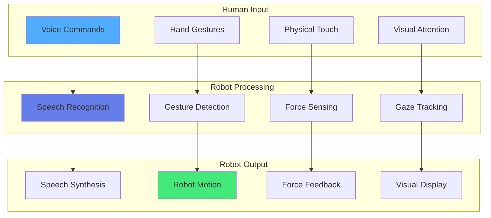
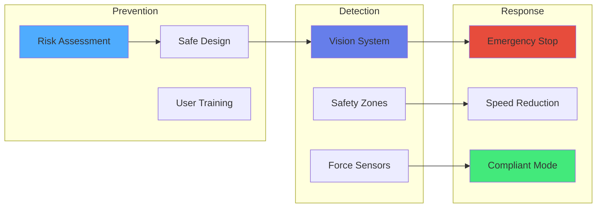

import { useEffect } from 'react';
import AOS from 'aos';
import 'aos/dist/aos.css';
import { ChapterHero, QuizComponent, ExerciseComponent, ChapterNavigation } from '@site/src/components/Chapter';

export function HRIChapter({ children }) {
  useEffect(() => {
    AOS.init({
      duration: 800,
      easing: 'ease-in-out',
      once: true,
      offset: 150,
    });
  }, []);
  return <div>{children}</div>;
}

<HRIChapter>

<ChapterHero
  title="Human-Robot Interaction"
  subtitle="Building Intuitive and Safe Human-Robot Partnerships"
  icon="🤝"
/>

<div data-aos="fade-up">

## What You'll Learn

This chapter explores how robots interact naturally and safely with humans:

- **Interaction Modalities**: Speech, gestures, touch, and multimodal communication
- **Social Robotics**: Designing robots that understand social cues and norms
- **Safety Standards**: Collision avoidance, force limiting, and fail-safe mechanisms
- **Natural Language Processing**: Voice commands and conversational AI
- **Collaborative Robots (Cobots)**: Working alongside humans in shared spaces

</div>

---

## Prerequisites

<div data-aos="fade-up">

Before diving into this chapter, you should understand:
- **Chapter 3**: Perception Systems (sensors for interaction)
- **Chapter 6**: Robot Vision (detecting and tracking humans)
- **Chapter 7**: Sensors & Actuators (force/torque sensing)

</div>

---

## HRI Interaction Modalities

<div data-aos="fade-right">

Humans and robots can communicate through multiple channels:

### 1. Natural Language
- **Speech Recognition**: Converting voice to text (ASR)
- **Intent Understanding**: NLP to extract user goals
- **Speech Synthesis**: Text-to-speech (TTS) for robot responses
- **Examples**: Alexa, Google Assistant, robot voice commands

### 2. Gestures and Body Language
- **Hand Gestures**: Pointing, waving, stop signals
- **Pose Estimation**: Understanding body posture and movement
- **Facial Expressions**: Emotion recognition for social interaction
- **Examples**: Directing robots with hand signals, collaborative assembly

### 3. Touch and Haptics
- **Physical Guidance**: Moving robot by hand (kinesthetic teaching)
- **Force Feedback**: Robot applies forces to guide human
- **Tactile Sensors**: Detecting gentle touch vs collision
- **Examples**: Collaborative manipulation, rehabilitation robots

### 4. Visual Displays
- **Screen Interfaces**: Traditional GUIs on tablets/monitors
- **AR/VR**: Augmented/virtual reality for teleoperation
- **Status Indicators**: LEDs, screens showing robot state
- **Examples**: Robot dashboards, telepresence systems

</div>

<div data-aos="fade-left">



</div>

---

## Speech-Based Interaction

<div data-aos="fade-up">

Voice is the most natural interface for humans. Modern HRI systems integrate:

**Pipeline:**
1. **Speech Recognition (ASR)**: Audio → Text
2. **Natural Language Understanding (NLU)**: Text → Intent
3. **Dialogue Management**: Maintain conversation context
4. **Natural Language Generation (NLG)**: Intent → Response text
5. **Text-to-Speech (TTS)**: Text → Audio

</div>

<div data-aos="fade-right">

```python
import speech_recognition as sr
from gtts import gTTS
import os

class VoiceInteractionSystem:
    def __init__(self):
        self.recognizer = sr.Recognizer()
        self.microphone = sr.Microphone()

    def listen(self, timeout=5):
        """Capture and transcribe speech"""
        with self.microphone as source:
            print("Listening...")
            self.recognizer.adjust_for_ambient_noise(source)
            audio = self.recognizer.listen(source, timeout=timeout)

        try:
            text = self.recognizer.recognize_google(audio)
            print(f"User said: {text}")
            return text
        except sr.UnknownValueError:
            print("Could not understand audio")
            return None
        except sr.RequestError as e:
            print(f"Error: {e}")
            return None

    def speak(self, text):
        """Convert text to speech and play"""
        tts = gTTS(text=text, lang='en')
        tts.save("response.mp3")
        os.system("mpg123 response.mp3")

    def parse_intent(self, text):
        """Extract user intent from text"""
        text_lower = text.lower()

        if "move" in text_lower or "go" in text_lower:
            return {"intent": "navigate", "text": text}
        elif "pick" in text_lower or "grab" in text_lower:
            return {"intent": "grasp", "text": text}
        elif "stop" in text_lower:
            return {"intent": "stop", "text": text}
        elif "hello" in text_lower:
            return {"intent": "greet", "text": text}
        else:
            return {"intent": "unknown", "text": text}

    def execute_command(self, intent):
        """Execute robot action based on intent"""
        if intent["intent"] == "navigate":
            self.speak("Moving forward")
        elif intent["intent"] == "grasp":
            self.speak("Attempting to grasp object")
        elif intent["intent"] == "stop":
            self.speak("Stopping")
        elif intent["intent"] == "greet":
            self.speak("Hello! How can I help you?")
        else:
            self.speak("I didn't understand that command")

# Usage
hri = VoiceInteractionSystem()
text = hri.listen()
if text:
    intent = hri.parse_intent(text)
    hri.execute_command(intent)
```

</div>

---

## Safety in Human-Robot Interaction

<div data-aos="fade-up">

Safety is paramount when robots operate near humans.

### ISO 15066: Collaborative Robot Safety

**Key Requirements:**
1. **Safety-rated monitored stop**: Robot stops when human enters workspace
2. **Hand guiding**: Human can physically move robot
3. **Speed and separation monitoring**: Robot slows as human approaches
4. **Power and force limiting**: Contact forces below injury thresholds

### Safety Strategies

**1. Collision Avoidance**
- Detect humans using vision/LIDAR
- Maintain safe distance
- Stop when human detected

**2. Compliant Control**
- Use force/torque sensors
- Implement impedance control
- Limit actuator forces

**3. Emergency Stop**
- Physical e-stop buttons
- Software emergency stops
- Safe state on power loss

</div>

<div data-aos="fade-left">



</div>

---

## Exercises

<ExerciseComponent
  exercise={{
    id: 'hri-ex1',
    title: 'Safety Zone Calculation',
    objective: 'Calculate safe approach distances',
    instructions: `
A collaborative robot operates at 0.5 m/s. Human reaction time is 0.25 seconds.

Calculate:
1. Minimum safe separation distance
2. Required deceleration to stop within this distance
3. Distance with 20% safety margin
`,
    expectedOutcome: 'Distance: 0.125m, With margin: 0.15m, Deceleration: 1.0 m/s²',
    hints: [
      'Distance = velocity × time',
      'Safety margin accounts for uncertainties'
    ],
    solution: `
velocity = 0.5  # m/s
reaction_time = 0.25  # s

# Minimum distance
min_distance = velocity * reaction_time
print(f"Minimum: {min_distance} m")

# With 20% margin
distance_margin = min_distance * 1.2
print(f"With margin: {distance_margin} m")

# Deceleration: v² = 2as
deceleration = velocity**2 / (2 * min_distance)
print(f"Deceleration: {deceleration} m/s²")
`,
    difficulty: 'easy',
    estimatedTime: 10
  }}
/>

<ExerciseComponent
  exercise={{
    id: 'hri-ex2',
    title: 'Intent Recognition',
    objective: 'Build simple intent classifier',
    instructions: `
Create intent classifier for commands:
- "move": navigation
- "grasp": picking objects
- "release": dropping
- "greet": social interaction

Test on: "Please move to the kitchen", "Grab the box"
`,
    expectedOutcome: 'Correctly classifies intents',
    hints: [
      'Use keyword matching',
      'Consider synonyms'
    ],
    solution: `
def classify_intent(text):
    text = text.lower()
    if "move" in text or "go" in text:
        return "move"
    elif "grab" in text or "pick" in text:
        return "grasp"
    elif "drop" in text or "release" in text:
        return "release"
    elif "hello" in text or "hi" in text:
        return "greet"
    return "unknown"

tests = ["Please move to the kitchen", "Grab the box"]
for t in tests:
    print(f"{t} → {classify_intent(t)}")
`,
    difficulty: 'medium',
    estimatedTime: 15
  }}
/>

---

## Quiz

<QuizComponent
  questions={[
    {
      id: 'hri-q1',
      question: 'What is the primary advantage of multimodal interaction?',
      options: [
        { label: 'A', value: 'option-a', text: 'Lower cost' },
        { label: 'B', value: 'option-b', text: 'Natural communication through multiple channels (voice, gesture, touch)' },
        { label: 'C', value: 'option-c', text: 'Less processing power' },
        { label: 'D', value: 'option-d', text: 'Faster execution' }
      ],
      correctAnswer: 'option-b',
      explanation: 'Multimodal interaction allows natural communication through multiple channels, making HRI more intuitive and robust.'
    },
    {
      id: 'hri-q2',
      question: 'What is power and force limiting in collaborative robotics?',
      options: [
        { label: 'A', value: 'option-a', text: 'Reducing battery power' },
        { label: 'B', value: 'option-b', text: 'Designing robots with inherently low forces below injury thresholds' },
        { label: 'C', value: 'option-c', text: 'Using physical barriers' },
        { label: 'D', value: 'option-d', text: 'Stopping robot completely' }
      ],
      correctAnswer: 'option-b',
      explanation: 'Power and force limiting means robots are designed to stay below injury thresholds during contact.'
    },
    {
      id: 'hri-q3',
      question: 'What does NLU (Natural Language Understanding) do?',
      options: [
        { label: 'A', value: 'option-a', text: 'Converts speech to text' },
        { label: 'B', value: 'option-b', text: 'Extracts user intent and meaning from text' },
        { label: 'C', value: 'option-c', text: 'Generates speech' },
        { label: 'D', value: 'option-d', text: 'Detects noise' }
      ],
      correctAnswer: 'option-b',
      explanation: 'NLU processes text to extract user intent, entities, and meaning for robot understanding.'
    },
    {
      id: 'hri-q4',
      question: 'Why is force sensing important for safe HRI?',
      options: [
        { label: 'A', value: 'option-a', text: 'Faster movement' },
        { label: 'B', value: 'option-b', text: 'Detects contact and enables immediate reaction to prevent injury' },
        { label: 'C', value: 'option-c', text: 'Better vision' },
        { label: 'D', value: 'option-d', text: 'Lower power use' }
      ],
      correctAnswer: 'option-b',
      explanation: 'Force sensors detect physical contact, allowing robots to stop or comply immediately to prevent injuries.'
    },
    {
      id: 'hri-q5',
      question: 'What is kinesthetic teaching?',
      options: [
        { label: 'A', value: 'option-a', text: 'Keyboard programming' },
        { label: 'B', value: 'option-b', text: 'Physically moving robot by hand to teach trajectories' },
        { label: 'C', value: 'option-c', text: 'VR simulation' },
        { label: 'D', value: 'option-d', text: 'Voice commands only' }
      ],
      correctAnswer: 'option-b',
      explanation: 'Kinesthetic teaching allows users to physically guide robots through motions, providing intuitive programming.'
    }
  ]}
/>

---

## Summary

<div data-aos="fade-up">

**Key Takeaways:**

- **Multimodal interaction** (voice, gesture, touch) makes HRI natural
- **Safety standards** ensure robots work safely alongside humans
- **Natural language** enables intuitive voice control
- **Force sensing** prevents injuries during physical interaction
- **Collaborative robots** are designed for safe human-robot collaboration

Effective HRI requires understanding human capabilities and safety requirements for trustworthy robot partners.

</div>

<ChapterNavigation
  previousChapter={{
    url: '/docs/control-theory',
    title: 'Chapter 8: Control Theory & Stability'
  }}
  nextChapter={{
    url: '/docs/autonomous-navigation',
    title: 'Chapter 10: Autonomous Navigation'
  }}
/>

</HRIChapter>
