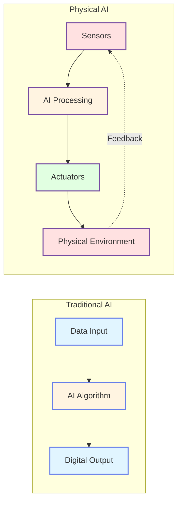
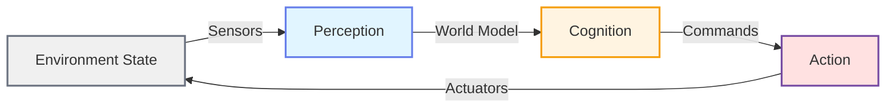
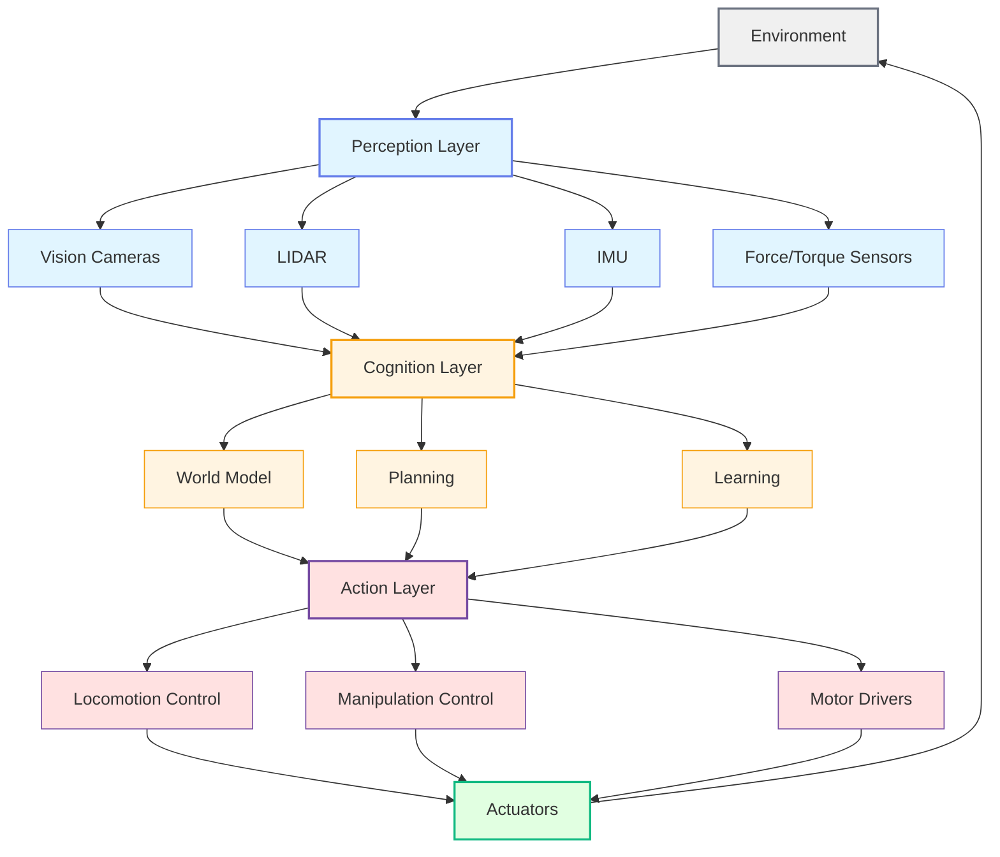

import { useEffect } from 'react';
import AOS from 'aos';
import 'aos/dist/aos.css';
import { ChapterHero, QuizComponent, ExerciseComponent, ChapterNavigation } from '@site/src/components/Chapter';
import styles from './intro.module.css';

export function IntroChapter({ children }) {
  useEffect(() => {
    AOS.init({
      duration: 800,
      easing: 'ease-in-out',
      once: true,
      offset: 150,
    });
  }, []);

  return <div className={styles.chapterContainer}>{children}</div>;
}

<IntroChapter>

<ChapterHero
  title="Introduction to Physical AI"
  subtitle="From Algorithms to Embodied Intelligence"
  icon="🤖"
/>

<div className={styles.contentWrapper}>

## Introduction

<div data-aos="fade-up">

What if AI could not just think, but also **touch**, **see**, and **move** through the world? This chapter explores **Physical AI**—artificial intelligence systems that interact with the real world through sensors and actuators. Unlike traditional AI that operates purely in digital space, Physical AI bridges the gap between computation and physical action, enabling robots to perceive their environment, make decisions, and execute tasks in the real world.

We'll explore how embodied intelligence differs from disembodied algorithms, why physical interaction creates unique challenges, and how humanoid robots represent the cutting edge of Physical AI research.

</div>

---

## What is Physical AI?

<div data-aos="fade-right">

Physical AI refers to artificial intelligence systems integrated with **physical bodies**—robots with sensors (eyes, touch, proprioception) and actuators (motors, servos) that enable interaction with the real world. While traditional AI excels at pattern recognition, language processing, and strategic games, Physical AI must handle:

- **Real-time constraints**: Decisions must happen fast enough for physical interaction
- **Uncertainty**: Real-world sensing is noisy and incomplete
- **Dynamics**: Physical laws (gravity, friction, momentum) constrain actions
- **Safety**: Mistakes can cause physical damage

**Key Concepts**:
- **Embodiment**: Intelligence shaped by physical interaction with environment
- **Sensorimotor loop**: Continuous cycle of sensing → processing → action → sensing
- **Closed-loop control**: Using feedback to correct actions in real-time
- **Sim-to-real gap**: Differences between simulated and real-world behavior

<div data-aos="fade-left" data-aos-delay="200" style={{marginTop: '2rem'}}>

**Figure 1: Traditional AI vs. Physical AI**



*Comparison diagram showing Traditional AI as a linear flow versus Physical AI as a closed feedback loop.*

</div>

</div>

---

## Embodied Intelligence

<div data-aos="fade-up">

Embodied intelligence argues that cognition is deeply tied to having a body. The way we think is influenced by our ability to manipulate objects, navigate spaces, and experience physical consequences. For robots, this means:

1. **Morphology matters**: Body design affects what tasks are possible (e.g., humanoid vs. wheeled robots)
2. **Learning through interaction**: Physical experience generates training data
3. **Affordances**: What actions are possible depends on body capabilities
4. **Sensorimotor grounding**: Concepts are linked to physical experiences (e.g., "heavy" learned through lifting)

**Traditional AI learns from datasets. Physical AI learns from doing.**

**Key Concepts**:
- **Morphological computation**: Body design solves problems (passive dynamics)
- **Developmental robotics**: Learning like children through exploration
- **Active perception**: Moving to gather better information
- **Proprioception**: Sensing one's own body position and movement

<div data-aos="zoom-in" data-aos-delay="200" style={{marginTop: '2rem'}}>

**Figure 2: Sensorimotor Loop**



*Circular flowchart showing the continuous sensorimotor loop: Environment → Sensors → Perception → Cognition → Action → Environment.*

</div>

### Code Example: Simple Sensorimotor Loop

<div data-aos="fade-up" data-aos-delay="100" style={{marginTop: '2rem'}}>

The following Python code demonstrates the fundamental sensorimotor loop in action:

</div>

<div data-aos="fade-right" data-aos-delay="200">

```python
# Conceptual example: A simple sensorimotor loop for a robot
# This demonstrates the continuous cycle of Physical AI

import time

class SimplePhysicalAI:
    def __init__(self):
        self.position = 0.0
        self.target = 10.0
        self.velocity = 0.0

    def sense(self):
        """Read sensor data (e.g., distance to target)"""
        error = self.target - self.position
        return error

    def decide(self, error):
        """Simple proportional controller: speed proportional to error"""
        kp = 0.5  # Proportional gain
        desired_velocity = kp * error
        return desired_velocity

    def act(self, velocity):
        """Execute action: update position based on velocity"""
        dt = 0.1  # Time step (100ms)
        self.position += velocity * dt
        self.velocity = velocity

    def run(self, steps=50):
        """Run the sensorimotor loop"""
        for step in range(steps):
            # 1. SENSE: Measure current state
            error = self.sense()

            # 2. DECIDE: Compute desired action
            velocity = self.decide(error)

            # 3. ACT: Execute the action
            self.act(velocity)

            # Print status
            print(f"Step {step}: pos={self.position:.2f}, "
                  f"target={self.target:.2f}, error={error:.2f}")

            # Check if reached target (within tolerance)
            if abs(error) < 0.1:
                print(f"Reached target in {step} steps!")
                break

            time.sleep(0.05)  # Simulate real-time execution

# Run the example
robot = SimplePhysicalAI()
robot.run()
```

</div>

<div data-aos="fade-left" data-aos-delay="300" style={{marginTop: '1.5rem'}}>

**How it works**:

1. **Sense**: The `sense()` method measures the distance from the target (error)
2. **Decide**: The `decide()` method uses a simple proportional controller to calculate desired velocity
3. **Act**: The `act()` method updates the robot's position based on velocity
4. **Repeat**: The loop continues until the target is reached (error < 0.1)

**Key Learning**: Real Physical AI systems have much more complex sensing (cameras, LIDAR, IMUs), decision-making (neural networks, planning algorithms), and actuation (motor control, force feedback), but the core sense-decide-act loop remains the same.

**Try it yourself**: Copy this code and run it in Python 3.8+ (no external packages required!)

</div>

</div>

---

## Humanoid Robotics Overview

<div data-aos="fade-left">

Humanoid robots are designed to resemble human form and capabilities. **Why humanoid?**

- **Human-centric environments**: Buildings, tools, and infrastructure designed for human bodies
- **Social interaction**: Humanlike appearance facilitates communication with people
- **General-purpose capability**: Arms for manipulation, legs for mobility, sensors for perception
- **Research platform**: Tests theories about human intelligence and biomechanics

**Key components of humanoid systems**:
- **Locomotion**: Bipedal walking, running, climbing
- **Manipulation**: Dexterous hands for grasping and tool use
- **Perception**: Vision, LIDAR, tactile sensing for world understanding
- **Cognition**: Planning, learning, and decision-making systems

**Key Concepts**:
- **Degrees of freedom (DOF)**: Number of independent joint movements
- **Center of mass (COM)**: Balance point critical for walking
- **Anthropomorphic design**: Mimicking human proportions and capabilities
- **Teleoperation vs. autonomy**: Human-controlled vs. self-directed behavior

<div data-aos="fade-right" data-aos-delay="200" style={{marginTop: '2rem'}}>

**Figure 3: Humanoid Robot Architecture**



*Hierarchical architecture showing three layers: Perception (sensors), Cognition (world model, planning, learning), and Action (control and actuation) with feedback to the environment.*

</div>

</div>

---

## Real-World Applications and Impact

<div data-aos="fade-up">

Physical AI is transforming industries across the globe:

### Manufacturing & Logistics
- Warehouse robots (Amazon Robotics, Boston Dynamics Stretch)
- Assembly line automation with vision-guided manipulation
- Predictive maintenance using robot inspectors

### Healthcare & Eldercare
- Surgical robots (Da Vinci system)
- Rehabilitation exoskeletons
- Companion robots for elderly care

### Search & Rescue
- Disaster response robots navigating rubble (Boston Dynamics Spot)
- Drones for aerial surveying
- Underwater inspection robots

### Domestic Assistance
- Robot vacuum cleaners (Roomba—simple but effective Physical AI)
- Future aspirations: Cooking, cleaning, and general household tasks

**Societal Impact**:
- Job displacement concerns vs. new opportunities
- Accessibility for people with disabilities
- Safety and ethical considerations

**Key Concepts**:
- **Human-in-the-loop**: Robots augmenting human capabilities
- **Task automation hierarchy**: Simple → complex task automation over time
- **Robot ethics**: Safety, privacy, accountability
- **Adoption barriers**: Cost, reliability, social acceptance

</div>

---

## Exercises

<ExerciseComponent
  exercise={{
    id: 'exercise-1',
    title: 'Identify Physical AI Systems',
    objective: 'Distinguish between traditional AI and Physical AI in real-world systems',
    instructions: `1. Make a list of 5 AI systems you interact with daily (e.g., smartphone assistant, Netflix recommendations, GPS navigation, robot vacuum, self-driving car)
2. For each system, identify:
   - Does it have sensors that perceive the physical world?
   - Does it have actuators that change the physical world?
   - Does it operate in a closed-loop (using feedback)?
3. Classify each as Traditional AI, Physical AI, or Hybrid`,
    expectedOutcome: 'Correct classification: Physical AI (robot vacuum, self-driving car), Traditional AI (Netflix recommendations, chatbots), Hybrid (GPS navigation)',
    hints: [
      'Consider whether the system only processes data or also interacts physically',
      'Feedback loops mean the system\'s actions affect its future inputs',
      'Hybrid systems may have limited physical interaction (e.g., audio output)'
    ],
    solution: `| System | Sensors? | Actuators? | Feedback? | Classification |
|--------|----------|------------|-----------|----------------|
| Robot Vacuum | ✅ (bump, cliff sensors) | ✅ (wheels, brush) | ✅ (adjusts path) | Physical AI |
| GPS Navigation | ✅ (GPS receiver) | ❌ (display only) | Partial | Hybrid |
| Netflix | ❌ (viewing data) | ❌ (suggestions) | ❌ | Traditional AI |
| Self-Driving Car | ✅ (cameras, LIDAR) | ✅ (steering, brakes) | ✅ (continuous) | Physical AI |
| Smartphone Assistant | Partial (mic) | Partial (speaker) | Partial | Hybrid |`,
    difficulty: 'easy',
    estimatedTime: 10
  }}
/>

<ExerciseComponent
  exercise={{
    id: 'exercise-2',
    title: 'Design a Simple Sensorimotor Loop',
    objective: 'Apply the sensorimotor loop concept to a practical scenario',
    instructions: `1. Scenario: "A robot must follow a black line on the floor"
2. Design the sensorimotor loop by specifying:
   - Sense: What sensor(s) does the robot need?
   - Decide: What algorithm determines action?
   - Act: What actuators execute the action?
3. Draw a flowchart showing the loop (or describe in text)
4. Identify one potential failure mode and how feedback helps correct it`,
    expectedOutcome: 'A complete design with: Sensor (color sensor/camera), Decision (if line left → turn left), Actuator (differential drive motors), Failure mode (drifts off line → sensor detects → corrective turn)',
    hints: [
      'Line-following robots typically use infrared or color sensors',
      'The decision algorithm can be as simple as "if left sensor sees black, turn left"',
      'Differential drive means controlling left and right wheels independently for steering'
    ],
    solution: `**Sensorimotor Loop Design: Line-Following Robot**

**Sense**:
- 2 color sensors (left and right) at front of robot
- Each sensor returns: black (1) or white (0)

**Decide** (algorithm):
if left_sensor == 1 and right_sensor == 0:
    action = "turn_left"
elif left_sensor == 0 and right_sensor == 1:
    action = "turn_right"
elif left_sensor == 1 and right_sensor == 1:
    action = "go_straight"
else:  # both white
    action = "search"  # slow down, oscillate to find line

**Act**:
- Left motor + Right motor (variable speed 0-100%)
- turn_left: left 50%, right 100%
- turn_right: left 100%, right 50%
- go_straight: both 100%

**Failure Mode & Correction**:
- **Failure**: Robot drifts off line on curve
- **Detection**: Both sensors read white (lost line)
- **Correction**: Enter "search" mode → oscillate left-right → resume following when line found
- **Feedback**: Continuous sensor reading enables immediate detection and correction`,
    difficulty: 'medium',
    estimatedTime: 15
  }}
/>

---

## Quiz: Test Your Understanding

<QuizComponent
  questions={[
    {
      id: 'q1',
      question: 'What is the primary difference between traditional AI and Physical AI?',
      options: [
        { label: 'A', value: 'option-a', text: 'Physical AI uses neural networks, traditional AI does not' },
        { label: 'B', value: 'option-b', text: 'Physical AI interacts with the physical world through sensors and actuators' },
        { label: 'C', value: 'option-c', text: 'Traditional AI is faster than Physical AI' },
        { label: 'D', value: 'option-d', text: 'Physical AI only works in simulations' }
      ],
      correctAnswer: 'option-b',
      explanation: 'Physical AI is defined by its embodiment—it has sensors to perceive and actuators to affect the physical world. Traditional AI operates purely in digital space (e.g., analyzing data, generating text).'
    },
    {
      id: 'q2',
      question: 'Which of the following is NOT a key challenge unique to Physical AI?',
      options: [
        { label: 'A', value: 'option-a', text: 'Real-time processing constraints' },
        { label: 'B', value: 'option-b', text: 'Handling sensor noise and uncertainty' },
        { label: 'C', value: 'option-c', text: 'Running out of memory on a server' },
        { label: 'D', value: 'option-d', text: 'Ensuring physical safety during operation' }
      ],
      correctAnswer: 'option-c',
      explanation: 'Memory limitations are a general computing challenge, not unique to Physical AI. Real-time constraints, sensor noise, and safety are specific to physical embodiment.'
    },
    {
      id: 'q3',
      question: 'What does "embodied intelligence" emphasize?',
      options: [
        { label: 'A', value: 'option-a', text: 'Intelligence can only exist in biological bodies' },
        { label: 'B', value: 'option-b', text: 'Physical interaction shapes cognition and learning' },
        { label: 'C', value: 'option-c', text: 'Robots must have humanoid form to be intelligent' },
        { label: 'D', value: 'option-d', text: 'Simulation is better than real-world testing' }
      ],
      correctAnswer: 'option-b',
      explanation: 'Embodied intelligence theory argues that having a body and interacting physically with the environment fundamentally shapes how intelligence develops and operates.'
    },
    {
      id: 'q4',
      question: 'In the sensorimotor loop, what happens immediately after "Act"?',
      options: [
        { label: 'A', value: 'option-a', text: 'The program terminates' },
        { label: 'B', value: 'option-b', text: 'The environment changes, leading to new sensor readings' },
        { label: 'C', value: 'option-c', text: 'The robot goes into sleep mode' },
        { label: 'D', value: 'option-d', text: 'The algorithm is retrained' }
      ],
      correctAnswer: 'option-b',
      explanation: 'The sensorimotor loop is continuous: Action → Environment changes → New sensor data → Perception → Decision → Action (repeat). It\'s a closed loop.'
    },
    {
      id: 'q5',
      question: 'Why are humanoid robots particularly useful for operating in human environments?',
      options: [
        { label: 'A', value: 'option-a', text: 'They are cheaper to manufacture than other robot types' },
        { label: 'B', value: 'option-b', text: 'They can use tools and navigate spaces designed for human bodies' },
        { label: 'C', value: 'option-c', text: 'They always perform better than specialized robots' },
        { label: 'D', value: 'option-d', text: 'They don\'t require AI algorithms' }
      ],
      correctAnswer: 'option-b',
      explanation: 'Human environments (buildings, stairs, doorknobs, tools) are designed for human-shaped bodies. Humanoid robots can leverage this existing infrastructure without requiring modifications.'
    }
  ]}
/>

---

## Summary

<div data-aos="fade-up">

**Key Takeaways**:

- **Physical AI** bridges digital intelligence with physical interaction through sensors and actuators
- **Embodied intelligence** emphasizes the role of physical experience in shaping cognition
- **Humanoid robots** exemplify Physical AI, designed to operate in human-centric environments
- **Real-world applications** span manufacturing, healthcare, search and rescue, and domestic assistance
- **The sensorimotor loop** (sense → decide → act → repeat) is fundamental to all Physical AI systems

**Looking Ahead**: In the next chapters, we'll dive deeper into the technical foundations—exploring robot kinematics, perception systems, motion planning, and machine learning techniques that power modern Physical AI. We'll also cover practical frameworks like ROS 2, simulation platforms like Gazebo and NVIDIA Isaac, and hands-on implementation of humanoid robot behaviors.

</div>

</div>

<ChapterNavigation
  nextChapter={{
    url: '/docs/foundations',
    title: 'Chapter 2: Foundations of Robotics'
  }}
/>

</IntroChapter>
