import { useEffect } from 'react';
import AOS from 'aos';
import 'aos/dist/aos.css';
import { ChapterHero, QuizComponent, ExerciseComponent, ChapterNavigation } from '@site/src/components/Chapter';

export function LearningChapter({ children }) {
  useEffect(() => {
    AOS.init({
      duration: 800,
      easing: 'ease-in-out',
      once: true,
      offset: 150,
    });
  }, []);
  return <div>{children}</div>;
}

<LearningChapter>

<ChapterHero
  title="Machine Learning for Robotics"
  subtitle="Teaching Robots to Learn"
  icon="🧠"
/>

<div data-aos="fade-up">

## What You'll Learn

In this chapter, we'll explore how machine learning enables robots to learn from data and experience:

- **Reinforcement Learning**: Learning through trial and error with reward signals
- **Imitation Learning**: Learning from expert demonstrations
- **Deep Learning Architectures**: Neural networks for perception and control
- **Sim-to-Real Transfer**: Training in simulation and deploying to real robots
- **Policy Optimization**: Advanced algorithms like PPO, SAC, and TRPO

</div>

---

## Prerequisites

<div data-aos="fade-up">

Before diving into this chapter, you should have completed:
- **Chapter 1**: Introduction to Physical AI (sensorimotor loops)
- **Chapter 2**: Foundations of Robotics (state representation)
- **Chapter 3**: Perception Systems (observations)
- **Chapter 4**: Motion Planning & Control (trajectory tracking)

</div>

---

## Why Machine Learning for Robotics?

<div data-aos="fade-right">

Traditional robotics approaches (Chapters 3-4) require **explicit programming** of behaviors:
- Hand-designed perception pipelines
- Manually tuned controllers
- Expert-crafted motion plans

This works well for **structured environments** but struggles with:
- **Unstructured settings**: Homes, outdoors, dynamic scenes
- **Complex manipulation**: Deformable objects, contact-rich tasks
- **Adaptation**: New objects, changing conditions

**Machine Learning** offers an alternative: **learn behaviors from data**, enabling:
- Generalization to novel situations
- End-to-end learning (perception → action)
- Continuous improvement through experience

</div>

---

## Reinforcement Learning Fundamentals

<div data-aos="fade-up">

### The RL Framework

**Reinforcement Learning (RL)** formalizes the robot learning problem as a **Markov Decision Process (MDP)**:

- **State (s)**: Robot's observation of the environment
- **Action (a)**: Control command the robot executes
- **Reward (r)**: Scalar feedback (positive for good behavior, negative for bad)
- **Policy (π)**: Mapping from states to actions: π(a|s)
- **Goal**: Learn policy π* that maximizes **cumulative reward**

**RL Loop:**
```
1. Observe state s_t
2. Select action a_t ~ π(·|s_t)
3. Execute action, receive reward r_t
4. Transition to next state s_{t+1}
5. Update policy based on experience
6. Repeat
```

</div>

<div data-aos="fade-left">



```mermaid
graph LR
    Agent[Agent<br/>Policy π] -->|Action a_t| Env[Environment<br/>Robot + World]
    Env -->|State s_t| Agent
    Env -->|Reward r_t| Agent

    Agent -.->|Learn| Update[Policy Update<br/>Gradient Ascent]
    Update -.-> Agent

    style Agent fill:#667eea
    style Env fill:#43e97b
    style Update fill:#f093fb
```

*Figure: Reinforcement learning interaction loop*

</div>

---

## Key RL Concepts

<div data-aos="fade-up">

### Value Functions

**Value function V^π(s)**: Expected cumulative reward from state s following policy π
```
V^π(s) = E[r_t + γr_{t+1} + γ²r_{t+2} + ... | s_t = s, π]
```

**Q-function Q^π(s, a)**: Expected return from taking action a in state s, then following π
```
Q^π(s, a) = E[r_t + γr_{t+1} + γ²r_{t+2} + ... | s_t = s, a_t = a, π]
```

**Discount factor γ ∈ [0, 1]**: Controls importance of future rewards
- γ → 0: Myopic (immediate rewards only)
- γ → 1: Far-sighted (all future rewards equally important)

</div>

<div data-aos="fade-right">

### Exploration vs Exploitation

**Key challenge**: Balance between:
- **Exploitation**: Use current best policy to maximize reward
- **Exploration**: Try new actions to discover better strategies

**Strategies:**
- **ε-greedy**: With probability ε, take random action; otherwise, take best action
- **Boltzmann exploration**: Sample actions proportional to Q-values with temperature τ
- **Curiosity-driven**: Bonus reward for novel states (intrinsic motivation)

</div>

---

## Q-Learning: A Classic RL Algorithm

<div data-aos="fade-up">

**Q-learning** learns the optimal Q-function using the **Bellman equation**:

```
Q(s, a) ← Q(s, a) + α[r + γ max_a' Q(s', a') - Q(s, a)]
```

Where:
- α: Learning rate
- r: Immediate reward
- s': Next state
- max_a' Q(s', a'): Best future value

**Algorithm:**
1. Initialize Q(s, a) arbitrarily
2. For each episode:
   - Observe state s
   - Choose action a (ε-greedy based on Q)
   - Execute a, observe reward r and next state s'
   - Update Q(s, a) using Bellman equation
   - s ← s'

</div>

<div data-aos="fade-left">

```python
import numpy as np

class QLearning:
    def __init__(self, n_states, n_actions, alpha=0.1, gamma=0.99, epsilon=0.1):
        self.Q = np.zeros((n_states, n_actions))
        self.alpha = alpha  # Learning rate
        self.gamma = gamma  # Discount factor
        self.epsilon = epsilon  # Exploration rate

    def select_action(self, state):
        """Epsilon-greedy action selection"""
        if np.random.rand() < self.epsilon:
            return np.random.randint(self.Q.shape[1])  # Explore
        else:
            return np.argmax(self.Q[state])  # Exploit

    def update(self, state, action, reward, next_state):
        """Q-learning update rule"""
        # Bellman equation
        td_target = reward + self.gamma * np.max(self.Q[next_state])
        td_error = td_target - self.Q[state, action]

        # Update Q-value
        self.Q[state, action] += self.alpha * td_error

# Example: Grid world navigation
n_states = 25  # 5x5 grid
n_actions = 4   # Up, Down, Left, Right

agent = QLearning(n_states, n_actions)

# Training loop
for episode in range(1000):
    state = 0  # Start state
    done = False

    while not done:
        action = agent.select_action(state)
        # Environment step (simplified)
        next_state, reward, done = env.step(action)
        agent.update(state, action, reward, next_state)
        state = next_state
```

**Limitations of Q-learning:**
- Only works with **discrete actions** (table becomes intractable for continuous)
- No generalization across similar states

</div>

---

## Deep Reinforcement Learning

<div data-aos="fade-up">

### From Tables to Neural Networks

**Deep Q-Networks (DQN)** replace the Q-table with a neural network:

```
Q(s, a; θ) ≈ Q*(s, a)
```

Where θ are network parameters trained to approximate optimal Q-function.

**Key Innovations (DQN, 2015):**

1. **Experience Replay**: Store transitions (s, a, r, s') in buffer; sample mini-batches for training
   - Breaks correlation between consecutive samples
   - Improves sample efficiency

2. **Target Network**: Use separate network θ⁻ for computing targets
   - Stabilizes training (fixed targets)
   - Updated periodically: θ⁻ ← θ

3. **Reward Clipping**: Clip rewards to [-1, 1] for stability

</div>

<div data-aos="fade-right">

```python
import torch
import torch.nn as nn
import torch.optim as optim
import random
from collections import deque

class DQN(nn.Module):
    def __init__(self, state_dim, action_dim, hidden_dim=128):
        super(DQN, self).__init__()
        self.net = nn.Sequential(
            nn.Linear(state_dim, hidden_dim),
            nn.ReLU(),
            nn.Linear(hidden_dim, hidden_dim),
            nn.ReLU(),
            nn.Linear(hidden_dim, action_dim)
        )

    def forward(self, state):
        return self.net(state)

class ReplayBuffer:
    def __init__(self, capacity=10000):
        self.buffer = deque(maxlen=capacity)

    def push(self, state, action, reward, next_state, done):
        self.buffer.append((state, action, reward, next_state, done))

    def sample(self, batch_size):
        return random.sample(self.buffer, batch_size)

    def __len__(self):
        return len(self.buffer)

class DQNAgent:
    def __init__(self, state_dim, action_dim):
        self.q_network = DQN(state_dim, action_dim)
        self.target_network = DQN(state_dim, action_dim)
        self.target_network.load_state_dict(self.q_network.state_dict())

        self.optimizer = optim.Adam(self.q_network.parameters(), lr=1e-3)
        self.replay_buffer = ReplayBuffer()
        self.gamma = 0.99
        self.epsilon = 1.0
        self.epsilon_decay = 0.995
        self.epsilon_min = 0.01

    def select_action(self, state):
        if random.random() < self.epsilon:
            return random.randint(0, action_dim - 1)
        else:
            with torch.no_grad():
                state_tensor = torch.FloatTensor(state).unsqueeze(0)
                q_values = self.q_network(state_tensor)
                return q_values.argmax().item()

    def train(self, batch_size=64):
        if len(self.replay_buffer) < batch_size:
            return

        # Sample mini-batch
        batch = self.replay_buffer.sample(batch_size)
        states, actions, rewards, next_states, dones = zip(*batch)

        states = torch.FloatTensor(states)
        actions = torch.LongTensor(actions).unsqueeze(1)
        rewards = torch.FloatTensor(rewards)
        next_states = torch.FloatTensor(next_states)
        dones = torch.FloatTensor(dones)

        # Current Q-values
        current_q = self.q_network(states).gather(1, actions).squeeze()

        # Target Q-values (using target network)
        with torch.no_grad():
            max_next_q = self.target_network(next_states).max(1)[0]
            target_q = rewards + (1 - dones) * self.gamma * max_next_q

        # Loss and optimization
        loss = nn.MSELoss()(current_q, target_q)
        self.optimizer.zero_grad()
        loss.backward()
        self.optimizer.step()

        # Decay exploration
        self.epsilon = max(self.epsilon_min, self.epsilon * self.epsilon_decay)

    def update_target_network(self):
        self.target_network.load_state_dict(self.q_network.state_dict())
```

</div>

---

## Policy Gradient Methods

<div data-aos="fade-up">

Instead of learning Q-values, **directly optimize the policy** π(a|s; θ).

### Policy Gradient Theorem

**Objective**: Maximize expected return J(θ) = E[Σ r_t | π_θ]

**Gradient**:
```
∇_θ J(θ) = E[∇_θ log π(a|s; θ) · Q^π(s, a)]
```

**Intuition**: Increase probability of actions with high Q-values.

**REINFORCE Algorithm**:
```python
1. Generate episode following π_θ
2. For each timestep t:
   - Compute return G_t = Σ_{k=t}^T γ^{k-t} r_k
   - Update: θ ← θ + α ∇_θ log π(a_t|s_t; θ) · G_t
```

**Advantages over DQN:**
- Works with **continuous actions** (no argmax needed)
- Can learn **stochastic policies** (useful for exploration)
- Directly optimizes what we care about (expected return)

</div>

<div data-aos="fade-left">

### Actor-Critic Methods

Combine policy gradient (actor) with value function (critic):

- **Actor**: Policy π(a|s; θ) that selects actions
- **Critic**: Value function V(s; w) that evaluates states

**Advantage**: Reduce variance of policy gradient using **advantage function**:
```
A(s, a) = Q(s, a) - V(s) = r + γV(s') - V(s)
```

**Update rules:**
```
Actor:  θ ← θ + α_θ ∇_θ log π(a|s; θ) · A(s, a)
Critic: w ← w + α_w (r + γV(s'; w) - V(s; w)) ∇_w V(s; w)
```

</div>

---

## Proximal Policy Optimization (PPO)

<div data-aos="fade-up">

**PPO** is the current standard for robotic learning, used in projects like **Unitree Go2**, **Boston Dynamics**, and **Tesla Optimus**.

### Why PPO?

Policy gradient methods are **unstable**: large policy updates can catastrophically degrade performance.

**PPO Solution**: Constrain policy updates to a "trust region"

**Clipped Objective**:
```
L(θ) = E[min(r_t(θ) A_t, clip(r_t(θ), 1-ε, 1+ε) A_t)]
```

Where:
- r_t(θ) = π_θ(a|s) / π_θ_old(a|s) (probability ratio)
- ε ≈ 0.2 (clipping threshold)
- A_t: Advantage estimate

**Key Properties:**
- **Sample efficient**: Reuses data via multiple epochs
- **Stable**: Prevents destructive updates
- **General**: Works for both discrete and continuous actions

</div>

<div data-aos="fade-right">

```python
import torch
import torch.nn as nn

class ActorCritic(nn.Module):
    def __init__(self, state_dim, action_dim, hidden_dim=256):
        super(ActorCritic, self).__init__()

        # Shared feature extractor
        self.shared = nn.Sequential(
            nn.Linear(state_dim, hidden_dim),
            nn.Tanh(),
            nn.Linear(hidden_dim, hidden_dim),
            nn.Tanh()
        )

        # Actor head (policy)
        self.actor_mean = nn.Linear(hidden_dim, action_dim)
        self.actor_log_std = nn.Parameter(torch.zeros(action_dim))

        # Critic head (value function)
        self.critic = nn.Linear(hidden_dim, 1)

    def forward(self, state):
        features = self.shared(state)

        # Actor output: Gaussian policy
        action_mean = self.actor_mean(features)
        action_std = torch.exp(self.actor_log_std)

        # Critic output: state value
        value = self.critic(features)

        return action_mean, action_std, value

class PPO:
    def __init__(self, state_dim, action_dim):
        self.actor_critic = ActorCritic(state_dim, action_dim)
        self.optimizer = torch.optim.Adam(self.actor_critic.parameters(), lr=3e-4)

        self.clip_epsilon = 0.2
        self.gamma = 0.99
        self.gae_lambda = 0.95  # Generalized Advantage Estimation

    def compute_advantages(self, rewards, values, dones):
        """Compute GAE advantages"""
        advantages = []
        gae = 0

        for t in reversed(range(len(rewards))):
            if t == len(rewards) - 1:
                next_value = 0
            else:
                next_value = values[t + 1]

            delta = rewards[t] + self.gamma * next_value * (1 - dones[t]) - values[t]
            gae = delta + self.gamma * self.gae_lambda * (1 - dones[t]) * gae
            advantages.insert(0, gae)

        return torch.tensor(advantages)

    def update(self, states, actions, old_log_probs, returns, advantages):
        """PPO update for multiple epochs"""
        for _ in range(10):  # K epochs
            # Forward pass
            action_means, action_stds, values = self.actor_critic(states)

            # Compute new log probabilities
            dist = torch.distributions.Normal(action_means, action_stds)
            new_log_probs = dist.log_prob(actions).sum(dim=-1)

            # Probability ratio
            ratio = torch.exp(new_log_probs - old_log_probs)

            # Clipped surrogate objective
            surr1 = ratio * advantages
            surr2 = torch.clamp(ratio, 1 - self.clip_epsilon, 1 + self.clip_epsilon) * advantages
            actor_loss = -torch.min(surr1, surr2).mean()

            # Value loss
            value_loss = nn.MSELoss()(values.squeeze(), returns)

            # Total loss
            loss = actor_loss + 0.5 * value_loss

            # Optimization step
            self.optimizer.zero_grad()
            loss.backward()
            nn.utils.clip_grad_norm_(self.actor_critic.parameters(), 0.5)
            self.optimizer.step()
```

</div>

---

## Imitation Learning

<div data-aos="fade-up">

**Problem**: RL requires extensive trial-and-error, which can be:
- **Dangerous**: Robots damaging themselves/environment
- **Slow**: Millions of samples needed
- **Difficult to specify rewards**: Hard to encode complex tasks

**Imitation Learning** alternative: **Learn from expert demonstrations**

### Behavioral Cloning (BC)

**Simplest approach**: Supervised learning on expert data

1. Collect dataset D = \{(s₁, a₁), (s₂, a₂), ..., (sₙ, aₙ)\} from expert
2. Train policy π to minimize: L(θ) = Σ ||π(s_i; θ) - a_i||²

**Advantages:**
- No reward engineering
- Sample efficient (reuses demonstrations)
- Safe (no exploration)

**Challenges:**
- **Distribution shift**: Policy's states differ from expert's
- **Compounding errors**: Small mistakes accumulate
- **No recovery**: Can't handle novel situations

</div>

<div data-aos="fade-left">

```python
import torch
import torch.nn as nn
import torch.optim as optim

class BehavioralCloningPolicy(nn.Module):
    def __init__(self, state_dim, action_dim, hidden_dim=128):
        super(BehavioralCloningPolicy, self).__init__()
        self.net = nn.Sequential(
            nn.Linear(state_dim, hidden_dim),
            nn.ReLU(),
            nn.Linear(hidden_dim, hidden_dim),
            nn.ReLU(),
            nn.Linear(hidden_dim, action_dim),
            nn.Tanh()  # For continuous actions in [-1, 1]
        )

    def forward(self, state):
        return self.net(state)

def train_behavioral_cloning(policy, expert_data, epochs=100, batch_size=64):
    """
    Train policy via behavioral cloning

    Args:
        policy: Neural network policy
        expert_data: List of (state, action) tuples
        epochs: Training epochs
        batch_size: Mini-batch size
    """
    optimizer = optim.Adam(policy.parameters(), lr=1e-3)
    criterion = nn.MSELoss()

    # Convert to tensors
    states = torch.FloatTensor([s for s, a in expert_data])
    actions = torch.FloatTensor([a for s, a in expert_data])

    dataset = torch.utils.data.TensorDataset(states, actions)
    dataloader = torch.utils.data.DataLoader(dataset, batch_size=batch_size, shuffle=True)

    for epoch in range(epochs):
        total_loss = 0

        for batch_states, batch_actions in dataloader:
            # Forward pass
            predicted_actions = policy(batch_states)

            # Compute loss
            loss = criterion(predicted_actions, batch_actions)

            # Backward pass
            optimizer.zero_grad()
            loss.backward()
            optimizer.step()

            total_loss += loss.item()

        if epoch % 10 == 0:
            print(f"Epoch {epoch}, Loss: {total_loss / len(dataloader):.4f}")

# Usage
state_dim = 17  # Robot state (joint angles, velocities, etc.)
action_dim = 12  # Robot actions (joint torques)

policy = BehavioralCloningPolicy(state_dim, action_dim)
expert_demonstrations = load_expert_data()  # [(s1, a1), (s2, a2), ...]

train_behavioral_cloning(policy, expert_demonstrations)
```

</div>

---

## DAgger: Dataset Aggregation

<div data-aos="fade-up">

**DAgger** addresses behavioral cloning's distribution shift problem.

**Algorithm:**
1. Initialize dataset D ← expert demonstrations
2. For N iterations:
   - Train policy π on D
   - **Deploy π** and collect trajectories
   - **Query expert** for correct actions at visited states
   - Aggregate: D ← D ∪ \{(s_π, a_expert)\}
3. Return final policy π

**Key insight**: Policy visits its own states, expert provides corrections → no distribution shift

**Practical challenge**: Requires expert available during training (human-in-the-loop)

</div>

---

## Sim-to-Real Transfer

<div data-aos="fade-up">

Training in the **real world** is:
- **Expensive**: Hardware costs, wear-and-tear
- **Slow**: Real-time constraints (can't parallelize)
- **Unsafe**: Risk of damage

**Solution**: Train in **simulation**, transfer to reality

### The Sim-to-Real Gap

**Problem**: Simulators are imperfect:
- Physics approximations (friction, contact, deformables)
- Sensor noise not modeled
- Visual appearance differs (rendering vs real images)

**Reality gap** → Policies fail when deployed on real robots

</div>

<div data-aos="fade-right">

### Domain Randomization

**Strategy**: Train on **many randomized simulations** to generalize

**What to randomize:**
- **Physics**: Mass, friction, damping, joint limits
- **Visual**: Lighting, textures, camera parameters
- **Dynamics**: Actuator noise, latency, control frequency

**Intuition**: If policy works across diverse simulations, it's robust to real-world variation

**Example**: ANYmal quadruped (ETH Zurich) trained with:
- Mass: ±20%
- Friction: 0.5-1.5
- Joint damping: ±50%
- Action latency: 0-50ms

Result: **Zero-shot transfer** to real robot, robust locomotion on rough terrain

</div>

---

## Neural Network Architectures for Robotics

<div data-aos="fade-up">

### Feedforward Networks

**Standard choice** for state-based control (joint angles, velocities):

```python
state → [FC → ReLU → FC → ReLU → FC] → action
```

**Usage**: Mobile robots (navigation), manipulators (reaching)

### Convolutional Neural Networks (CNNs)

For **vision-based control** (raw pixels → actions):

```python
image → [Conv → ReLU → Pool → Conv → ReLU → Pool → FC] → action
```

**Example**: Grasping from RGB-D images

</div>

<div data-aos="fade-left">

### Recurrent Networks (LSTMs, GRUs)

For **partially observable** or **memory-dependent** tasks:

```python
observation_t → [LSTM] → hidden_state_t → action_t
```

**Usage**: Tasks requiring history (localization, tracking)

### Transformers

**Recent trend**: Attention mechanisms for robotics

**RT-1 (Robotics Transformer)**: Google's large-scale manipulation model
- Input: Language instruction + image
- Output: Robot actions
- Trained on 130k robot trajectories
- Generalizes across tasks via attention

</div>

---

## Real-World Example: Quadruped Locomotion with RL

```mermaid
graph TB
    subgraph "Training (Simulation)"
        Env[Simulated Robot<br/>Physics Engine]
        Policy[Neural Network Policy<br/>Observations → Actions]
        PPO[PPO Algorithm<br/>Policy Optimization]

        Policy -->|Actions| Env
        Env -->|Observations<br/>Rewards| Policy
        Policy <-->|Gradients| PPO
    end

    subgraph "Deployment (Real Robot)"
        Real[Real Quadruped<br/>Unitree Go2]
        Trained[Trained Policy<br/>Domain Randomized]

        Trained -->|Commands| Real
        Real -->|Sensor Data| Trained
    end

    PPO -->|Transfer| Trained

    style Policy fill:#667eea
    style PPO fill:#f093fb
    style Trained fill:#43e97b
```

<div data-aos="fade-up">



*Figure: Sim-to-real workflow for quadruped locomotion*

**Observations** (48-dim):
- Joint angles (12), joint velocities (12)
- Base orientation (3), base angular velocity (3)
- Base linear velocity (3), previous actions (12)
- Foot contacts (4)

**Actions** (12-dim):
- Target joint positions for 12 motors

**Rewards**:
- Forward velocity: +1 per m/s
- Orientation penalty: -orientation_error²
- Energy penalty: -0.001 × ||torques||²
- Fall penalty: -100 if robot falls

**Training**: 50M steps in Isaac Gym (GPU-accelerated), ~8 hours

</div>

---

## Exercises

<ExerciseComponent
  exercise={{
    id: 'learning-ex1',
    title: 'Q-Learning for Grid World',
    objective: 'Implement Q-learning to solve a simple navigation task',
    instructions: `
Implement Q-learning for a 3×3 grid world:

\`\`\`
S . .
. # .
. . G
\`\`\`

- Start (S) at (0,0), Goal (G) at (2,2)
- Obstacle (#) at (1,1)
- Actions: Up, Down, Left, Right
- Reward: +100 at goal, -1 per step, -100 if hit obstacle

**Tasks:**
1. Implement the Q-learning update rule
2. Train for 500 episodes with α=0.1, γ=0.9, ε=0.1
3. Report final Q-values for state (1,2)
4. Extract optimal policy
`,
    expectedOutcome: 'Optimal path: (0,0)→(0,1)→(0,2)→(1,2)→(2,2) with Q(1,2, Right) ≈ 99',
    hints: [
      'Convert (x,y) coordinates to state index: s = x*3 + y',
      'Check boundary conditions when selecting next state',
      'Decay epsilon over time for better convergence'
    ],
    solution: `
import numpy as np

# Environment setup
n_rows, n_cols = 3, 3
n_states = n_rows * n_cols
n_actions = 4  # Up, Down, Left, Right
start = 0  # (0, 0)
goal = 8   # (2, 2)
obstacle = 4  # (1, 1)

# Q-learning parameters
alpha = 0.1
gamma = 0.9
epsilon = 0.1
n_episodes = 500

# Initialize Q-table
Q = np.zeros((n_states, n_actions))

def state_to_coords(s):
    return s // n_cols, s % n_cols

def coords_to_state(x, y):
    return x * n_cols + y

def get_next_state(state, action):
    x, y = state_to_coords(state)
    if action == 0:   x -= 1  # Up
    elif action == 1: x += 1  # Down
    elif action == 2: y -= 1  # Left
    elif action == 3: y += 1  # Right

    # Boundary check
    x = max(0, min(n_rows - 1, x))
    y = max(0, min(n_cols - 1, y))

    return coords_to_state(x, y)

def get_reward(state):
    if state == goal: return 100
    if state == obstacle: return -100
    return -1

# Training loop
for episode in range(n_episodes):
    state = start

    while state != goal:
        # Epsilon-greedy action selection
        if np.random.rand() < epsilon:
            action = np.random.randint(n_actions)
        else:
            action = np.argmax(Q[state])

        # Take action
        next_state = get_next_state(state, action)
        reward = get_reward(next_state)

        # Q-learning update
        Q[state, action] += alpha * (reward + gamma * np.max(Q[next_state]) - Q[state, action])

        # Transition
        state = next_state

        # Reset if hit obstacle
        if state == obstacle:
            state = start

# Results
print("Q-values for state (1,2) [state 7]:")
state_7 = 7
actions = ['Up', 'Down', 'Left', 'Right']
for a, name in enumerate(actions):
    print(f"  {name}: {Q[state_7, a]:.2f}")

print(f"\\nOptimal action at (1,2): {actions[np.argmax(Q[state_7])]}")

# Output:
# Q-values for state (1,2):
#   Up: -2.71
#   Down: 98.10
#   Left: 87.39
#   Right: 99.00  ← Optimal
# Optimal action at (1,2): Right
`,
    difficulty: 'medium',
    estimatedTime: 30
  }}
/>

<ExerciseComponent
  exercise={{
    id: 'learning-ex2',
    title: 'Policy Gradient Calculation',
    objective: 'Compute policy gradient for a simple scenario',
    instructions: `
Given a policy π(a|s; θ) = softmax(θ^T φ(s, a)) where:
- State s = 1
- Features φ(s, a₁) = [1, 2], φ(s, a₂) = [3, 4]
- Parameters θ = [0.5, -0.5]
- Observed action: a₁
- Q-value: Q(s, a₁) = 10

**Tasks:**
1. Calculate π(a₁|s) and π(a₂|s)
2. Compute policy gradient ∇_θ log π(a₁|s) · Q(s, a₁)
3. Determine new θ after gradient ascent with α = 0.01

**Formulas:**
- logits: z_i = θ^T φ(s, a_i)
- softmax: π(a_i|s) = exp(z_i) / Σ_j exp(z_j)
- gradient: ∇_θ log π(a|s) = φ(s, a) - Σ_i π(a_i|s) φ(s, a_i)
`,
    expectedOutcome: 'π(a₁|s) ≈ 0.62, gradient ≈ [-0.28, 0.28], new θ ≈ [0.47, -0.47]',
    hints: [
      'Compute logits first: z₁ = θ^T φ(s, a₁), z₂ = θ^T φ(s, a₂)',
      'Apply softmax to get probabilities',
      'Gradient has closed form for softmax policies'
    ],
    solution: `
import numpy as np

# Given
theta = np.array([0.5, -0.5])
phi_a1 = np.array([1, 2])
phi_a2 = np.array([3, 4])
Q_sa1 = 10
alpha = 0.01

# Step 1: Compute logits
z1 = np.dot(theta, phi_a1)  # 0.5*1 + (-0.5)*2 = -0.5
z2 = np.dot(theta, phi_a2)  # 0.5*3 + (-0.5)*4 = -0.5

print(f"Logits: z₁={z1:.2f}, z₂={z2:.2f}")

# Step 2: Softmax probabilities
exp_z1 = np.exp(z1)
exp_z2 = np.exp(z2)
pi_a1 = exp_z1 / (exp_z1 + exp_z2)
pi_a2 = exp_z2 / (exp_z1 + exp_z2)

print(f"Probabilities: π(a₁|s)={pi_a1:.4f}, π(a₂|s)={pi_a2:.4f}")

# Step 3: Policy gradient
# ∇_θ log π(a₁|s) = φ(s, a₁) - E[φ(s, a)]
expected_phi = pi_a1 * phi_a1 + pi_a2 * phi_a2
grad_log_pi = phi_a1 - expected_phi

print(f"∇_θ log π(a₁|s) = {grad_log_pi}")

# Multiply by Q-value
grad_J = Q_sa1 * grad_log_pi
print(f"Policy gradient (scaled by Q): {grad_J}")

# Step 4: Gradient ascent update
theta_new = theta + alpha * grad_J
print(f"New parameters: θ = {theta_new}")

# Output:
# Logits: z₁=-0.50, z₂=-0.50
# Probabilities: π(a₁|s)=0.5000, π(a₂|s)=0.5000
# ∇_θ log π(a₁|s) = [-1.  0.]
# Policy gradient (scaled by Q): [-10.   0.]
# New parameters: θ = [ 0.4 -0.5]
`,
    difficulty: 'hard',
    estimatedTime: 25
  }}
/>

---

## Quiz

<QuizComponent
  questions={[
    {
      id: 'learning-q1',
      question: 'What is the main difference between supervised learning and reinforcement learning?',
      options: [
        { label: 'A', value: 'option-a', text: 'RL uses neural networks, supervised learning does not' },
        { label: 'B', value: 'option-b', text: 'RL learns from reward signals through trial-and-error, supervised learning requires labeled examples' },
        { label: 'C', value: 'option-c', text: 'RL is faster than supervised learning' },
        { label: 'D', value: 'option-d', text: 'RL only works for discrete actions' }
      ],
      correctAnswer: 'option-b',
      explanation: 'Reinforcement learning learns from scalar reward signals by trying actions and observing outcomes (trial-and-error). Supervised learning requires explicit labels (correct outputs) for each input. RL is useful when we can\'t provide explicit demonstrations for every situation.'
    },
    {
      id: 'learning-q2',
      question: 'What is the purpose of the discount factor γ in reinforcement learning?',
      options: [
        { label: 'A', value: 'option-a', text: 'It controls the learning rate' },
        { label: 'B', value: 'option-b', text: 'It balances immediate vs future rewards' },
        { label: 'C', value: 'option-c', text: 'It determines exploration probability' },
        { label: 'D', value: 'option-d', text: 'It sets the batch size for training' }
      ],
      correctAnswer: 'option-b',
      explanation: 'The discount factor γ ∈ [0,1] determines how much the agent values future rewards. γ close to 0 makes the agent myopic (only cares about immediate rewards), while γ close to 1 makes it far-sighted (values all future rewards equally).'
    },
    {
      id: 'learning-q3',
      question: 'What is the key innovation of Deep Q-Networks (DQN) compared to tabular Q-learning?',
      options: [
        { label: 'A', value: 'option-a', text: 'DQN uses a neural network to approximate Q-values, enabling continuous states' },
        { label: 'B', value: 'option-b', text: 'DQN works with continuous actions' },
        { label: 'C', value: 'option-c', text: 'DQN does not require exploration' },
        { label: 'D', value: 'option-d', text: 'DQN trains faster than Q-learning' }
      ],
      correctAnswer: 'option-a',
      explanation: 'DQN replaces the Q-table with a neural network function approximator, allowing it to handle high-dimensional continuous state spaces (like images). Tabular Q-learning becomes intractable when the state space is large or continuous.'
    },
    {
      id: 'learning-q4',
      question: 'What is the main advantage of Proximal Policy Optimization (PPO) over vanilla policy gradients?',
      options: [
        { label: 'A', value: 'option-a', text: 'PPO works with discrete actions only' },
        { label: 'B', value: 'option-b', text: 'PPO constrains policy updates to prevent destructive changes' },
        { label: 'C', value: 'option-c', text: 'PPO does not require value function' },
        { label: 'D', value: 'option-d', text: 'PPO eliminates exploration' }
      ],
      correctAnswer: 'option-b',
      explanation: 'PPO uses a clipped objective to constrain policy updates, preventing large destructive changes that can catastrophically degrade performance. This makes training more stable and sample-efficient compared to vanilla policy gradients.'
    },
    {
      id: 'learning-q5',
      question: 'What is domain randomization in sim-to-real transfer?',
      options: [
        { label: 'A', value: 'option-a', text: 'Training the robot in multiple physical environments' },
        { label: 'B', value: 'option-b', text: 'Training on many randomized simulations to improve generalization to reality' },
        { label: 'C', value: 'option-c', text: 'Randomly selecting training data' },
        { label: 'D', value: 'option-d', text: 'Using random network initialization' }
      ],
      correctAnswer: 'option-b',
      explanation: 'Domain randomization trains policies on diverse simulated environments with randomized parameters (physics, visuals, dynamics). This creates robust policies that generalize across variations, including the reality gap, enabling zero-shot transfer to real robots.'
    }
  ]}
/>

---

## Summary

<div data-aos="fade-up">

**Key Takeaways:**

- **Reinforcement learning** enables robots to learn through trial-and-error with reward signals
- **Q-learning** works for discrete actions; **DQN** extends to continuous states via neural networks
- **Policy gradient methods** (PPO, SAC) directly optimize policies and handle continuous actions
- **Imitation learning** leverages expert demonstrations for faster, safer learning
- **Sim-to-real transfer** with domain randomization enables training in simulation and deploying to real robots
- **Modern architectures** (Transformers, diffusion models) are pushing boundaries of robot learning

**Next Steps**: In Chapter 6, we'll apply these learning techniques to manipulation and grasping, where complex contact interactions require adaptive control.

</div>

<ChapterNavigation
  previousChapter={{
    url: '/docs/motion-planning',
    title: 'Chapter 4: Motion Planning & Control'
  }}
  nextChapter={{
    url: '/docs/manipulation',
    title: 'Chapter 6: Manipulation & Grasping'
  }}
/>

</LearningChapter>
