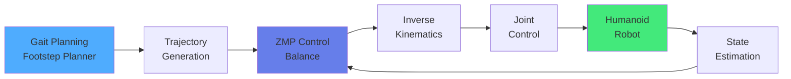
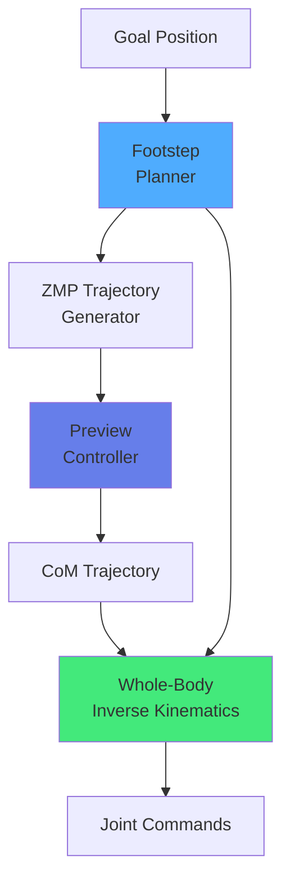

import { useEffect } from 'react';
import AOS from 'aos';
import 'aos/dist/aos.css';
import { ChapterHero, QuizComponent, ExerciseComponent, ChapterNavigation } from '@site/src/components/Chapter';

export function LocomotionChapter({ children }) {
  useEffect(() => {
    AOS.init({ duration: 800, easing: 'ease-in-out', once: true, offset: 150 });
  }, []);
  return <div>{children}</div>;
}

<LocomotionChapter>

<ChapterHero title="Humanoid Locomotion" subtitle="Walking on Two Legs" icon="🚶" />

## Overview

Bipedal locomotion represents one of the most challenging and fascinating problems in robotics. Unlike wheeled or quadrupedal robots with inherent stability, humanoid robots must constantly maintain dynamic balance while walking on two legs—a feat humans master unconsciously but robots struggle with enormously. The complexity arises from managing underactuated dynamics, coordinating many degrees of freedom, and maintaining stability on a small support base. Despite these challenges, bipedal walking offers unique advantages: navigating human environments designed for two-legged locomotion, climbing stairs, stepping over obstacles, and operating in spaces where wheeled robots cannot go.

### Challenges of Bipedal Walking

**1. Underactuation**:
- Robots cannot directly control their center of mass position in space
- Can only apply torques at joints and influence motion indirectly
- Must work within Newton's laws—cannot "pull themselves up by their bootstraps"
- Requires careful trajectory planning to achieve desired CoM motion

**2. Hybrid Dynamics**:
- Discrete foot contact events create discontinuous dynamics
- Switching between single support, double support, and flight phases
- Impact forces during foot strikes add complexity
- Different control strategies needed for each phase

**3. High-Dimensional State Space**:
- Typical humanoids have 20-40+ degrees of freedom
- Coordinating all joints while maintaining balance is computationally expensive
- Curse of dimensionality for planning and learning algorithms
- Real-time control at 100-1000 Hz required

**4. Stability on Small Support Base**:
- Support polygon (footprint) is small relative to body mass
- Center of pressure must stay within support polygon
- High center of mass makes humanoids inherently unstable (inverted pendulum)
- Must constantly regulate balance like humans do

### Key Concepts

**Zero Moment Point (ZMP)**:

The ZMP is the point on the ground where the net moment of all ground reaction forces is zero. It's a critical stability criterion for bipedal walking.

**Mathematical Definition**:
```
ZMP_x = (Σ f_i × r_i,x - Σ τ_i,y) / Σ f_i,z
ZMP_y = (Σ f_i × r_i,y + Σ τ_i,x) / Σ f_i,z
```

Where:
- f_i: Forces at contact point i
- r_i: Position of contact point i
- τ_i: Torques at contact point i

**Stability Criterion**: For stable walking without tipping, ZMP must remain inside the support polygon (convex hull of all ground contact points).

**Support Polygon**: The area on the ground that encompasses all contact points:
- **Double support**: Union of both foot polygons
- **Single support**: Area of one foot
- Robot tips over when ZMP reaches polygon boundary

**Gait Phases**:

**1. Double Support Phase** (10-30% of gait cycle):
- Both feet on ground simultaneously
- Most stable phase
- Weight transfer from rear foot to front foot
- ZMP moves from rear foot to front foot

**2. Single Support Phase** (70-90% of gait cycle):
- One foot (stance leg) supports entire body weight
- Other foot (swing leg) moves forward through the air
- Least stable phase—small support polygon
- ZMP must stay within stance foot area

**3. Flight Phase** (only in running):
- Both feet off ground
- No ZMP defined (no ground contact)
- Ballistic motion until next touchdown

**Center of Mass (CoM) Dynamics**:

The inverted pendulum model approximates bipedal walking:

```
Linear Inverted Pendulum Model (LIPM):
ẍ = ω² (x - p)

where:
  x = horizontal CoM position
  p = ZMP position
  ω = √(g/h), g = gravity, h = CoM height
```

This simple model captures the essential dynamics: CoM accelerates away from ZMP position.



### Gait Generation Approaches

**1. Model-Based (Traditional ZMP Methods)**:

Model-based approaches use the LIPM and ZMP criterion to plan stable walking trajectories.

**ZMP Preview Control**:

```python
import numpy as np
import scipy.linalg

class ZMPPreviewController:
    def __init__(self, dt=0.01, preview_steps=150):
        """
        ZMP preview controller using LIPM
        dt: timestep (s)
        preview_steps: number of future ZMP references to consider
        """
        self.dt = dt
        self.N = preview_steps

        # LIPM parameters
        self.h = 0.8  # CoM height (m)
        self.g = 9.81  # gravity
        self.omega = np.sqrt(self.g / self.h)

        # State space model: ẋ = Ax + Bu, y = Cx
        # State: [com_x, com_vel_x, com_acc_x]
        A = np.array([[1, self.dt, self.dt**2/2],
                      [0, 1, self.dt],
                      [0, 0, 1]])
        B = np.array([[self.dt**3/6], [self.dt**2/2], [self.dt]])
        C = np.array([[1, 0, -self.h/self.g]])  # ZMP = x - h/g * ẍ

        # Compute preview control gain (LQR with preview)
        Q = np.eye(1) * 1.0  # Output cost
        R = np.eye(1) * 1e-6  # Control cost

        self.K, self.f = self.compute_preview_gains(A, B, C, Q, R)

    def compute_preview_gains(self, A, B, C, Q, R):
        """Compute preview controller gains"""
        # This is a simplified version
        # Full implementation requires solving Riccati equation
        # and computing preview gains for N future steps

        # State feedback gain (LQR)
        P = scipy.linalg.solve_continuous_are(A, B, C.T @ Q @ C, R)
        K = np.linalg.inv(R) @ B.T @ P

        # Preview gain (simplified)
        f = np.zeros(self.N)
        for i in range(self.N):
            f[i] = 1.0 / (1 + i)  # Decay with preview distance

        return K, f

    def compute_control(self, state, zmp_ref_future):
        """
        Compute jerk control to track ZMP reference
        state: [com_x, com_vel, com_acc]
        zmp_ref_future: array of future ZMP references (length N)
        """
        # State feedback
        u_fb = -self.K @ state.reshape(-1, 1)

        # Preview feedforward
        u_ff = 0
        for i in range(min(len(zmp_ref_future), self.N)):
            u_ff += self.f[i] * zmp_ref_future[i]

        jerk = u_fb[0, 0] + u_ff
        return jerk
```

**Footstep Planning**:

```python
class FootstepPlanner:
    def __init__(self, step_length=0.2, step_width=0.15):
        self.step_length = step_length  # m
        self.step_width = step_width  # m

    def plan_footsteps(self, start_pose, goal_pose, num_steps):
        """
        Plan sequence of footstep positions
        Returns: [(x, y, theta), ...] for each foot
        """
        footsteps = []

        current_pos = np.array(start_pose[:2])
        current_theta = start_pose[2]
        goal_pos = np.array(goal_pose[:2])

        # Alternate left and right feet
        for i in range(num_steps):
            # Calculate next step toward goal
            to_goal = goal_pos - current_pos
            distance = np.linalg.norm(to_goal)

            if distance < self.step_length:
                # Last step
                next_pos = goal_pos
            else:
                # Step toward goal
                direction = to_goal / distance
                next_pos = current_pos + direction * self.step_length

            # Alternate left/right
            lateral_offset = self.step_width / 2
            if i % 2 == 0:  # Left foot
                next_pos += np.array([-lateral_offset * np.sin(current_theta),
                                     lateral_offset * np.cos(current_theta)])
            else:  # Right foot
                next_pos += np.array([lateral_offset * np.sin(current_theta),
                                     -lateral_offset * np.cos(current_theta)])

            footsteps.append((next_pos[0], next_pos[1], current_theta))
            current_pos = next_pos

        return footsteps
```

**Whole-Body Inverse Kinematics**:

After planning CoM and footstep trajectories, IK computes joint angles:

```python
class WholeBodyIK:
    def __init__(self, robot_model):
        self.robot = robot_model

    def solve(self, com_pos, left_foot_pose, right_foot_pose):
        """
        Solve for joint angles satisfying:
        - CoM at desired position
        - Left foot at desired pose
        - Right foot at desired pose
        """
        # This typically uses optimization:
        # min ||q - q_prev||²
        # s.t. CoM(q) = com_pos
        #      FK_left(q) = left_foot_pose
        #      FK_right(q) = right_foot_pose
        #      q_min <= q <= q_max

        # Implemented using QP solver or nonlinear optimizer
        pass
```



**Examples**: Honda ASIMO, KAIST HUBO, HRP-series robots

**2. Learning-Based (Modern Approaches)**:

Modern methods use deep reinforcement learning to discover gaits end-to-end without explicit ZMP planning.

**Advantages**:
- No need for accurate models
- Can discover more efficient gaits
- Handles complex terrains naturally
- More robust to disturbances

**Disadvantages**:
- Requires massive simulation time
- Less interpretable than model-based
- Sim-to-real gap challenges

**Training Pipeline**:
1. Define reward function (forward velocity, upright posture, energy efficiency)
2. Train in simulation with domain randomization
3. Transfer to real robot with optional fine-tuning

**Popular Algorithms**:
- **PPO (Proximal Policy Optimization)**: Stable, widely used
- **SAC (Soft Actor-Critic)**: Sample efficient
- **ARS (Augmented Random Search)**: Simple, effective

**Examples**: Unitree H1 (5 m/s walking), Boston Dynamics Atlas (backflips), Tesla Optimus, Agility Digit

---

## Exercises

<ExerciseComponent
  exercise={{
    id: 'loco-ex1',
    title: 'ZMP Calculation',
    objective: 'Calculate Zero Moment Point location',
    instructions: 'Robot has foot length 20cm. Center of mass at x=8cm from heel. For stable standing, what is the valid ZMP range?',
    expectedOutcome: 'ZMP must be within 0-20cm from heel',
    hints: ['ZMP must stay within support polygon', 'Support polygon = foot contact area'],
    solution: 'ZMP range = [0cm, 20cm] from heel. If ZMP moves outside this range, robot will tip over.',
    difficulty: 'easy',
    estimatedTime: 5
  }}
/>

<ExerciseComponent
  exercise={{
    id: 'loco-ex2',
    title: 'Step Frequency Calculation',
    objective: 'Calculate walking parameters',
    instructions: 'Humanoid walks at 1 m/s with 40cm step length. Calculate: (1) Steps per second, (2) Single support time if double support is 0.1s per step.',
    expectedOutcome: '2.5 steps/sec, single support time: 0.3s',
    hints: ['Frequency = velocity / step_length', 'Total step time = 1/frequency'],
    solution: 'freq = 1.0/0.4 = 2.5 Hz; step_time = 0.4s; single_support = 0.4 - 0.1 = 0.3s',
    difficulty: 'medium',
    estimatedTime: 10
  }}
/>

---

## Quiz

<QuizComponent
  questions={[
    { id: 'loco-q1', question: 'What is the Zero Moment Point (ZMP)?', options: [{ label: 'A', value: 'option-a', text: 'The center of mass' }, { label: 'B', value: 'option-b', text: 'Point on ground where net moment of contact forces is zero' }, { label: 'C', value: 'option-c', text: 'The ankle joint' }, { label: 'D', value: 'option-d', text: 'The foot center' }], correctAnswer: 'option-b', explanation: 'ZMP is the point on the ground where the sum of all moments equals zero. For stable walking, ZMP must remain within the support polygon.' },
    { id: 'loco-q2', question: 'Why is bipedal walking more challenging than wheeled locomotion?', options: [{ label: 'A', value: 'option-a', text: 'It uses more power' }, { label: 'B', value: 'option-b', text: 'It requires dynamic balance on small support area with underactuated dynamics' }, { label: 'C', value: 'option-c', text: 'It is slower' }, { label: 'D', value: 'option-d', text: 'It needs more sensors' }], correctAnswer: 'option-b', explanation: 'Bipedal walking requires maintaining dynamic balance on a small support polygon (feet) while dealing with underactuated, hybrid dynamics from discrete foot contacts.' },
    { id: 'loco-q3', question: 'What happens during single support phase?', options: [{ label: 'A', value: 'option-a', text: 'Both feet on ground' }, { label: 'B', value: 'option-b', text: 'One foot on ground, other swinging' }, { label: 'C', value: 'option-c', text: 'Robot is stationary' }, { label: 'D', value: 'option-d', text: 'Both feet in air' }], correctAnswer: 'option-b', explanation: 'Single support phase occurs when one foot supports the robot while the other swings forward. This is the most unstable part of the gait cycle.' },
    { id: 'loco-q4', question: 'How do modern learning-based approaches differ from traditional ZMP methods?', options: [{ label: 'A', value: 'option-a', text: 'They are slower' }, { label: 'B', value: 'option-b', text: 'They learn end-to-end policies from data rather than using explicit ZMP planning' }, { label: 'C', value: 'option-c', text: 'They only work in simulation' }, { label: 'D', value: 'option-d', text: 'They use wheels' }], correctAnswer: 'option-b', explanation: 'Learning-based methods (RL/IL) learn walking policies directly from experience without explicitly computing ZMP, often achieving more natural and robust gaits.' },
    { id: 'loco-q5', question: 'What is the support polygon?', options: [{ label: 'A', value: 'option-a', text: 'The robot\'s weight' }, { label: 'B', value: 'option-b', text: 'The area on ground encompassing all contact points' }, { label: 'C', value: 'option-c', text: 'The robot\'s height' }, { label: 'D', value: 'option-d', text: 'The step length' }], correctAnswer: 'option-b', explanation: 'The support polygon is the convex hull of all ground contact points. The robot is stable if its center of pressure (ZMP) remains inside this polygon.' }
  ]}
/>

## Summary

Humanoid locomotion remains one of robotics' grand challenges, requiring the delicate coordination of balance control, gait planning, and whole-body motion. Traditional model-based approaches using ZMP theory and preview control provide stability guarantees and interpretable behavior, exemplified by robots like Honda's ASIMO. Modern learning-based methods using deep reinforcement learning can discover more natural, robust gaits without explicit models, as demonstrated by Boston Dynamics' Atlas and Unitree's H1. The field continues to advance rapidly, with recent humanoids achieving walking speeds approaching human performance (5+ m/s) and dynamic maneuvers like backflips. Success in bipedal walking requires managing underactuated dynamics, hybrid contact switching, high-dimensional control, and continuous balance regulation on small support polygons—challenges that push the boundaries of control theory, machine learning, and mechanical design.

<ChapterNavigation
  previousChapter={{
    url: '/docs/simulation',
    title: 'Chapter 11: Simulation & Digital Twins'
  }}
  nextChapter={{
    url: '/docs/manipulation',
    title: 'Chapter 13: Grasping & Manipulation'
  }}
/>

</LocomotionChapter>
