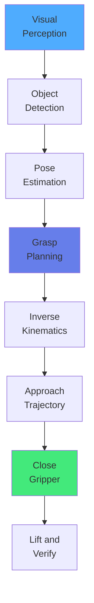

import { useEffect } from 'react';
import AOS from 'aos';
import 'aos/dist/aos.css';
import { ChapterHero, QuizComponent, ExerciseComponent, ChapterNavigation } from '@site/src/components/Chapter';

export function ManipulationChapter({ children }) {
  useEffect(() => {
    AOS.init({ duration: 800, easing: 'ease-in-out', once: true, offset: 150 });
  }, []);
  return <div>{children}</div>;
}

<ManipulationChapter>

<ChapterHero title="Grasping & Manipulation" subtitle="Robots That Can Handle Physical Objects" icon="🦾" />

## Overview

Manipulation is the ability to change an object's pose or configuration through physical interaction. Grasping—securely holding objects—is fundamental to manipulation tasks.

### Grasp Types

**1. Power Grasp**: Entire hand wraps around object (high force, low precision)
- Example: Holding a hammer, carrying boxes

**2. Precision Grasp**: Fingertips contact object (low force, high precision)
- Example: Picking up a coin, writing with a pen

**3. Form-Closure Grasp**: Geometry alone prevents motion
- Example: Object trapped in cage, no friction needed

**4. Force-Closure Grasp**: Contact forces prevent motion
- Example: Friction-based gripping, most practical approach

### Contact Mechanics

**Coulomb Friction Model**:
```
Friction force: f ≤ μ·N

where:
- μ: coefficient of friction
- N: normal force
```

For stable grasp, friction forces must counteract gravity and external forces.



### Gripper Designs

**Parallel Jaw**: Two opposing fingers, simple and reliable
**Three-Finger**: Increased dexterity, can grasp irregular shapes
**Dexterous Hand**: Human-like with 15-20 DOF, complex control
**Suction**: Vacuum grippers for flat surfaces
**Soft Grippers**: Compliant materials, conform to object shape

---

## Exercises

<ExerciseComponent
  exercise={{
    id: 'grasp-ex1',
    title: 'Force-Closure Grasp',
    objective: 'Check grasp stability',
    instructions: 'Parallel jaw gripper grasps 1kg box. Friction coefficient μ=0.5. What minimum normal force N is needed to prevent slipping?',
    expectedOutcome: 'Minimum normal force: 19.62 N',
    hints: ['Friction must counteract weight', 'f = μN ≥ mg', 'Solve for N'],
    solution: 'Weight = 1kg × 9.81m/s² = 9.81N. Friction: f = μN. Need f ≥ 9.81N, so N ≥ 9.81/0.5 = 19.62N',
    difficulty: 'medium',
    estimatedTime: 10
  }}
/>

<ExerciseComponent
  exercise={{
    id: 'grasp-ex2',
    title: 'Grasp Width Calculation',
    objective: 'Calculate gripper opening',
    instructions: 'Cylindrical object has 6cm diameter. Gripper needs 1cm clearance on each side. What gripper width is required?',
    expectedOutcome: '8 cm gripper width',
    hints: ['Add clearances to object width', 'width = diameter + 2×clearance'],
    solution: 'width = 6cm + 1cm + 1cm = 8cm',
    difficulty: 'easy',
    estimatedTime: 5
  }}
/>

---

## Quiz

<QuizComponent
  questions={[
    { id: 'grasp-q1', question: 'What is the difference between form-closure and force-closure?', options: [{ label: 'A', value: 'option-a', text: 'They are the same' }, { label: 'B', value: 'option-b', text: 'Form-closure uses geometry alone, force-closure relies on friction forces' }, { label: 'C', value: 'option-c', text: 'Form-closure is stronger' }, { label: 'D', value: 'option-d', text: 'Force-closure only works with metal' }], correctAnswer: 'option-b', explanation: 'Form-closure constrains object motion through geometry (like a cage), while force-closure uses contact forces and friction to prevent motion.' },
    { id: 'grasp-q2', question: 'Why are soft grippers advantageous?', options: [{ label: 'A', value: 'option-a', text: 'They are cheaper' }, { label: 'B', value: 'option-b', text: 'They conform to object shapes, providing robust grasping of irregular objects' }, { label: 'C', value: 'option-c', text: 'They are faster' }, { label: 'D', value: 'option-d', text: 'They require less power' }], correctAnswer: 'option-b', explanation: 'Soft grippers made of compliant materials passively conform to object geometry, enabling robust grasping of irregular shapes without precise pose estimation.' },
    { id: 'grasp-q3', question: 'What role does friction play in grasping?', options: [{ label: 'A', value: 'option-a', text: 'It reduces grip strength' }, { label: 'B', value: 'option-b', text: 'It provides tangential forces that prevent slipping' }, { label: 'C', value: 'option-c', text: 'It is not important' }, { label: 'D', value: 'option-d', text: 'It only matters for metal objects' }], correctAnswer: 'option-b', explanation: 'Friction at contact points provides tangential forces (f ≤ μN) that resist slipping, essential for stable grasping under gravity and external forces.' },
    { id: 'grasp-q4', question: 'What is in-hand manipulation?', options: [{ label: 'A', value: 'option-a', text: 'Picking up objects' }, { label: 'B', value: 'option-b', text: 'Repositioning an object within the hand without releasing it' }, { label: 'C', value: 'option-c', text: 'Dropping objects' }, { label: 'D', value: 'option-d', text: 'Using both hands' }], correctAnswer: 'option-b', explanation: 'In-hand manipulation involves changing an object\'s pose while maintaining grasp, using finger repositioning and rotation—a hallmark of dexterous manipulation.' },
    { id: 'grasp-q5', question: 'Why is pose estimation important for grasping?', options: [{ label: 'A', value: 'option-a', text: 'To calculate object weight' }, { label: 'B', value: 'option-b', text: 'To determine object position and orientation for planning grasp approach' }, { label: 'C', value: 'option-c', text: 'To measure friction' }, { label: 'D', value: 'option-d', text: 'To control gripper speed' }], correctAnswer: 'option-b', explanation: 'Accurate pose estimation enables the robot to plan appropriate grasp points and approach trajectories, crucial for successful object acquisition.' }
  ]}
/>

## Summary

Grasping and manipulation require understanding contact mechanics, friction, and force balance. Different gripper designs trade off between simplicity and dexterity. Modern approaches combine classical grasp planning with learning-based methods to handle diverse objects robustly. Force-closure and proper contact modeling ensure stable, reliable manipulation.

<ChapterNavigation
  previousChapter={{
    url: '/docs/locomotion',
    title: 'Chapter 12: Humanoid Locomotion'
  }}
  nextChapter={{
    url: '/docs/ethics',
    title: 'Chapter 14: Ethics & Safety in Physical AI'
  }}
/>

</ManipulationChapter>
