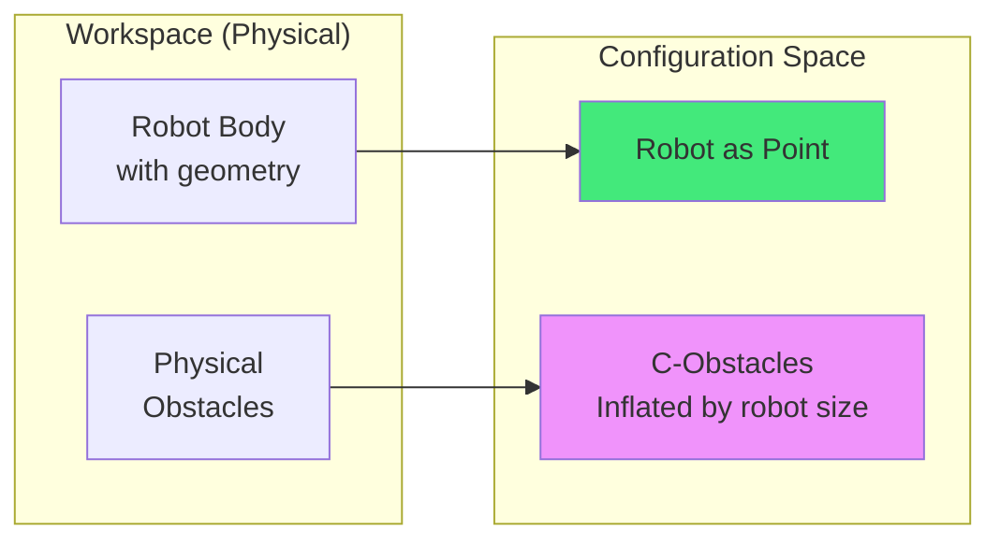
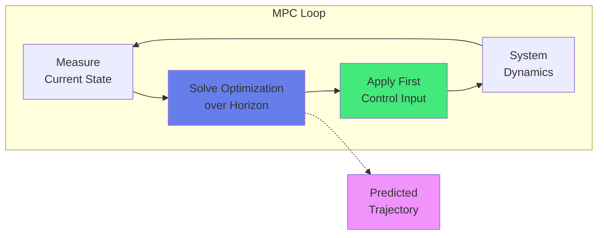
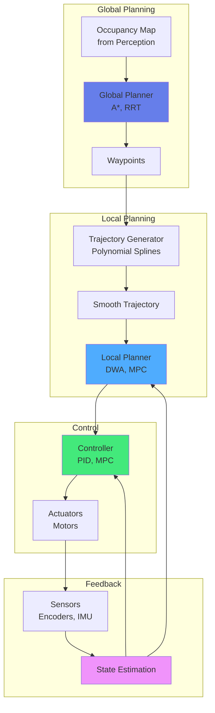

import { useEffect } from 'react';
import AOS from 'aos';
import 'aos/dist/aos.css';
import { ChapterHero, QuizComponent, ExerciseComponent, ChapterNavigation } from '@site/src/components/Chapter';

export function MotionPlanningChapter({ children }) {
  useEffect(() => {
    AOS.init({
      duration: 800,
      easing: 'ease-in-out',
      once: true,
      offset: 150,
    });
  }, []);
  return <div>{children}</div>;
}

<MotionPlanningChapter>

<ChapterHero
  title="Motion Planning & Control"
  subtitle="From Planning to Execution"
  icon="🗺️"
/>

<div data-aos="fade-up">

## What You'll Learn

In this chapter, we'll explore how robots plan and execute motion:

- **Path Planning**: Finding collision-free paths through complex environments
- **Trajectory Optimization**: Generating smooth, efficient motion trajectories
- **Inverse Kinematics**: Computing joint angles to reach desired positions
- **Control Systems**: PID, MPC, and other control strategies
- **Obstacle Avoidance**: Real-time collision avoidance techniques

</div>

---

## Prerequisites

<div data-aos="fade-up">

Before diving into this chapter, you should have completed:
- **Chapter 1**: Introduction to Physical AI (action in sensorimotor loops)
- **Chapter 2**: Foundations of Robotics (kinematics, dynamics)
- **Chapter 3**: Perception Systems (environment sensing)

</div>

---

## The Motion Planning Problem

<div data-aos="fade-right">

Motion planning answers the fundamental question: **"How should the robot move from point A to point B?"**

This involves two main challenges:

**1. Path Planning (Geometric)**
- Find a collision-free path in the environment
- Consider kinematic constraints (reachability)
- Often operates in configuration space (C-space)

**2. Trajectory Planning (Dynamic)**
- Add time dimension to the path
- Consider velocity and acceleration limits
- Optimize for smoothness, energy, or time

The complete pipeline: **Perception → Planning → Control → Execution**

</div>

---

## Configuration Space (C-Space)

<div data-aos="fade-up">

### From Workspace to C-Space

Instead of planning in physical (workspace) coordinates, we often plan in **configuration space**:

- **Workspace**: Physical 3D environment (x, y, z coordinates)
- **Configuration space (C-space)**: Space of all robot configurations (joint angles, poses)

**Example**: A 2-link arm
- Workspace: (x, y) position of end-effector
- C-space: (θ₁, θ₂) joint angles

**Obstacle Transformation**: Obstacles in workspace are mapped to C-space, where the robot becomes a point.

</div>

<div data-aos="fade-left">



*Figure: Configuration space transformation simplifies planning*

</div>

---

## Path Planning Algorithms

<div data-aos="fade-up">

### 1. Grid-Based Planning: A* (A-Star)

**A\*** is a widely-used optimal path planning algorithm that searches a graph using a heuristic.

**How A\* Works:**

1. Represent environment as a grid (occupancy map)
2. Each cell is a node; edges connect neighbors
3. Use cost function: f(n) = g(n) + h(n)
   - g(n): actual cost from start to node n
   - h(n): heuristic estimate from n to goal (e.g., Euclidean distance)
4. Expand nodes with lowest f(n) first (priority queue)
5. Terminate when goal is reached

**Optimality**: A\* guarantees optimal path if heuristic is **admissible** (never overestimates true cost)

</div>

<div data-aos="fade-right">

```python
import heapq
import numpy as np

class AStar:
    def __init__(self, occupancy_grid):
        """
        occupancy_grid: 2D numpy array (0=free, 1=obstacle)
        """
        self.grid = occupancy_grid
        self.rows, self.cols = occupancy_grid.shape

    def heuristic(self, a, b):
        """Euclidean distance heuristic"""
        return np.sqrt((b[0] - a[0])**2 + (b[1] - a[1])**2)

    def get_neighbors(self, node):
        """8-connected grid neighbors"""
        neighbors = []
        for dx, dy in [(-1,0), (1,0), (0,-1), (0,1),  # Cardinal
                       (-1,-1), (-1,1), (1,-1), (1,1)]:  # Diagonal
            x, y = node[0] + dx, node[1] + dy
            if 0 <= x < self.rows and 0 <= y < self.cols:
                if self.grid[x, y] == 0:  # Free space
                    cost = 1.414 if dx != 0 and dy != 0 else 1.0
                    neighbors.append(((x, y), cost))
        return neighbors

    def plan(self, start, goal):
        """A* path planning"""
        # Priority queue: (f_score, node)
        open_set = [(0, start)]
        came_from = {}

        # g_score: cost from start to node
        g_score = {start: 0}
        # f_score: g + heuristic
        f_score = {start: self.heuristic(start, goal)}

        while open_set:
            current_f, current = heapq.heappop(open_set)

            if current == goal:
                # Reconstruct path
                path = [current]
                while current in came_from:
                    current = came_from[current]
                    path.append(current)
                return path[::-1]  # Reverse

            for neighbor, cost in self.get_neighbors(current):
                tentative_g = g_score[current] + cost

                if neighbor not in g_score or tentative_g < g_score[neighbor]:
                    came_from[neighbor] = current
                    g_score[neighbor] = tentative_g
                    f_score[neighbor] = tentative_g + self.heuristic(neighbor, goal)
                    heapq.heappush(open_set, (f_score[neighbor], neighbor))

        return None  # No path found

# Usage
grid = np.array([
    [0, 0, 0, 0, 0],
    [0, 1, 1, 0, 0],
    [0, 0, 0, 0, 0],
    [0, 0, 1, 1, 0],
    [0, 0, 0, 0, 0]
])

planner = AStar(grid)
path = planner.plan(start=(0, 0), goal=(4, 4))
print(f"Path: {path}")
```

</div>

---

## Sampling-Based Planning: RRT

<div data-aos="fade-up">

### Rapidly-Exploring Random Trees (RRT)

For high-dimensional spaces (e.g., robot arms with many joints), grid-based methods become intractable. **RRT** randomly samples the configuration space to build a tree.

**RRT Algorithm:**

1. Initialize tree with start configuration
2. **Loop:**
   - Sample random configuration q_rand
   - Find nearest node q_near in tree
   - Extend tree toward q_rand by small step → q_new
   - If q_new is collision-free, add to tree
3. Terminate when tree reaches goal region

**Advantages:**
- Works in high-dimensional spaces (10+ DOF)
- Probabilistically complete (finds path if exists, given infinite time)
- Fast exploration

**RRT* Variant**: Asymptotically optimal version that rewires tree for better paths

</div>

<div data-aos="fade-left">

```python
import numpy as np
from scipy.spatial import KDTree

class RRT:
    def __init__(self, start, goal, obstacle_check_fn, bounds, max_iter=5000, step_size=0.5):
        self.start = np.array(start)
        self.goal = np.array(goal)
        self.obstacle_check = obstacle_check_fn
        self.bounds = bounds  # [(min_x, max_x), (min_y, max_y), ...]
        self.max_iter = max_iter
        self.step_size = step_size

        self.tree = [self.start]
        self.parent = {0: None}

    def sample(self):
        """Sample random configuration (with goal bias)"""
        if np.random.rand() < 0.1:  # 10% goal bias
            return self.goal
        return np.array([np.random.uniform(low, high)
                        for low, high in self.bounds])

    def nearest(self, q):
        """Find nearest node in tree to q"""
        tree_array = np.array(self.tree)
        distances = np.linalg.norm(tree_array - q, axis=1)
        return np.argmin(distances)

    def steer(self, q_near, q_rand):
        """Extend from q_near toward q_rand by step_size"""
        direction = q_rand - q_near
        distance = np.linalg.norm(direction)
        if distance < self.step_size:
            return q_rand
        return q_near + (direction / distance) * self.step_size

    def plan(self):
        """RRT path planning"""
        for i in range(self.max_iter):
            q_rand = self.sample()
            nearest_idx = self.nearest(q_rand)
            q_near = self.tree[nearest_idx]
            q_new = self.steer(q_near, q_rand)

            # Check collision
            if not self.obstacle_check(q_new):
                new_idx = len(self.tree)
                self.tree.append(q_new)
                self.parent[new_idx] = nearest_idx

                # Check if goal reached
                if np.linalg.norm(q_new - self.goal) < self.step_size:
                    # Reconstruct path
                    path = [q_new]
                    current = new_idx
                    while self.parent[current] is not None:
                        current = self.parent[current]
                        path.append(self.tree[current])
                    return path[::-1]

        return None  # No path found

# Usage
def obstacle_check(q):
    """Return True if q collides with obstacle"""
    # Example: circular obstacle at (5, 5) with radius 2
    return np.linalg.norm(q - np.array([5, 5])) < 2

rrt = RRT(start=[0, 0], goal=[10, 10],
          obstacle_check_fn=obstacle_check,
          bounds=[(0, 10), (0, 10)])
path = rrt.plan()
```

</div>

---

## Trajectory Optimization

<div data-aos="fade-up">

Once we have a path (sequence of waypoints), we need a **trajectory** (path + timing) that satisfies:
- Velocity and acceleration limits
- Smoothness (no jerky motion)
- Optimality (minimize time, energy, or jerk)

### Polynomial Trajectories

A common approach is to fit polynomial splines between waypoints.

**Cubic Polynomial** (for each segment):
```
q(t) = a₀ + a₁t + a₂t² + a₃t³
```

Boundary conditions fix coefficients:
- q(0) = q_start, q(T) = q_end (position)
- q̇(0) = v_start, q̇(T) = v_end (velocity)

For smoothness, use **quintic polynomials** (5th order) that also control acceleration.

</div>

<div data-aos="fade-right">

```python
import numpy as np

def cubic_trajectory(q_start, q_end, v_start, v_end, T, dt=0.01):
    """
    Generate cubic polynomial trajectory

    Args:
        q_start, q_end: start and end positions
        v_start, v_end: start and end velocities
        T: duration
        dt: time step

    Returns:
        times, positions, velocities, accelerations
    """
    # Solve for coefficients
    A = np.array([
        [0, 0, 0, 1],
        [T**3, T**2, T, 1],
        [0, 0, 1, 0],
        [3*T**2, 2*T, 1, 0]
    ])
    b = np.array([q_start, q_end, v_start, v_end])
    coeffs = np.linalg.solve(A, b)  # [a3, a2, a1, a0]

    # Generate trajectory
    times = np.arange(0, T, dt)
    positions = coeffs[0]*times**3 + coeffs[1]*times**2 + coeffs[2]*times + coeffs[3]
    velocities = 3*coeffs[0]*times**2 + 2*coeffs[1]*times + coeffs[2]
    accelerations = 6*coeffs[0]*times + 2*coeffs[1]

    return times, positions, velocities, accelerations

# Example: Move from 0 to 10 in 2 seconds, starting and ending at rest
times, pos, vel, acc = cubic_trajectory(
    q_start=0, q_end=10, v_start=0, v_end=0, T=2.0
)
```

</div>

---

## Inverse Kinematics (IK)

<div data-aos="fade-up">

**Forward Kinematics**: Given joint angles → find end-effector position
**Inverse Kinematics**: Given desired end-effector position → find joint angles

IK is critical for manipulation and reaching tasks.

### Analytical vs Numerical IK

**Analytical IK**: Closed-form solution (fast, but only for specific robot geometries)
- Example: 2-link planar arm has explicit solution

**Numerical IK**: Iterative optimization (general, works for any robot)
- Jacobian-based methods (Jacobian transpose, pseudoinverse)
- Optimization-based (nonlinear least squares)

</div>

<div data-aos="fade-left">

### Example: 2-Link Planar Arm (Analytical IK)

```python
import numpy as np

def inverse_kinematics_2link(x, y, L1, L2):
    """
    Analytical IK for 2-link planar arm

    Args:
        x, y: desired end-effector position
        L1, L2: link lengths

    Returns:
        (theta1, theta2): joint angles (two solutions)
    """
    # Distance to target
    D = np.sqrt(x**2 + y**2)

    # Check reachability
    if D > L1 + L2 or D < abs(L1 - L2):
        raise ValueError("Target unreachable")

    # Cosine law for theta2
    cos_theta2 = (x**2 + y**2 - L1**2 - L2**2) / (2 * L1 * L2)

    # Two solutions (elbow up/down)
    theta2_1 = np.arccos(cos_theta2)
    theta2_2 = -theta2_1

    # theta1 from geometric relations
    k1 = L1 + L2 * np.cos(theta2_1)
    k2 = L2 * np.sin(theta2_1)
    theta1_1 = np.arctan2(y, x) - np.arctan2(k2, k1)

    k1 = L1 + L2 * np.cos(theta2_2)
    k2 = L2 * np.sin(theta2_2)
    theta1_2 = np.arctan2(y, x) - np.arctan2(k2, k1)

    return (theta1_1, theta2_1), (theta1_2, theta2_2)

# Usage
L1, L2 = 1.0, 1.0  # Link lengths
x_target, y_target = 1.5, 0.5

solutions = inverse_kinematics_2link(x_target, y_target, L1, L2)
print(f"Solution 1: θ1={np.degrees(solutions[0][0]):.1f}°, θ2={np.degrees(solutions[0][1]):.1f}°")
print(f"Solution 2: θ1={np.degrees(solutions[1][0]):.1f}°, θ2={np.degrees(solutions[1][1]):.1f}°")
```

</div>

---

## Control Systems

<div data-aos="fade-up">

After planning, we need **control** to execute the trajectory accurately despite disturbances and model uncertainties.

### PID Control

**PID (Proportional-Integral-Derivative)** is the most common controller in robotics.

**Control Law**:
```
u(t) = Kₚ·e(t) + Kᵢ·∫e(τ)dτ + Kd·ė(t)
```

Where:
- **e(t) = desired - actual**: error
- **Kₚ**: Proportional gain (immediate response)
- **Kᵢ**: Integral gain (eliminates steady-state error)
- **Kd**: Derivative gain (damping, reduces overshoot)

**Tuning**: Adjust gains (often manually or via Ziegler-Nichols method)

</div>

<div data-aos="fade-right">

```python
import time

class PIDController:
    def __init__(self, Kp, Ki, Kd, setpoint=0):
        self.Kp = Kp
        self.Ki = Ki
        self.Kd = Kd
        self.setpoint = setpoint

        self.integral = 0
        self.prev_error = 0
        self.prev_time = time.time()

    def update(self, measurement):
        """Calculate control output"""
        current_time = time.time()
        dt = current_time - self.prev_time

        # Error
        error = self.setpoint - measurement

        # Proportional term
        P = self.Kp * error

        # Integral term (with anti-windup)
        self.integral += error * dt
        self.integral = np.clip(self.integral, -10, 10)  # Anti-windup
        I = self.Ki * self.integral

        # Derivative term
        derivative = (error - self.prev_error) / dt if dt > 0 else 0
        D = self.Kd * derivative

        # Control output
        output = P + I + D

        # Update state
        self.prev_error = error
        self.prev_time = current_time

        return output

    def set_setpoint(self, setpoint):
        self.setpoint = setpoint
        self.integral = 0  # Reset integral on setpoint change

# Usage example
controller = PIDController(Kp=2.0, Ki=0.5, Kd=0.1, setpoint=10.0)

# Simulation loop
position = 0
for _ in range(100):
    control_effort = controller.update(position)
    # Apply control to system (simplified dynamics)
    position += control_effort * 0.01  # System response
    time.sleep(0.01)
```

</div>

---

## Model Predictive Control (MPC)

<div data-aos="fade-up">

**MPC** optimizes control over a future time horizon, considering constraints and predictions.

**How MPC Works:**

1. At each time step, solve optimization problem:
   ```
   min  Σ (cost of trajectory over horizon)
   subject to:
     - system dynamics
     - input constraints (actuator limits)
     - state constraints (safety bounds)
   ```

2. Apply **first control input** from optimal sequence
3. **Re-plan** at next time step (receding horizon)

**Advantages:**
- Handles constraints explicitly
- Optimal multi-step lookahead
- Adapts to disturbances via replanning

**Challenges:**
- Computationally expensive (requires fast solver)
- Needs accurate model

</div>

<div data-aos="fade-left">



*Figure: Model Predictive Control receding horizon strategy*

</div>

---

## Obstacle Avoidance

<div data-aos="fade-up">

### Dynamic Window Approach (DWA)

For real-time obstacle avoidance, the **Dynamic Window Approach** is widely used in mobile robots.

**DWA Algorithm:**

1. Compute **dynamic window**: set of (v, ω) velocities reachable in next time step given acceleration limits
2. For each velocity pair, **simulate trajectory** over short horizon
3. **Score** trajectories based on:
   - Progress toward goal (maximize)
   - Clearance from obstacles (maximize)
   - Velocity (prefer higher speeds)
4. Select velocity with **best score**

**Real-time**: Runs at control frequency (10-20 Hz)

</div>

<div data-aos="fade-right">

```python
import numpy as np

class DynamicWindowApproach:
    def __init__(self, config):
        self.max_v = config['max_v']  # Max linear velocity
        self.max_w = config['max_w']  # Max angular velocity
        self.max_acc_v = config['max_acc_v']
        self.max_acc_w = config['max_acc_w']
        self.v_resolution = config['v_resolution']
        self.w_resolution = config['w_resolution']
        self.predict_time = config['predict_time']
        self.dt = config['dt']

    def dynamic_window(self, v, w):
        """Calculate dynamic window based on current velocities"""
        return [
            max(0, v - self.max_acc_v * self.dt),
            min(self.max_v, v + self.max_acc_v * self.dt),
            max(-self.max_w, w - self.max_acc_w * self.dt),
            min(self.max_w, w + self.max_acc_w * self.dt)
        ]

    def predict_trajectory(self, x, y, theta, v, w):
        """Predict robot trajectory for given velocities"""
        trajectory = []
        for t in np.arange(0, self.predict_time, self.dt):
            x += v * np.cos(theta) * self.dt
            y += v * np.sin(theta) * self.dt
            theta += w * self.dt
            trajectory.append([x, y, theta])
        return np.array(trajectory)

    def calculate_score(self, trajectory, goal, obstacles):
        """Score trajectory based on goal heading, distance, and velocity"""
        # Goal heading
        dx = goal[0] - trajectory[-1, 0]
        dy = goal[1] - trajectory[-1, 1]
        goal_heading = np.arctan2(dy, dx)
        heading_score = 1.0 - abs(goal_heading - trajectory[-1, 2]) / np.pi

        # Distance to goal
        dist_to_goal = np.hypot(dx, dy)
        dist_score = 1.0 / (1.0 + dist_to_goal)

        # Obstacle clearance
        min_clearance = float('inf')
        for obs in obstacles:
            distances = np.hypot(trajectory[:, 0] - obs[0],
                               trajectory[:, 1] - obs[1])
            min_clearance = min(min_clearance, np.min(distances))

        if min_clearance < 0.3:  # Collision threshold
            return 0  # Invalid trajectory

        clearance_score = min_clearance / 2.0

        # Weighted sum
        return 2.0 * heading_score + 1.0 * dist_score + 1.0 * clearance_score

    def plan(self, state, goal, obstacles):
        """
        state: [x, y, theta, v, w]
        goal: [x, y]
        obstacles: list of [x, y] positions
        """
        x, y, theta, v, w = state
        dw = self.dynamic_window(v, w)

        best_v, best_w = 0, 0
        best_score = 0

        # Search over velocity space
        for v_cand in np.arange(dw[0], dw[1], self.v_resolution):
            for w_cand in np.arange(dw[2], dw[3], self.w_resolution):
                trajectory = self.predict_trajectory(x, y, theta, v_cand, w_cand)
                score = self.calculate_score(trajectory, goal, obstacles)

                if score > best_score:
                    best_score = score
                    best_v = v_cand
                    best_w = w_cand

        return best_v, best_w

# Usage
config = {
    'max_v': 1.0,
    'max_w': 1.0,
    'max_acc_v': 0.5,
    'max_acc_w': 1.0,
    'v_resolution': 0.1,
    'w_resolution': 0.1,
    'predict_time': 2.0,
    'dt': 0.1
}

dwa = DynamicWindowApproach(config)
state = [0, 0, 0, 0, 0]  # [x, y, theta, v, w]
goal = [10, 10]
obstacles = [[5, 5], [7, 3]]

v_cmd, w_cmd = dwa.plan(state, goal, obstacles)
print(f"Commanded velocities: v={v_cmd:.2f} m/s, ω={w_cmd:.2f} rad/s")
```

</div>

---

## Complete Motion Planning Pipeline

<div data-aos="fade-up">



*Figure: Complete motion planning and control architecture*

</div>

---

## Exercises

<ExerciseComponent
  exercise={{
    id: 'motion-ex1',
    title: 'A* Path Planning',
    objective: 'Implement and analyze A* algorithm behavior',
    instructions: `
Given a 5x5 grid with obstacles, trace the A* algorithm execution:

Grid (0=free, 1=obstacle):
\`\`\`
[0, 0, 0, 0, 0]
[0, 1, 1, 1, 0]
[0, 0, 0, 1, 0]
[0, 1, 0, 0, 0]
[0, 0, 0, 0, 0]
\`\`\`

Start: (0, 0), Goal: (4, 4)
Heuristic: Euclidean distance

**Tasks:**
1. Calculate f-scores for the first 3 nodes expanded
2. Determine the optimal path
3. Count total nodes expanded vs nodes in path
`,
    expectedOutcome: 'Path: (0,0)→(1,0)→(2,0)→(2,1)→(2,2)→(3,2)→(3,3)→(4,3)→(4,4), Cost ≈ 9.66',
    hints: [
      'f(n) = g(n) + h(n), where h is Euclidean distance to goal',
      'Diagonal moves cost √2 ≈ 1.414, cardinal moves cost 1.0',
      'A* expands nodes in order of lowest f-score'
    ],
    solution: `
# Trace first 3 expansions:

1. Start (0,0): g=0, h=5.66, f=5.66
   → Expand (0,0), add neighbors (0,1), (1,0), (1,1)

2. Expand (1,1): g=1.41, h=4.24, f=5.65 (lowest)
   → Cannot proceed (obstacle at (1,2), (2,1))

3. Expand (1,0): g=1.0, h=5.0, f=6.0
   → Add (2,0)

# Full path found:
(0,0) → (1,0) → (2,0) → (2,1) → (2,2) → (3,2) → (3,3) → (4,3) → (4,4)

# Path cost = 1 + 1 + 1 + 1 + 1.41 + 1.41 + 1.41 + 1 = 9.24

# Efficiency: ~15 nodes expanded, 9 nodes in path
`,
    difficulty: 'medium',
    estimatedTime: 25
  }}
/>

<ExerciseComponent
  exercise={{
    id: 'motion-ex2',
    title: 'Inverse Kinematics for 2-Link Arm',
    objective: 'Calculate joint angles for a target position',
    instructions: `
A 2-link planar robot arm has:
- Link 1 length: L₁ = 3.0 m
- Link 2 length: L₂ = 2.0 m

Target end-effector position: (x, y) = (4.0, 2.0)

**Tasks:**
1. Check if target is reachable
2. Calculate both IK solutions (elbow up and elbow down)
3. Verify solutions by computing forward kinematics

**Formulas:**
- cos(θ₂) = (x² + y² - L₁² - L₂²) / (2·L₁·L₂)
- θ₁ = atan2(y, x) - atan2(L₂·sin(θ₂), L₁ + L₂·cos(θ₂))
`,
    expectedOutcome: 'Two solutions: (θ₁≈20°, θ₂≈73°) and (θ₁≈66°, θ₂≈-73°)',
    hints: [
      'Reachability: |L₁-L₂| ≤ distance ≤ L₁+L₂',
      'Two solutions differ by elbow configuration (±θ₂)',
      'Use atan2(y, x) for correct quadrant handling'
    ],
    solution: `
import numpy as np

L1, L2 = 3.0, 2.0
x, y = 4.0, 2.0

# Check reachability
D = np.sqrt(x**2 + y**2)
print(f"Distance: {D:.2f}, Range: [{abs(L1-L2)}, {L1+L2}]")
print(f"Reachable: {abs(L1-L2) <= D <= L1+L2}")

# IK solution
cos_theta2 = (x**2 + y**2 - L1**2 - L2**2) / (2 * L1 * L2)
theta2_1 = np.arccos(cos_theta2)  # Elbow up
theta2_2 = -theta2_1               # Elbow down

# theta1 for each solution
k1 = L1 + L2 * np.cos(theta2_1)
k2 = L2 * np.sin(theta2_1)
theta1_1 = np.arctan2(y, x) - np.arctan2(k2, k1)

k1 = L1 + L2 * np.cos(theta2_2)
k2 = L2 * np.sin(theta2_2)
theta1_2 = np.arctan2(y, x) - np.arctan2(k2, k1)

print(f"Solution 1: θ₁={np.degrees(theta1_1):.1f}°, θ₂={np.degrees(theta2_1):.1f}°")
print(f"Solution 2: θ₁={np.degrees(theta1_2):.1f}°, θ₂={np.degrees(theta2_2):.1f}°")

# Verify with forward kinematics
x1 = L1*np.cos(theta1_1) + L2*np.cos(theta1_1 + theta2_1)
y1 = L1*np.sin(theta1_1) + L2*np.sin(theta1_1 + theta2_1)
print(f"Verification: ({x1:.2f}, {y1:.2f}) ≈ ({x}, {y})")

# Output:
# Distance: 4.47, Range: [1.0, 5.0]
# Reachable: True
# Solution 1: θ₁=20.4°, θ₂=72.5°
# Solution 2: θ₁=66.3°, θ₂=-72.5°
# Verification: (4.00, 2.00) ≈ (4.0, 2.0) ✓
`,
    difficulty: 'hard',
    estimatedTime: 30
  }}
/>

---

## Quiz

<QuizComponent
  questions={[
    {
      id: 'motion-q1',
      question: 'What is the main advantage of planning in configuration space (C-space) rather than workspace?',
      options: [
        { label: 'A', value: 'option-a', text: 'C-space is always 2D, making it simpler' },
        { label: 'B', value: 'option-b', text: 'The robot becomes a point, simplifying collision checking' },
        { label: 'C', value: 'option-c', text: 'C-space eliminates the need for sensors' },
        { label: 'D', value: 'option-d', text: 'C-space paths are always shorter' }
      ],
      correctAnswer: 'option-b',
      explanation: 'In configuration space, obstacles are "inflated" by the robot\'s geometry, allowing the robot to be treated as a point. This greatly simplifies collision checking during planning.'
    },
    {
      id: 'motion-q2',
      question: 'What property makes A* algorithm optimal for path planning?',
      options: [
        { label: 'A', value: 'option-a', text: 'It always finds the path with fewest waypoints' },
        { label: 'B', value: 'option-b', text: 'It uses an admissible heuristic that never overestimates cost' },
        { label: 'C', value: 'option-c', text: 'It explores all possible paths exhaustively' },
        { label: 'D', value: 'option-d', text: 'It runs faster than other algorithms' }
      ],
      correctAnswer: 'option-b',
      explanation: 'A* guarantees finding the optimal (lowest-cost) path when using an admissible heuristic—one that never overestimates the true cost to reach the goal. Common admissible heuristics include Euclidean and Manhattan distance.'
    },
    {
      id: 'motion-q3',
      question: 'Why is RRT (Rapidly-Exploring Random Tree) preferred for high-dimensional planning?',
      options: [
        { label: 'A', value: 'option-a', text: 'It always finds optimal paths' },
        { label: 'B', value: 'option-b', text: 'It avoids the curse of dimensionality by random sampling' },
        { label: 'C', value: 'option-c', text: 'It requires less memory than A*' },
        { label: 'D', value: 'option-d', text: 'It works without knowing the goal position' }
      ],
      correctAnswer: 'option-b',
      explanation: 'Grid-based methods like A* become intractable in high dimensions (e.g., 7-DOF robot arm = 7D C-space). RRT uses random sampling to explore the space efficiently without discretizing it into a grid, making it practical for high-dimensional problems.'
    },
    {
      id: 'motion-q4',
      question: 'What does the "D" term in PID control do?',
      options: [
        { label: 'A', value: 'option-a', text: 'It eliminates steady-state error' },
        { label: 'B', value: 'option-b', text: 'It provides damping and reduces overshoot' },
        { label: 'C', value: 'option-c', text: 'It speeds up the response time' },
        { label: 'D', value: 'option-d', text: 'It increases proportional gain' }
      ],
      correctAnswer: 'option-b',
      explanation: 'The Derivative (D) term in PID control acts on the rate of change of error, providing damping that reduces overshoot and oscillations. It helps stabilize the system but can amplify noise if the derivative gain is too high.'
    },
    {
      id: 'motion-q5',
      question: 'What is the key benefit of Model Predictive Control (MPC) over PID?',
      options: [
        { label: 'A', value: 'option-a', text: 'MPC is computationally simpler' },
        { label: 'B', value: 'option-b', text: 'MPC explicitly handles constraints and optimizes over a future horizon' },
        { label: 'C', value: 'option-c', text: 'MPC does not require a system model' },
        { label: 'D', value: 'option-d', text: 'MPC only uses proportional control' }
      ],
      correctAnswer: 'option-b',
      explanation: 'MPC optimizes control actions over a future time horizon while explicitly considering constraints (e.g., actuator limits, safety bounds). This predictive, constrained optimization capability is its main advantage over reactive controllers like PID.'
    }
  ]}
/>

---

## Summary

<div data-aos="fade-up">

**Key Takeaways:**

- **Path planning** finds collision-free paths using algorithms like **A\*** (grid-based) and **RRT** (sampling-based)
- **Configuration space** simplifies planning by representing the robot as a point
- **Trajectory optimization** adds timing and smoothness constraints using polynomial splines
- **Inverse kinematics** computes joint angles to reach desired end-effector positions
- **PID control** is widely used for trajectory tracking, while **MPC** handles constraints and predictions
- **Dynamic Window Approach** enables real-time obstacle avoidance for mobile robots

**Next Steps**: In Chapter 5, we'll explore how machine learning enables robots to learn policies directly from data, bypassing explicit planning and control design.

</div>

<ChapterNavigation
  previousChapter={{
    url: '/docs/perception',
    title: 'Chapter 3: Perception Systems'
  }}
  nextChapter={{
    url: '/docs/learning',
    title: 'Chapter 5: Machine Learning for Robotics'
  }}
/>

</MotionPlanningChapter>
