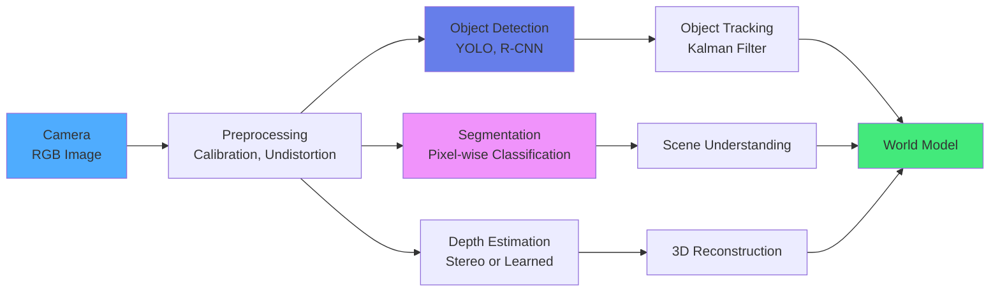
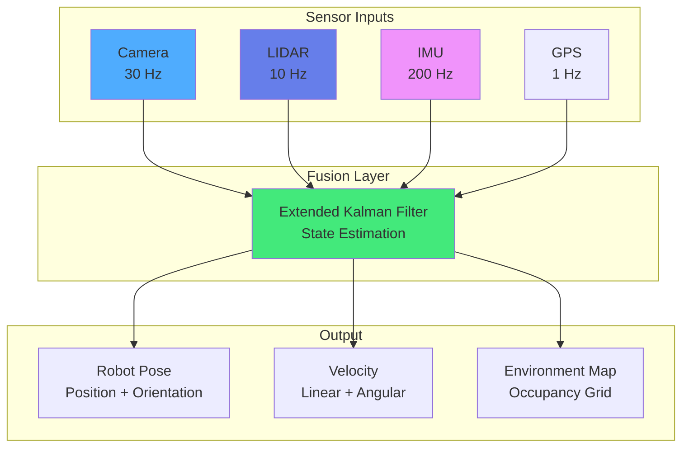

import { useEffect } from 'react';
import AOS from 'aos';
import 'aos/dist/aos.css';
import { ChapterHero, QuizComponent, ExerciseComponent, ChapterNavigation } from '@site/src/components/Chapter';

export function PerceptionChapter({ children }) {
  useEffect(() => {
    AOS.init({
      duration: 800,
      easing: 'ease-in-out',
      once: true,
      offset: 150,
    });
  }, []);
  return <div>{children}</div>;
}

<PerceptionChapter>

<ChapterHero
  title="Perception Systems"
  subtitle="How Robots See and Sense the World"
  icon="👁️"
/>

<div data-aos="fade-up">

## What You'll Learn

In this chapter, we'll explore how robots build an understanding of their environment:

- **Vision Systems**: Cameras, depth sensors, and computer vision algorithms
- **LIDAR**: 3D scanning and point cloud processing
- **Inertial Measurement**: IMUs for orientation and acceleration
- **Sensor Fusion**: Combining multiple sensors for robust perception
- **SLAM**: Simultaneous Localization and Mapping

</div>

---

## Prerequisites

<div data-aos="fade-up">

Before diving into this chapter, you should have completed:
- **Chapter 1**: Introduction to Physical AI (sensorimotor loops)
- **Chapter 2**: Foundations of Robotics (sensor types and robot anatomy)

</div>

---

## The Perception Challenge

<div data-aos="fade-right">

For robots to operate in the real world, they must **perceive** their surroundings accurately. Unlike controlled factory environments, real-world perception involves:

- **Lighting variations**: Shadows, glare, day/night changes
- **Occlusions**: Objects blocking the view of others
- **Dynamic scenes**: Moving people, vehicles, and objects
- **Sensor noise**: Imperfect measurements requiring filtering
- **Computational constraints**: Real-time processing on limited hardware

Modern perception systems combine **multiple sensor modalities** to overcome these challenges, creating robust representations of the environment.

</div>

---

## Vision Systems

<div data-aos="fade-up">

### Cameras: The Primary Sensor

Cameras are the most versatile and information-rich sensors in robotics. Types include:

**1. Monocular Cameras**
- Single camera providing 2D images
- Cheap and lightweight
- Lacks depth information (requires learning or motion)
- Common in mobile robots, drones

**2. Stereo Cameras**
- Two cameras separated by a baseline
- Provides depth through triangulation
- Mimics human binocular vision
- Used in autonomous vehicles, manipulation

**3. RGB-D Cameras**
- Combines color (RGB) and depth (D) information
- Active sensing (infrared patterns or time-of-flight)
- Examples: Intel RealSense, Microsoft Kinect
- Indoor robotics, 3D scanning

</div>

<div data-aos="fade-left">

### Computer Vision Algorithms

Key computer vision tasks for robotics:

- **Object Detection**: Locate and classify objects (YOLO, Faster R-CNN)
- **Semantic Segmentation**: Label every pixel by category
- **Instance Segmentation**: Distinguish individual objects
- **Pose Estimation**: Determine 3D orientation of objects
- **Optical Flow**: Track motion between frames
- **Visual Odometry**: Estimate camera motion from images

</div>

---

## Vision Pipeline Diagram

<div data-aos="fade-up">



*Figure: Computer vision pipeline from raw images to world model*

</div>

---

## LIDAR: 3D Scanning

<div data-aos="fade-right">

**LIDAR** (Light Detection and Ranging) uses laser pulses to measure distances, creating detailed 3D point clouds.

### How LIDAR Works

1. Emit laser pulse
2. Measure time-of-flight (TOF) to object
3. Calculate distance: d = (c × t) / 2
4. Rotate to scan 360° (or use solid-state design)
5. Generate point cloud: millions of (x, y, z) points

### LIDAR Advantages

- **Accurate**: Millimeter precision at 100+ meter range
- **Weather resistant**: Works in rain, fog (better than cameras)
- **Day/night**: Independent of lighting conditions
- **360° coverage**: Spinning LIDARs provide full field of view

### LIDAR Types

- **Mechanical spinning**: Velodyne, Ouster (autonomous vehicles)
- **Solid-state**: No moving parts, more compact (Luminar, Aeva)
- **2D LIDAR**: Single plane scanning (warehouse robots)
- **3D LIDAR**: Multi-layer scanning (self-driving cars)

</div>

---

## Inertial Measurement Units (IMUs)

<div data-aos="fade-up">

IMUs measure **acceleration** and **angular velocity**, providing orientation and motion information.

### IMU Components

**1. Accelerometer**: Measures linear acceleration (3-axis: x, y, z)
- Detects gravity direction (tilt sensing)
- Measures dynamic acceleration (motion)
- Noise increases with integration (drift)

**2. Gyroscope**: Measures angular velocity (3-axis: roll, pitch, yaw)
- High-frequency accuracy
- Drifts over time (integration error)
- Complementary to accelerometer

**3. Magnetometer**: Measures magnetic field (compass)
- Provides absolute heading reference
- Susceptible to magnetic interference
- Often used to correct gyroscope drift

</div>

<div data-aos="fade-left">

### Sensor Fusion with IMU

IMUs are rarely used alone. Combined with other sensors:

- **IMU + Camera**: Visual-Inertial Odometry (VIO)
- **IMU + GPS**: Robust outdoor navigation
- **IMU + LIDAR**: High-frequency state estimation

**Complementary Filter**: Simple fusion technique
```python
# Combine accelerometer (low-freq, no drift) with gyroscope (high-freq, drifts)
alpha = 0.98  # Trust gyro more for high-frequency changes

angle_gyro = previous_angle + gyro_rate * dt
angle_accel = atan2(accel_y, accel_z)

# Fused angle
angle = alpha * angle_gyro + (1 - alpha) * angle_accel
```

</div>

---

## Sensor Fusion Architecture

<div data-aos="fade-up">



*Figure: Multi-sensor fusion using Extended Kalman Filter*

</div>

---

## SLAM: Simultaneous Localization and Mapping

<div data-aos="fade-right">

**SLAM** solves the chicken-and-egg problem: to build a map, you need to know your location; to localize, you need a map.

### SLAM Pipeline

1. **Feature Extraction**: Identify landmarks (corners, edges, objects)
2. **Data Association**: Match current observations with map
3. **State Estimation**: Update robot pose and map jointly
4. **Loop Closure**: Detect revisited locations, correct drift

### Popular SLAM Algorithms

- **Visual SLAM**: ORB-SLAM, RTAB-Map (camera-based)
- **LIDAR SLAM**: Cartographer, LOAM (laser-based)
- **RGB-D SLAM**: KinectFusion, ElasticFusion (depth camera)
- **Visual-Inertial**: VINS-Mono, MSCKF (camera + IMU)

</div>

<div data-aos="fade-left">

### SLAM Challenges

- **Scale ambiguity**: Monocular SLAM doesn't know absolute scale
- **Loop closure**: Recognizing previously visited places
- **Dynamic environments**: Moving objects confuse mapping
- **Computational cost**: Real-time processing on embedded systems
- **Long-term drift**: Errors accumulate over time/distance

Modern solutions use **learning-based methods** (deep SLAM) and **multi-session mapping** to address these challenges.

</div>

---

## Code Example: Simple Object Detection

<div data-aos="fade-up">

```python
import cv2
import numpy as np

class SimplePerception:
    def __init__(self):
        # Load pre-trained YOLO model
        self.net = cv2.dnn.readNet("yolov4.weights", "yolov4.cfg")
        self.layer_names = self.net.getLayerNames()
        self.output_layers = [self.layer_names[i - 1]
                             for i in self.net.getUnconnectedOutLayers()]

        # Load class names
        with open("coco.names", "r") as f:
            self.classes = [line.strip() for line in f.readlines()]

    def detect_objects(self, image):
        """Detect objects in image using YOLO"""
        height, width = image.shape[:2]

        # Prepare image for network
        blob = cv2.dnn.blobFromImage(image, 1/255.0, (416, 416),
                                     swapRB=True, crop=False)
        self.net.setInput(blob)

        # Run inference
        outputs = self.net.forward(self.output_layers)

        # Process detections
        boxes, confidences, class_ids = [], [], []

        for output in outputs:
            for detection in output:
                scores = detection[5:]
                class_id = np.argmax(scores)
                confidence = scores[class_id]

                if confidence > 0.5:  # Confidence threshold
                    # Object detected
                    center_x = int(detection[0] * width)
                    center_y = int(detection[1] * height)
                    w = int(detection[2] * width)
                    h = int(detection[3] * height)

                    # Bounding box coordinates
                    x = int(center_x - w / 2)
                    y = int(center_y - h / 2)

                    boxes.append([x, y, w, h])
                    confidences.append(float(confidence))
                    class_ids.append(class_id)

        # Non-maximum suppression to remove overlapping boxes
        indices = cv2.dnn.NMSBoxes(boxes, confidences, 0.5, 0.4)

        detected_objects = []
        for i in indices:
            box = boxes[i]
            class_name = self.classes[class_ids[i]]
            confidence = confidences[i]
            detected_objects.append({
                'class': class_name,
                'confidence': confidence,
                'box': box
            })

        return detected_objects

# Usage
perception = SimplePerception()
image = cv2.imread('scene.jpg')
objects = perception.detect_objects(image)

for obj in objects:
    print(f"Detected {obj['class']} with {obj['confidence']:.2f} confidence")
```

</div>

---

## Exercises

<ExerciseComponent
  exercise={{
    id: 'perception-ex1',
    title: 'Stereo Vision Depth Calculation',
    objective: 'Calculate depth from stereo disparity',
    instructions: `
A stereo camera system has the following parameters:
- Baseline (distance between cameras): b = 0.12 m
- Focal length: f = 500 pixels
- Disparity (pixel difference): d = 25 pixels

Calculate the depth (Z) to the observed object using the formula:
Z = (b × f) / d

**Context**: Disparity is inversely proportional to depth—closer objects have larger disparity.
`,
    expectedOutcome: 'Depth Z = 2.4 meters',
    hints: [
      'Ensure all units are consistent (meters, pixels)',
      'Larger disparity means closer object',
      'Check: Does the result make physical sense?'
    ],
    solution: `
b = 0.12  # meters (baseline)
f = 500   # pixels (focal length)
d = 25    # pixels (disparity)

Z = (b * f) / d
print(f"Depth to object: {Z:.2f} meters")
# Output: Depth to object: 2.40 meters

# Verification: If disparity doubles (d=50), depth halves (Z=1.2m) ✓
`,
    difficulty: 'easy',
    estimatedTime: 10
  }}
/>

<ExerciseComponent
  exercise={{
    id: 'perception-ex2',
    title: 'Complementary Filter Implementation',
    objective: 'Fuse accelerometer and gyroscope data for tilt estimation',
    instructions: `
Implement a complementary filter to estimate roll angle from IMU data.

**Given:**
- Gyroscope reading: gyro_rate = 0.05 rad/s
- Accelerometer reading: accel_y = 2.0 m/s², accel_z = 9.0 m/s²
- Time step: dt = 0.01 s
- Previous angle: previous_angle = 0.20 rad
- Filter coefficient: alpha = 0.98

**Steps:**
1. Integrate gyroscope: angle_gyro = previous_angle + gyro_rate * dt
2. Calculate accelerometer angle: angle_accel = atan2(accel_y, accel_z)
3. Apply complementary filter: angle = alpha * angle_gyro + (1 - alpha) * angle_accel
`,
    expectedOutcome: 'Fused angle ≈ 0.2226 radians (12.76°)',
    hints: [
      'Use math.atan2(y, z) for accelerometer angle',
      'Gyro provides high-frequency accuracy, accel provides long-term reference',
      'Alpha near 1.0 trusts gyro more (typical: 0.95-0.99)'
    ],
    solution: `
import math

# Given values
gyro_rate = 0.05  # rad/s
accel_y = 2.0     # m/s²
accel_z = 9.0     # m/s²
dt = 0.01         # seconds
previous_angle = 0.20  # radians
alpha = 0.98

# Gyroscope integration
angle_gyro = previous_angle + gyro_rate * dt

# Accelerometer angle
angle_accel = math.atan2(accel_y, accel_z)

# Complementary filter
angle = alpha * angle_gyro + (1 - alpha) * angle_accel

print(f"Gyro angle: {angle_gyro:.4f} rad")
print(f"Accel angle: {angle_accel:.4f} rad")
print(f"Fused angle: {angle:.4f} rad ({math.degrees(angle):.2f}°)")

# Output:
# Gyro angle: 0.2005 rad
# Accel angle: 0.2187 rad
# Fused angle: 0.2226 rad (12.76°)
`,
    difficulty: 'medium',
    estimatedTime: 20
  }}
/>

---

## Quiz

<QuizComponent
  questions={[
    {
      id: 'perception-q1',
      question: 'What is the primary advantage of LIDAR over cameras for robot perception?',
      options: [
        { label: 'A', value: 'option-a', text: 'LIDAR provides color information' },
        { label: 'B', value: 'option-b', text: 'LIDAR gives accurate 3D depth regardless of lighting conditions' },
        { label: 'C', value: 'option-c', text: 'LIDAR is cheaper than cameras' },
        { label: 'D', value: 'option-d', text: 'LIDAR has higher resolution than cameras' }
      ],
      correctAnswer: 'option-b',
      explanation: 'LIDAR provides accurate distance measurements independent of lighting conditions (works day/night, in shadows), though it lacks color information and is generally more expensive than cameras.'
    },
    {
      id: 'perception-q2',
      question: 'What does an IMU (Inertial Measurement Unit) typically contain?',
      options: [
        { label: 'A', value: 'option-a', text: 'Only an accelerometer' },
        { label: 'B', value: 'option-b', text: 'Accelerometer, gyroscope, and often a magnetometer' },
        { label: 'C', value: 'option-c', text: 'Camera and LIDAR' },
        { label: 'D', value: 'option-d', text: 'GPS receiver and compass' }
      ],
      correctAnswer: 'option-b',
      explanation: 'A typical IMU contains a 3-axis accelerometer (linear acceleration), 3-axis gyroscope (angular velocity), and often a 3-axis magnetometer (magnetic field) for complete motion sensing.'
    },
    {
      id: 'perception-q3',
      question: 'In stereo vision, what is disparity?',
      options: [
        { label: 'A', value: 'option-a', text: 'The color difference between two images' },
        { label: 'B', value: 'option-b', text: 'The pixel difference in position of the same object in left and right images' },
        { label: 'C', value: 'option-c', text: 'The time delay between capturing two images' },
        { label: 'D', value: 'option-d', text: 'The distance between the two cameras' }
      ],
      correctAnswer: 'option-b',
      explanation: 'Disparity is the pixel offset of the same object between left and right images in stereo vision. It is inversely proportional to depth: larger disparity = closer object.'
    },
    {
      id: 'perception-q4',
      question: 'What does SLAM stand for in robotics?',
      options: [
        { label: 'A', value: 'option-a', text: 'Sensory Localization And Mapping' },
        { label: 'B', value: 'option-b', text: 'Simultaneous Localization And Mapping' },
        { label: 'C', value: 'option-c', text: 'Sequential Learning And Measurement' },
        { label: 'D', value: 'option-d', text: 'Smart Laser Analysis Method' }
      ],
      correctAnswer: 'option-b',
      explanation: 'SLAM stands for Simultaneous Localization And Mapping—the process of building a map of an environment while simultaneously tracking the robot\'s location within that map.'
    },
    {
      id: 'perception-q5',
      question: 'Why is sensor fusion important in robotics?',
      options: [
        { label: 'A', value: 'option-a', text: 'It reduces the cost of sensors' },
        { label: 'B', value: 'option-b', text: 'It combines strengths of different sensors to overcome individual limitations' },
        { label: 'C', value: 'option-c', text: 'It makes robots faster' },
        { label: 'D', value: 'option-d', text: 'It eliminates the need for cameras' }
      ],
      correctAnswer: 'option-b',
      explanation: 'Sensor fusion combines data from multiple sensors to provide more accurate and robust perception. For example, IMU provides high-frequency updates while camera provides absolute position, compensating for each sensor\'s weaknesses.'
    }
  ]}
/>

---

## Summary

<div data-aos="fade-up">

**Key Takeaways:**

- **Vision systems** (cameras) are versatile but require careful processing for depth and object recognition
- **LIDAR** provides accurate 3D measurements independent of lighting, ideal for outdoor navigation
- **IMUs** measure motion and orientation, essential for high-frequency state estimation
- **Sensor fusion** combines multiple sensors using filters (Kalman, complementary) for robust perception
- **SLAM** enables robots to build maps while localizing themselves, critical for autonomous navigation

**Next Steps**: With perception in place, we'll explore how robots use this information to plan collision-free paths and control their motion in Chapter 4: Motion Planning & Control.

</div>

<ChapterNavigation
  previousChapter={{
    url: '/docs/foundations',
    title: 'Chapter 2: Foundations of Robotics'
  }}
  nextChapter={{
    url: '/docs/motion-planning',
    title: 'Chapter 4: Motion Planning & Control'
  }}
/>

</PerceptionChapter>
