import { useEffect } from 'react';
import AOS from 'aos';
import 'aos/dist/aos.css';
import { ChapterHero, QuizComponent, ExerciseComponent, ChapterNavigation } from '@site/src/components/Chapter';

export function RobotVisionChapter({ children }) {
  useEffect(() => {
    AOS.init({
      duration: 800,
      easing: 'ease-in-out',
      once: true,
      offset: 150,
    });
  }, []);
  return <div>{children}</div>;
}

<RobotVisionChapter>

<ChapterHero
  title="Robot Vision"
  subtitle="Advanced Perception for Intelligent Machines"
  icon="👁️"
/>

<div data-aos="fade-up">

## What You'll Learn

In this chapter, we'll explore advanced robot vision techniques that enable machines to see and understand their environment:

- **Object Recognition & Detection**: State-of-the-art deep learning approaches
- **3D Reconstruction**: Building spatial understanding from visual data
- **Visual Servoing**: Using vision for real-time robot control
- **Scene Understanding**: Semantic and instance segmentation
- **Depth Estimation**: From monocular and stereo vision

</div>

---

## Prerequisites

<div data-aos="fade-up">

Before diving into this chapter, you should have completed:
- **Chapter 3**: Perception Systems (camera basics, sensors)
- **Chapter 5**: Machine Learning for Robotics (deep learning fundamentals)

**Recommended Background**:
- Linear algebra (transformations, projections)
- Basic computer vision concepts
- Python and PyTorch/TensorFlow

</div>

---

## The Robot Vision Challenge

<div data-aos="fade-right">

While human vision feels effortless, enabling robots to "see" requires solving a complex set of interrelated challenges that push the boundaries of computer vision and robotics.

**Viewpoint Variation** poses one of the fundamental challenges in robot vision. Unlike humans who can effortlessly recognize a chair from any angle, robots struggle because objects appear dramatically different when viewed from different perspectives. A cup seen from above looks like a circle, while from the side it appears as a rectangle with a handle. Robots operating in dynamic environments must recognize objects under arbitrary viewpoints without prior knowledge of which angle they'll encounter. This challenge is addressed through 3D geometric representations, multi-view learning approaches, and view-invariant features that remain stable across different observation angles.

**Occlusion and Clutter** create additional complexity in real-world scenarios. Unlike controlled laboratory settings with isolated objects, real environments present scenes where objects overlap, partially hide each other, and exist among visual clutter. A robot reaching for a cup on a crowded table must segment it from overlapping plates, utensils, and other objects. Partial views are not exceptional cases but the norm in practical applications. Modern solutions employ instance segmentation networks that can separate individual objects even when they overlap, and part-based models that can recognize objects from visible portions even when other parts are hidden.

**Lighting Conditions** vary dramatically across different environments and times of day. Indoor fluorescent lighting differs vastly from outdoor sunlight, while shadows and specular reflections create ambiguous visual cues that confuse vision algorithms. A shiny metallic surface might appear completely different under different illumination, and shadows can be mistaken for objects or edges. Robust robot vision systems address this through illumination-invariant features that remain stable under lighting changes, and domain adaptation techniques that allow models trained in one lighting condition to generalize to others. Some advanced systems even use multiple cameras with different exposures or active lighting to handle challenging scenarios.

**Real-Time Requirements** impose strict computational constraints on robot vision systems. Unlike offline image analysis, robots need perception fast enough to support closed-loop control, typically requiring 10-30 Hz update rates for manipulation tasks and even faster for high-speed navigation. This creates a fundamental tradeoff between image resolution, which provides richer information, and processing speed, which enables reactive control. Solutions include efficient neural network architectures designed specifically for edge devices, GPU acceleration for parallel processing, and hierarchical approaches that process different aspects of the scene at different rates based on task requirements.

Modern robot vision leverages deep learning to tackle these challenges end-to-end, learning robust representations directly from data rather than relying on hand-crafted features.

</div>

---

## Object Detection with Deep Learning

<div data-aos="fade-up">

### YOLO (You Only Look Once)

**YOLO** revolutionized object detection by framing it as a single regression problem:

**Architecture**:


**How YOLO Works**:
1. Divide image into S×S grid
2. Each grid cell predicts B bounding boxes
3. Each box has: (x, y, w, h, confidence, class_probabilities)
4. Single forward pass → extremely fast (60+ FPS)

</div>

<div data-aos="fade-left">

### Implementation Example

```python
import torch
import torch.nn as nn
from torchvision.models import resnet50

class YOLOv5(nn.Module):
    def __init__(self, num_classes=80, num_anchors=3):
        super(YOLOv5, self).__init__()

        # Backbone: Feature extraction
        self.backbone = resnet50(pretrained=True)
        self.backbone = nn.Sequential(*list(self.backbone.children())[:-2])

        # Neck: Feature pyramid network
        self.neck = nn.Sequential(
            nn.Conv2d(2048, 512, 1),
            nn.BatchNorm2d(512),
            nn.LeakyReLU(0.1),
            nn.Conv2d(512, 1024, 3, padding=1),
            nn.BatchNorm2d(1024),
            nn.LeakyReLU(0.1)
        )

        # Head: Detection output
        # Output: (x, y, w, h, objectness, class_probs)
        out_channels = num_anchors * (5 + num_classes)
        self.head = nn.Conv2d(1024, out_channels, 1)

    def forward(self, x):
        # x: (batch, 3, 640, 640)
        features = self.backbone(x)  # (batch, 2048, 20, 20)
        neck_out = self.neck(features)  # (batch, 1024, 20, 20)
        detections = self.head(neck_out)  # (batch, out_channels, 20, 20)

        return detections

class YOLODetector:
    def __init__(self, model_path, conf_threshold=0.5, iou_threshold=0.4):
        self.model = YOLOv5(num_classes=80)
        self.model.load_state_dict(torch.load(model_path))
        self.model.eval()

        self.conf_threshold = conf_threshold
        self.iou_threshold = iou_threshold

    def detect(self, image):
        """
        Detect objects in image

        Args:
            image: numpy array (H, W, 3) in BGR format

        Returns:
            detections: list of {'box': [x1,y1,x2,y2], 'conf': float, 'class': int}
        """
        # Preprocess
        img_tensor = self.preprocess(image)

        # Inference
        with torch.no_grad():
            predictions = self.model(img_tensor)

        # Post-process
        detections = self.postprocess(predictions)

        return detections

    def preprocess(self, image):
        """Resize and normalize image"""
        import cv2

        # Resize to 640x640
        img = cv2.resize(image, (640, 640))

        # BGR to RGB
        img = cv2.cvtColor(img, cv2.COLOR_BGR2RGB)

        # Normalize to [0, 1]
        img = img.astype('float32') / 255.0

        # HWC to CHW
        img = img.transpose(2, 0, 1)

        # Add batch dimension
        img_tensor = torch.from_numpy(img).unsqueeze(0)

        return img_tensor

    def postprocess(self, predictions):
        """Convert network output to bounding boxes"""
        # Apply confidence threshold
        mask = predictions[..., 4] > self.conf_threshold

        # Non-maximum suppression
        boxes = self.non_max_suppression(predictions[mask], self.iou_threshold)

        return boxes

    def non_max_suppression(self, boxes, iou_threshold):
        """Remove overlapping boxes"""
        # Sort by confidence
        sorted_indices = torch.argsort(boxes[:, 4], descending=True)

        keep = []
        while len(sorted_indices) > 0:
            # Keep highest confidence box
            current = sorted_indices[0]
            keep.append(current)

            # Compute IoU with remaining boxes
            ious = self.compute_iou(boxes[current], boxes[sorted_indices[1:]])

            # Remove boxes with high overlap
            sorted_indices = sorted_indices[1:][ious < iou_threshold]

        return boxes[keep]

    def compute_iou(self, box, boxes):
        """Compute Intersection over Union"""
        # box: (x, y, w, h, conf, ...)
        # boxes: (N, ...)

        x1 = torch.max(box[0] - box[2]/2, boxes[:, 0] - boxes[:, 2]/2)
        y1 = torch.max(box[1] - box[3]/2, boxes[:, 1] - boxes[:, 3]/2)
        x2 = torch.min(box[0] + box[2]/2, boxes[:, 0] + boxes[:, 2]/2)
        y2 = torch.min(box[1] + box[3]/2, boxes[:, 1] + boxes[:, 3]/2)

        intersection = torch.clamp(x2 - x1, min=0) * torch.clamp(y2 - y1, min=0)

        box_area = box[2] * box[3]
        boxes_area = boxes[:, 2] * boxes[:, 3]
        union = box_area + boxes_area - intersection

        iou = intersection / (union + 1e-6)

        return iou

# Usage
detector = YOLODetector('yolov5_weights.pth')
import cv2
image = cv2.imread('robot_scene.jpg')
detections = detector.detect(image)

for det in detections:
    x1, y1, x2, y2 = det['box']
    cv2.rectangle(image, (x1, y1), (x2, y2), (0, 255, 0), 2)
    label = f"Class {det['class']}: {det['conf']:.2f}"
    cv2.putText(image, label, (x1, y1-10), cv2.FONT_HERSHEY_SIMPLEX, 0.5, (0,255,0), 2)

cv2.imshow('Detections', image)
cv2.waitKey(0)
```

</div>

---

## 3D Reconstruction from Images

<div data-aos="fade-up">

### Stereo Vision

**Stereo vision** uses two cameras (like human eyes) to compute depth through triangulation.

**Disparity to Depth**:
```
Z = (f × B) / d

where:
- Z: depth to object
- f: focal length (pixels)
- B: baseline (distance between cameras)
- d: disparity (pixel difference between left/right images)
```

**Key insight**: Closer objects have larger disparity, farther objects have smaller disparity.

</div>

<div data-aos="fade-right">


</div>

<div data-aos="fade-left">

### Stereo Matching Implementation

```python
import numpy as np
import cv2

class StereoDepthEstimator:
    def __init__(self, focal_length, baseline, block_size=15):
        """
        Args:
            focal_length: camera focal length in pixels
            baseline: distance between cameras in meters
            block_size: window size for block matching
        """
        self.focal_length = focal_length
        self.baseline = baseline

        # Create stereo matcher
        self.stereo = cv2.StereoSGBM_create(
            minDisparity=0,
            numDisparities=128,  # Max disparity - must be divisible by 16
            blockSize=block_size,
            P1=8 * 3 * block_size**2,  # Smoothness penalty
            P2=32 * 3 * block_size**2,
            disp12MaxDiff=1,
            uniquenessRatio=10,
            speckleWindowSize=100,
            speckleRange=32,
            mode=cv2.STEREO_SGBM_MODE_SGBM_3WAY
        )

    def compute_disparity(self, left_img, right_img):
        """Compute disparity map from stereo pair"""
        # Convert to grayscale
        left_gray = cv2.cvtColor(left_img, cv2.COLOR_BGR2GRAY)
        right_gray = cv2.cvtColor(right_img, cv2.COLOR_BGR2GRAY)

        # Compute disparity
        disparity = self.stereo.compute(left_gray, right_gray).astype(np.float32) / 16.0

        return disparity

    def disparity_to_depth(self, disparity):
        """Convert disparity map to depth map"""
        # Avoid division by zero
        disparity[disparity == 0] = 0.1

        # Z = (f * B) / d
        depth = (self.focal_length * self.baseline) / disparity

        return depth

    def depth_to_pointcloud(self, depth, rgb_image, camera_matrix):
        """Convert depth map to 3D point cloud"""
        h, w = depth.shape

        # Create meshgrid of pixel coordinates
        u, v = np.meshgrid(np.arange(w), np.arange(h))

        # Camera intrinsics
        fx = camera_matrix[0, 0]
        fy = camera_matrix[1, 1]
        cx = camera_matrix[0, 2]
        cy = camera_matrix[1, 2]

        # Back-project to 3D
        X = (u - cx) * depth / fx
        Y = (v - cy) * depth / fy
        Z = depth

        # Stack coordinates
        points = np.stack([X, Y, Z], axis=-1)

        # Get colors
        colors = rgb_image / 255.0

        # Filter invalid depths
        valid = (Z > 0) & (Z < 10)  # Keep points between 0-10 meters

        points_3d = points[valid]
        colors_3d = colors[valid]

        return points_3d, colors_3d

    def estimate_depth(self, left_img, right_img):
        """Complete pipeline: images → depth map"""
        # Compute disparity
        disparity = self.compute_disparity(left_img, right_img)

        # Convert to depth
        depth = self.disparity_to_depth(disparity)

        return depth

# Usage example
focal_length = 500  # pixels
baseline = 0.12     # meters (12 cm between cameras)

estimator = StereoDepthEstimator(focal_length, baseline)

# Load stereo images
left_img = cv2.imread('left.jpg')
right_img = cv2.imread('right.jpg')

# Estimate depth
depth_map = estimator.estimate_depth(left_img, right_img)

# Visualize
depth_colormap = cv2.applyColorMap(
    cv2.convertScaleAbs(depth_map, alpha=25),
    cv2.COLORMAP_JET
)
cv2.imshow('Depth Map', depth_colormap)
cv2.waitKey(0)

# Generate point cloud
camera_matrix = np.array([
    [500, 0, 320],
    [0, 500, 240],
    [0, 0, 1]
])
points, colors = estimator.depth_to_pointcloud(depth_map, left_img, camera_matrix)

# Save as PLY file
import open3d as o3d
pcd = o3d.geometry.PointCloud()
pcd.points = o3d.utility.Vector3dVector(points)
pcd.colors = o3d.utility.Vector3dVector(colors)
o3d.io.write_point_cloud("scene.ply", pcd)
```

</div>

---

## Visual Servoing

<div data-aos="fade-up">

**Visual servoing** uses visual feedback to control robot motion. Instead of planning a path, the robot reactively moves based on what it sees.

### Image-Based Visual Servoing (IBVS)

**Goal**: Minimize error between current image features and desired image features.

**Control Law**:
```
v = -λ L⁺ (s - s*)

where:
- v: robot velocity (6D: linear + angular)
- λ: gain (controls speed)
- L⁺: pseudo-inverse of image Jacobian
- s: current image features (e.g., object centroid)
- s*: desired image features
```

**Image Jacobian** L relates feature motion to camera motion:
```
ṡ = L v
```

</div>

<div data-aos="fade-right">

```python
import numpy as np
import cv2

class VisualServoController:
    def __init__(self, camera_matrix, gain=0.5):
        """
        Image-based visual servoing controller

        Args:
            camera_matrix: 3x3 camera intrinsic matrix
            gain: control gain (0 < λ < 1)
        """
        self.K = camera_matrix
        self.fx = camera_matrix[0, 0]
        self.fy = camera_matrix[1, 1]
        self.gain = gain

    def compute_image_jacobian(self, features, depth):
        """
        Compute image Jacobian for point features

        Args:
            features: Nx2 array of image coordinates (u, v)
            depth: Nx1 array of depths (Z) for each feature

        Returns:
            L: 2N x 6 image Jacobian matrix
        """
        n = len(features)
        L = np.zeros((2*n, 6))

        for i in range(n):
            u, v = features[i]
            Z = depth[i]

            # Convert to normalized coordinates
            x = (u - self.K[0, 2]) / self.fx
            y = (v - self.K[1, 2]) / self.fy

            # Image Jacobian for point (x, y) at depth Z
            L[2*i] = [
                -1/Z, 0, x/Z,           # Translation part
                x*y, -(1 + x**2), y     # Rotation part
            ]
            L[2*i+1] = [
                0, -1/Z, y/Z,           # Translation part
                1 + y**2, -x*y, -x      # Rotation part
            ]

        return L

    def compute_velocity(self, current_features, desired_features, depth):
        """
        Compute camera velocity command

        Args:
            current_features: Nx2 current feature positions
            desired_features: Nx2 desired feature positions
            depth: Nx1 depth estimates

        Returns:
            v: 6D velocity command [vx, vy, vz, wx, wy, wz]
        """
        # Feature error
        error = (desired_features - current_features).flatten()

        # Image Jacobian
        L = self.compute_image_jacobian(current_features, depth)

        # Pseudo-inverse
        L_pinv = np.linalg.pinv(L)

        # Control law: v = -λ L⁺ e
        velocity = -self.gain * L_pinv @ error

        return velocity

    def detect_features(self, image):
        """Detect visual features (e.g., corners, blob centers)"""
        # Convert to grayscale
        gray = cv2.cvtColor(image, cv2.COLOR_BGR2GRAY)

        # Detect corners
        corners = cv2.goodFeaturesToTrack(
            gray,
            maxCorners=4,
            qualityLevel=0.01,
            minDistance=30
        )

        if corners is not None:
            corners = corners.reshape(-1, 2)
        else:
            corners = np.array([])

        return corners

    def servo_step(self, image, desired_features, depth):
        """
        Single visual servoing iteration

        Args:
            image: current camera image
            desired_features: target feature positions
            depth: depth estimates for current features

        Returns:
            velocity: commanded robot velocity
            error: feature error magnitude
        """
        # Detect current features
        current_features = self.detect_features(image)

        if len(current_features) != len(desired_features):
            print(f"Warning: Expected {len(desired_features)} features, found {len(current_features)}")
            return np.zeros(6), float('inf')

        # Compute velocity
        velocity = self.compute_velocity(current_features, desired_features, depth)

        # Compute error magnitude
        error = np.linalg.norm(current_features - desired_features)

        return velocity, error

# Usage example
camera_matrix = np.array([
    [500, 0, 320],
    [0, 500, 240],
    [0, 0, 1]
])

controller = VisualServoController(camera_matrix, gain=0.3)

# Desired feature positions (4 corners of target)
desired_features = np.array([
    [200, 150],
    [400, 150],
    [400, 350],
    [200, 350]
])

# Depth estimates (meters)
depth = np.array([1.0, 1.0, 1.0, 1.0])

# Control loop
import rospy
from geometry_msgs.msg import Twist

rospy.init_node('visual_servo')
cmd_pub = rospy.Publisher('/camera/cmd_vel', Twist, queue_size=1)

rate = rospy.Rate(30)  # 30 Hz
while not rospy.is_shutdown():
    # Capture image
    image = capture_camera_image()  # Your camera capture function

    # Compute velocity
    velocity, error = controller.servo_step(image, desired_features, depth)

    # Check convergence
    if error < 5.0:  # pixels
        print("Visual servoing converged!")
        break

    # Send velocity command to robot
    cmd = Twist()
    cmd.linear.x = velocity[0]
    cmd.linear.y = velocity[1]
    cmd.linear.z = velocity[2]
    cmd.angular.x = velocity[3]
    cmd.angular.y = velocity[4]
    cmd.angular.z = velocity[5]

    cmd_pub.publish(cmd)
    rate.sleep()
```

</div>

---

## Scene Understanding

<div data-aos="fade-up">

### Semantic Segmentation

**Semantic segmentation** assigns a class label to every pixel in the image.

**Popular Architectures**:
- **U-Net**: Encoder-decoder with skip connections
- **DeepLab**: Atrous convolutions for multi-scale features
- **Mask R-CNN**: Instance segmentation (per-object masks)

```mermaid
flowchart TB
    %% Title: U-Net Architecture for Segmentation

    subgraph "Encoder (Downsampling)"
        I[Input Image<br/>512×512×3] --> E1[Conv Block 1<br/>256×256×64]
        E1 --> E2[Conv Block 2<br/>128×128×128]
        E2 --> E3[Conv Block 3<br/>64×64×256]
        E3 --> E4[Conv Block 4<br/>32×32×512]
    end

    subgraph "Bottleneck"
        E4 --> B[Conv Block 5<br/>16×16×1024]
    end

    subgraph "Decoder (Upsampling)"
        B --> D1[Upconv + Skip<br/>32×32×512]
        E4 -. Skip .-> D1
        D1 --> D2[Upconv + Skip<br/>64×64×256]
        E3 -. Skip .-> D2
        D2 --> D3[Upconv + Skip<br/>128×128×128]
        E2 -. Skip .-> D3
        D3 --> D4[Upconv + Skip<br/>256×256×64]
        E1 -. Skip .-> D4
    end

    subgraph "Output"
        D4 --> O[Segmentation Map<br/>512×512×num_classes]
    end

    style I fill:#4facfe
    style B fill:#667eea
    style O fill:#43e97b
```

</div>

<div data-aos="fade-left">



</div>

---

## Exercises

<ExerciseComponent
  exercise={{
    id: 'vision-ex1',
    title: 'YOLO Bounding Box Encoding',
    objective: 'Understand YOLO\'s coordinate system and bounding box representation',
    instructions: `
YOLO outputs bounding boxes in normalized coordinates relative to grid cells.

**Given:**
- Image size: 640×640 pixels
- Grid size: 20×20 (each cell is 32×32 pixels)
- Detected object in grid cell (10, 5)
- YOLO output for that cell: (x=0.6, y=0.3, w=0.2, h=0.4)

**Tasks:**
1. Convert (x, y) to absolute pixel coordinates (center of box)
2. Convert (w, h) to absolute pixel dimensions
3. Compute corner coordinates (x1, y1, x2, y2) of the bounding box

**YOLO Format:**
- (x, y): Offset from top-left of grid cell, normalized by cell size
- (w, h): Normalized by full image dimensions
`,
    expectedOutcome: 'Center: (339.2, 169.6), Dimensions: (128, 256), Corners: (275, 42) to (403, 298)',
    hints: [
      'Grid cell (10, 5) starts at pixel (10*32, 5*32) = (320, 160)',
      'Add offset: center_x = cell_x + x*cell_size',
      'Scale w, h by image dimensions: width = w * 640'
    ],
    solution: `
# Given
image_size = 640
grid_size = 20
cell_size = image_size / grid_size  # 32 pixels

grid_x, grid_y = 10, 5
x, y, w, h = 0.6, 0.3, 0.2, 0.4

# Step 1: Cell top-left corner in pixels
cell_top_left_x = grid_x * cell_size  # 10 * 32 = 320
cell_top_left_y = grid_y * cell_size  # 5 * 32 = 160

# Step 2: Center coordinates (absolute pixels)
center_x = cell_top_left_x + x * cell_size  # 320 + 0.6*32 = 339.2
center_y = cell_top_left_y + y * cell_size  # 160 + 0.3*32 = 169.6

# Step 3: Box dimensions (absolute pixels)
box_width = w * image_size   # 0.2 * 640 = 128
box_height = h * image_size  # 0.4 * 640 = 256

# Step 4: Corner coordinates
x1 = center_x - box_width / 2   # 339.2 - 64 = 275.2
y1 = center_y - box_height / 2  # 169.6 - 128 = 41.6
x2 = center_x + box_width / 2   # 339.2 + 64 = 403.2
y2 = center_y + box_height / 2  # 169.6 + 128 = 297.6

print(f"Center: ({center_x}, {center_y})")
print(f"Dimensions: {box_width}×{box_height}")
print(f"Corners: ({x1:.0f}, {y1:.0f}) to ({x2:.0f}, {y2:.0f})")

# Output:
# Center: (339.2, 169.6)
# Dimensions: 128×256
# Corners: (275, 42) to (403, 298)
`,
    difficulty: 'medium',
    estimatedTime: 20
  }}
/>

<ExerciseComponent
  exercise={{
    id: 'vision-ex2',
    title: 'Stereo Disparity Calculation',
    objective: 'Calculate depth from stereo camera system',
    instructions: `
A stereo camera system observes an object at different positions.

**Camera Setup:**
- Focal length: f = 600 pixels
- Baseline: B = 0.15 meters (15 cm)
- Image resolution: 1280×720

**Observations:**
- Object appears at pixel 500 in left image
- Object appears at pixel 450 in right image

**Tasks:**
1. Calculate disparity (d)
2. Calculate depth (Z) using Z = (f × B) / d
3. If disparity doubles, what happens to depth?
4. At what depth would disparity be 10 pixels?

**Formula:** Z = (f × B) / d
`,
    expectedOutcome: 'Disparity: 50 pixels, Depth: 1.8 meters, Relationship: depth is inversely proportional to disparity',
    hints: [
      'Disparity = absolute difference in pixel positions',
      'Larger disparity → closer object',
      'Doubling disparity → half the depth'
    ],
    solution: `
import numpy as np

# Given
focal_length = 600  # pixels
baseline = 0.15     # meters
left_pixel = 500
right_pixel = 450

# Task 1: Calculate disparity
disparity = abs(left_pixel - right_pixel)
print(f"Disparity: {disparity} pixels")

# Task 2: Calculate depth
depth = (focal_length * baseline) / disparity
print(f"Depth: {depth:.2f} meters")

# Task 3: If disparity doubles
disparity_doubled = 2 * disparity
depth_doubled = (focal_length * baseline) / disparity_doubled
print(f"\\nIf disparity doubles to {disparity_doubled} pixels:")
print(f"New depth: {depth_doubled:.2f} meters")
print(f"Relationship: Depth is halved (inverse relationship)")

# Task 4: Depth for 10-pixel disparity
target_disparity = 10
target_depth = (focal_length * baseline) / target_disparity
print(f"\\nFor {target_disparity}-pixel disparity:")
print(f"Depth: {target_depth:.2f} meters")

# Verification
print(f"\\nVerification: disparity × depth = {disparity * depth:.0f} = f × B = {focal_length * baseline:.0f}")

# Output:
# Disparity: 50 pixels
# Depth: 1.80 meters
#
# If disparity doubles to 100 pixels:
# New depth: 0.90 meters
# Relationship: Depth is halved (inverse relationship)
#
# For 10-pixel disparity:
# Depth: 9.00 meters
#
# Verification: disparity × depth = 90 = f × B = 90
`,
    difficulty: 'easy',
    estimatedTime: 15
  }}
/>

---

## Quiz

<QuizComponent
  questions={[
    {
      id: 'vision-q1',
      question: 'What is the main advantage of YOLO over two-stage detectors like Faster R-CNN?',
      options: [
        { label: 'A', value: 'option-a', text: 'YOLO has higher accuracy' },
        { label: 'B', value: 'option-b', text: 'YOLO processes the entire image in one forward pass, making it much faster' },
        { label: 'C', value: 'option-c', text: 'YOLO requires less training data' },
        { label: 'D', value: 'option-d', text: 'YOLO works only with small objects' }
      ],
      correctAnswer: 'option-b',
      explanation: 'YOLO (You Only Look Once) frames object detection as a single regression problem, processing the entire image in one network pass. This makes it extremely fast (60+ FPS) compared to two-stage detectors that first propose regions then classify them.'
    },
    {
      id: 'vision-q2',
      question: 'In stereo vision, what does disparity measure?',
      options: [
        { label: 'A', value: 'option-a', text: 'The color difference between two images' },
        { label: 'B', value: 'option-b', text: 'The pixel difference in position of the same object between left and right images' },
        { label: 'C', value: 'option-c', text: 'The distance between the two cameras' },
        { label: 'D', value: 'option-d', text: 'The time delay between capturing two images' }
      ],
      correctAnswer: 'option-b',
      explanation: 'Disparity is the horizontal pixel offset of the same point between stereo images. It is inversely proportional to depth: larger disparity means closer objects, smaller disparity means farther objects. Formula: Z = (f × B) / d.'
    },
    {
      id: 'vision-q3',
      question: 'What is the purpose of the Image Jacobian in visual servoing?',
      options: [
        { label: 'A', value: 'option-a', text: 'To detect image features' },
        { label: 'B', value: 'option-b', text: 'To relate camera/robot velocity to image feature motion' },
        { label: 'C', value: 'option-c', text: 'To improve image resolution' },
        { label: 'D', value: 'option-d', text: 'To calibrate the camera' }
      ],
      correctAnswer: 'option-b',
      explanation: 'The Image Jacobian L relates the motion of image features (ṡ) to camera velocity (v): ṡ = Lv. Its pseudo-inverse L⁺ is used in the control law v = -λL⁺(s-s*) to compute the robot velocity that minimizes feature error.'
    },
    {
      id: 'vision-q4',
      question: 'What is the difference between semantic segmentation and instance segmentation?',
      options: [
        { label: 'A', value: 'option-a', text: 'Semantic segmentation assigns class labels to pixels; instance segmentation distinguishes individual objects of the same class' },
        { label: 'B', value: 'option-b', text: 'Semantic segmentation is faster than instance segmentation' },
        { label: 'C', value: 'option-c', text: 'Instance segmentation only works with depth cameras' },
        { label: 'D', value: 'option-d', text: 'They are the same thing' }
      ],
      correctAnswer: 'option-a',
      explanation: 'Semantic segmentation labels every pixel with a class (e.g., all "person" pixels get the same label). Instance segmentation goes further by distinguishing individual instances (person #1, person #2, etc.), providing separate masks for each object.'
    },
    {
      id: 'vision-q5',
      question: 'Why is non-maximum suppression (NMS) necessary in object detection?',
      options: [
        { label: 'A', value: 'option-a', text: 'To speed up the neural network' },
        { label: 'B', value: 'option-b', text: 'To remove duplicate/overlapping bounding boxes for the same object' },
        { label: 'C', value: 'option-c', text: 'To increase detection accuracy' },
        { label: 'D', value: 'option-d', text: 'To reduce memory usage' }
      ],
      correctAnswer: 'option-b',
      explanation: 'Object detectors often produce multiple overlapping bounding boxes for the same object. NMS keeps the box with highest confidence and suppresses (removes) boxes with high overlap (IoU > threshold), ensuring only one detection per object.'
    }
  ]}
/>

---

## Summary

<div data-aos="fade-up">

**Key Takeaways:**

- **YOLO** revolutionized object detection with single-shot architecture achieving real-time performance
- **Stereo vision** computes depth through disparity: Z = (f × B) / d
- **Visual servoing** enables reactive robot control using visual feedback without explicit path planning
- **Semantic segmentation** assigns class labels to every pixel for complete scene understanding
- **3D reconstruction** from images enables robots to build spatial representations of their environment

**Modern robot vision** combines classical computer vision (stereo, calibration) with deep learning (YOLO, segmentation networks) for robust perception in unstructured environments.

</div>

<ChapterNavigation
  previousChapter={{
    url: '/docs/learning',
    title: 'Chapter 5: Machine Learning for Robotics'
  }}
  nextChapter={{
    url: '/docs/sensors-actuators',
    title: 'Chapter 7: Sensors & Actuators'
  }}
/>

</RobotVisionChapter>
