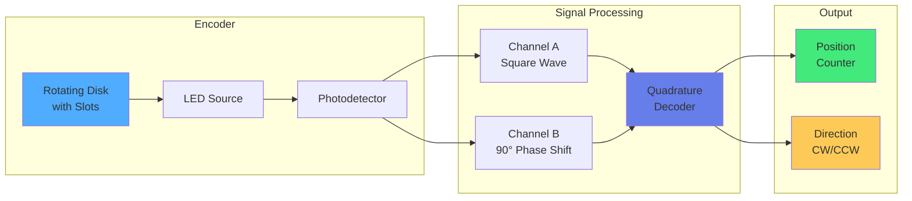

import { useEffect } from 'react';
import AOS from 'aos';
import 'aos/dist/aos.css';
import { ChapterHero, QuizComponent, ExerciseComponent, ChapterNavigation } from '@site/src/components/Chapter';

export function SensorsActuatorsChapter({ children }) {
  useEffect(() => {
    AOS.init({
      duration: 800,
      easing: 'ease-in-out',
      once: true,
      offset: 150,
    });
  }, []);
  return <div>{children}</div>;
}

<SensorsActuatorsChapter>

<ChapterHero
  title="Sensors & Actuators"
  subtitle="The Hardware Foundation of Physical AI"
  icon="⚙️"
/>

<div data-aos="fade-up">

## What You'll Learn

This chapter covers the essential hardware components that enable robots to sense and act:

- **Proprioceptive Sensors**: Encoders, IMUs, force/torque sensors
- **Exteroceptive Sensors**: Range finders, tactile sensors, proximity sensors
- **Actuator Types**: DC motors, servo motors, stepper motors, hydraulics
- **Motor Control**: PWM, PID tuning, torque control
- **Sensor Fusion**: Combining multiple sensor modalities

</div>

---

## Prerequisites

<div data-aos="fade-up">

Before diving into this chapter, you should understand:
- **Chapter 2**: Foundations of Robotics (robot anatomy)
- **Chapter 3**: Perception Systems (sensor basics)
- Basic electronics and control theory

</div>

---

## Proprioceptive Sensors: Internal State Sensing

<div data-aos="fade-right">

**Proprioceptive sensors** measure the robot's own state (joint angles, velocities, forces).

### 1. Encoders

**Encoders** measure rotational position of motors/joints.

**Types**:
- **Incremental encoders**: Count pulses from a known reference
- **Absolute encoders**: Provide unique position at power-on
- **Magnetic encoders**: Use Hall effect sensors (robust to dust)
- **Optical encoders**: Use light interruption patterns (high resolution)

**Resolution**: Measured in Counts Per Revolution (CPR) or Pulses Per Revolution (PPR)
- High-res: 4096-10000 CPR
- Standard: 1000-2048 CPR

</div>

<div data-aos="fade-left">



</div>

<div data-aos="fade-up">

### Encoder Reading Implementation

```python
import RPi.GPIO as GPIO
import time

class QuadratureEncoder:
    def __init__(self, pin_a, pin_b, cpr=1000):
        """
        Quadrature encoder reader

        Args:
            pin_a: GPIO pin for channel A
            pin_b: GPIO pin for channel B
            cpr: Counts per revolution
        """
        self.pin_a = pin_a
        self.pin_b = pin_b
        self.cpr = cpr

        self.position = 0
        self.last_a = 0
        self.last_b = 0

        # Setup GPIO
        GPIO.setmode(GPIO.BCM)
        GPIO.setup(pin_a, GPIO.IN, pull_up_down=GPIO.PUD_UP)
        GPIO.setup(pin_b, GPIO.IN, pull_up_down=GPIO.PUD_UP)

        # Attach interrupt
        GPIO.add_event_detect(pin_a, GPIO.BOTH, callback=self._update)
        GPIO.add_event_detect(pin_b, GPIO.BOTH, callback=self._update)

    def _update(self, channel):
        """Interrupt callback for position update"""
        a = GPIO.input(self.pin_a)
        b = GPIO.input(self.pin_b)

        # Quadrature decoding logic
        if a != self.last_a:
            if a == b:
                self.position += 1  # Clockwise
            else:
                self.position -= 1  # Counter-clockwise

        self.last_a = a
        self.last_b = b

    def get_position(self):
        """Get current position in counts"""
        return self.position

    def get_angle(self):
        """Get angle in radians"""
        return (self.position / self.cpr) * 2 * 3.14159

    def get_revolutions(self):
        """Get number of complete revolutions"""
        return self.position / self.cpr

    def reset(self):
        """Reset position counter"""
        self.position = 0

# Usage
encoder = QuadratureEncoder(pin_a=17, pin_b=18, cpr=2048)

while True:
    pos = encoder.get_position()
    angle = encoder.get_angle()
    revs = encoder.get_revolutions()

    print(f"Position: {pos} counts, Angle: {angle:.2f} rad, Revolutions: {revs:.2f}")
    time.sleep(0.1)
```

</div>

---

## Inertial Measurement Units (IMUs)

<div data-aos="fade-up">

**IMUs** combine accelerometers, gyroscopes, and magnetometers to measure orientation and motion.

### IMU Components

**1. Accelerometer (3-axis)**
- Measures linear acceleration + gravity
- Used for tilt sensing and motion detection
- Range: ±2g to ±16g typical

**2. Gyroscope (3-axis)**
- Measures angular velocity (rad/s)
- High-frequency accuracy but drifts over time
- Range: ±250°/s to ±2000°/s

**3. Magnetometer (3-axis)**
- Measures magnetic field (compass)
- Provides absolute heading reference
- Susceptible to magnetic interference

</div>

<div data-aos="fade-right">

```python
import smbus
import time
import math

class MPU6050_IMU:
    """MPU-6050 6-axis IMU (Accel + Gyro)"""

    # I2C address
    MPU6050_ADDR = 0x68

    # Register addresses
    PWR_MGMT_1 = 0x6B
    ACCEL_XOUT_H = 0x3B
    GYRO_XOUT_H = 0x43

    def __init__(self, bus=1):
        self.bus = smbus.SMBus(bus)

        # Wake up MPU-6050
        self.bus.write_byte_data(self.MPU6050_ADDR, self.PWR_MGMT_1, 0)

        # Calibration offsets
        self.accel_offset = {'x': 0, 'y': 0, 'z': 0}
        self.gyro_offset = {'x': 0, 'y': 0, 'z': 0}

    def read_word(self, reg):
        """Read 16-bit signed value from register"""
        high = self.bus.read_byte_data(self.MPU6050_ADDR, reg)
        low = self.bus.read_byte_data(self.MPU6050_ADDR, reg + 1)

        value = (high << 8) + low

        # Convert to signed
        if value >= 0x8000:
            value = -((65535 - value) + 1)

        return value

    def get_accel_data(self):
        """Read accelerometer data (m/s²)"""
        # Read raw values
        ax = self.read_word(self.ACCEL_XOUT_H)
        ay = self.read_word(self.ACCEL_XOUT_H + 2)
        az = self.read_word(self.ACCEL_XOUT_H + 4)

        # Convert to m/s² (sensitivity: 16384 LSB/g)
        accel_scale = 16384.0
        gravity = 9.81

        accel = {
            'x': (ax / accel_scale) * gravity - self.accel_offset['x'],
            'y': (ay / accel_scale) * gravity - self.accel_offset['y'],
            'z': (az / accel_scale) * gravity - self.accel_offset['z']
        }

        return accel

    def get_gyro_data(self):
        """Read gyroscope data (rad/s)"""
        # Read raw values
        gx = self.read_word(self.GYRO_XOUT_H)
        gy = self.read_word(self.GYRO_XOUT_H + 2)
        gz = self.read_word(self.GYRO_XOUT_H + 4)

        # Convert to rad/s (sensitivity: 131 LSB/°/s)
        gyro_scale = 131.0
        deg_to_rad = math.pi / 180.0

        gyro = {
            'x': (gx / gyro_scale) * deg_to_rad - self.gyro_offset['x'],
            'y': (gy / gyro_scale) * deg_to_rad - self.gyro_offset['y'],
            'z': (gz / gyro_scale) * deg_to_rad - self.gyro_offset['z']
        }

        return gyro

    def calibrate(self, samples=100):
        """Calibrate IMU by averaging readings"""
        print("Calibrating IMU... Keep sensor stationary.")

        accel_sum = {'x': 0, 'y': 0, 'z': 0}
        gyro_sum = {'x': 0, 'y': 0, 'z': 0}

        for _ in range(samples):
            accel = self.get_accel_data()
            gyro = self.get_gyro_data()

            accel_sum['x'] += accel['x']
            accel_sum['y'] += accel['y']
            accel_sum['z'] += accel['z']

            gyro_sum['x'] += gyro['x']
            gyro_sum['y'] += gyro['y']
            gyro_sum['z'] += gyro['z']

            time.sleep(0.01)

        # Average
        self.accel_offset['x'] = accel_sum['x'] / samples
        self.accel_offset['y'] = accel_sum['y'] / samples
        self.accel_offset['z'] = (accel_sum['z'] / samples) - 9.81  # Remove gravity

        self.gyro_offset['x'] = gyro_sum['x'] / samples
        self.gyro_offset['y'] = gyro_sum['y'] / samples
        self.gyro_offset['z'] = gyro_sum['z'] / samples

        print("Calibration complete!")

    def get_orientation(self):
        """Estimate orientation from accelerometer (roll, pitch)"""
        accel = self.get_accel_data()

        # Roll (rotation around x-axis)
        roll = math.atan2(accel['y'], accel['z'])

        # Pitch (rotation around y-axis)
        pitch = math.atan2(-accel['x'], math.sqrt(accel['y']**2 + accel['z']**2))

        return roll, pitch

# Usage
imu = MPU6050_IMU()
imu.calibrate()

while True:
    accel = imu.get_accel_data()
    gyro = imu.get_gyro_data()
    roll, pitch = imu.get_orientation()

    print(f"Accel: {accel['x']:.2f}, {accel['y']:.2f}, {accel['z']:.2f} m/s²")
    print(f"Gyro: {gyro['x']:.2f}, {gyro['y']:.2f}, {gyro['z']:.2f} rad/s")
    print(f"Orientation: Roll={math.degrees(roll):.1f}°, Pitch={math.degrees(pitch):.1f}°")
    print()

    time.sleep(0.1)
```

</div>

---

## Actuators: Creating Motion

<div data-aos="fade-up">

### DC Motors

**DC (Direct Current) motors** are the workhorses of robotics.

**Characteristics**:
- Speed proportional to voltage
- Torque proportional to current
- Simple control via PWM (Pulse Width Modulation)

**Types**:
- **Brushed DC**: Simple, cheap, requires maintenance
- **Brushless DC (BLDC)**: Efficient, high power, requires ESC

</div>

<div data-aos="fade-left">

```mermaid
flowchart TB
    %% Title: DC Motor Control System

    subgraph "Control"
        MCU[Microcontroller] --> PWM[PWM Signal<br/>0-100% Duty Cycle]
    end

    subgraph "Driver"
        PWM --> Driver[Motor Driver<br/>H-Bridge]
        Driver --> Dir[Direction<br/>Forward/Reverse]
    end

    subgraph "Motor"
        Dir --> Motor[DC Motor]
        Motor --> Load[Mechanical<br/>Load]
    end

    subgraph "Feedback"
        Motor --> Encoder[Encoder]
        Encoder --> MCU
    end

    style MCU fill:#4facfe
    style Driver fill:#667eea
    style Motor fill:#43e97b
    style Encoder fill:#f093fb
```

</div>

<div data-aos="fade-right">

### Motor Control with PID

```python
import RPi.GPIO as GPIO
import time

class DCMotorController:
    def __init__(self, pwm_pin, dir_pin1, dir_pin2, encoder, kp=1.0, ki=0.1, kd=0.05):
        """
        DC motor controller with PID

        Args:
            pwm_pin: GPIO pin for PWM speed control
            dir_pin1, dir_pin2: H-bridge direction pins
            encoder: QuadratureEncoder instance
            kp, ki, kd: PID gains
        """
        self.pwm_pin = pwm_pin
        self.dir_pin1 = dir_pin1
        self.dir_pin2 = dir_pin2
        self.encoder = encoder

        # PID parameters
        self.kp = kp
        self.ki = ki
        self.kd = kd

        self.integral = 0
        self.prev_error = 0
        self.prev_time = time.time()

        # Setup GPIO
        GPIO.setmode(GPIO.BCM)
        GPIO.setup(pwm_pin, GPIO.OUT)
        GPIO.setup(dir_pin1, GPIO.OUT)
        GPIO.setup(dir_pin2, GPIO.OUT)

        # Setup PWM (1 kHz frequency)
        self.pwm = GPIO.PWM(pwm_pin, 1000)
        self.pwm.start(0)

    def set_direction(self, direction):
        """Set motor direction: 1=forward, -1=reverse, 0=brake"""
        if direction > 0:
            GPIO.output(self.dir_pin1, GPIO.HIGH)
            GPIO.output(self.dir_pin2, GPIO.LOW)
        elif direction < 0:
            GPIO.output(self.dir_pin1, GPIO.LOW)
            GPIO.output(self.dir_pin2, GPIO.HIGH)
        else:
            GPIO.output(self.dir_pin1, GPIO.LOW)
            GPIO.output(self.dir_pin2, GPIO.LOW)

    def set_speed(self, speed):
        """Set motor speed: -100 to +100"""
        # Clamp speed
        speed = max(-100, min(100, speed))

        # Set direction
        self.set_direction(1 if speed >= 0 else -1)

        # Set PWM duty cycle
        self.pwm.ChangeDutyCycle(abs(speed))

    def pid_control(self, target_velocity):
        """
        PID velocity control

        Args:
            target_velocity: desired velocity (rad/s)

        Returns:
            control_output: PWM duty cycle (-100 to 100)
        """
        current_time = time.time()
        dt = current_time - self.prev_time

        # Current velocity (from encoder)
        current_pos = self.encoder.get_angle()
        current_velocity = (current_pos - self.prev_pos) / dt if dt > 0 else 0
        self.prev_pos = current_pos

        # Error
        error = target_velocity - current_velocity

        # Proportional
        p_term = self.kp * error

        # Integral (with anti-windup)
        self.integral += error * dt
        self.integral = max(-10, min(10, self.integral))  # Clamp
        i_term = self.ki * self.integral

        # Derivative
        derivative = (error - self.prev_error) / dt if dt > 0 else 0
        d_term = self.kd * derivative

        # Control output
        control = p_term + i_term + d_term

        # Update state
        self.prev_error = error
        self.prev_time = current_time

        # Convert to PWM duty cycle (-100 to 100)
        pwm_output = max(-100, min(100, control * 10))

        return pwm_output

    def velocity_control_loop(self, target_velocity, duration):
        """Run velocity control for specified duration"""
        self.prev_pos = self.encoder.get_angle()
        self.prev_time = time.time()

        start_time = time.time()
        while time.time() - start_time < duration:
            # Compute control output
            pwm = self.pid_control(target_velocity)

            # Apply to motor
            self.set_speed(pwm)

            time.sleep(0.01)  # 100 Hz control loop

    def stop(self):
        """Stop motor"""
        self.set_speed(0)
        self.pwm.stop()

# Usage
encoder = QuadratureEncoder(pin_a=17, pin_b=18, cpr=2048)
motor = DCMotorController(
    pwm_pin=12,
    dir_pin1=23,
    dir_pin2=24,
    encoder=encoder,
    kp=2.0, ki=0.5, kd=0.1
)

try:
    # Run at 10 rad/s for 5 seconds
    motor.velocity_control_loop(target_velocity=10.0, duration=5.0)
finally:
    motor.stop()
    GPIO.cleanup()
```

</div>

---

## Force and Torque Sensors

<div data-aos="fade-up">

**Force/Torque (F/T) sensors** measure interaction forces, critical for:
- Contact detection
- Compliant control
- Assembly tasks
- Human-robot interaction safety

**Types**:
- **Strain gauge**: Measures deformation under load
- **Piezoelectric**: Generates voltage under force
- **Capacitive**: Changes capacitance under pressure

**6-axis F/T sensor** measures: Fx, Fy, Fz (forces) and Tx, Ty, Tz (torques)

</div>

---

## Exercises

<ExerciseComponent
  exercise={{
    id: 'sensors-ex1',
    title: 'Encoder Resolution Calculation',
    objective: 'Understand encoder resolution and position accuracy',
    instructions: `
A quadrature encoder is mounted on a robot wheel.

**Given:**
- Encoder resolution: 2048 CPR (counts per revolution)
- Wheel diameter: 10 cm
- Gear ratio: 20:1 (motor to wheel)

**Tasks:**
1. How many encoder counts per wheel revolution?
2. What linear distance does the wheel travel per encoder count?
3. If encoder reads 40960 counts, how far has the robot moved?
4. What is the position resolution in mm?
`,
    expectedOutcome: 'Counts per wheel rev: 40960, Distance per count: 0.0077 mm, Total distance: 31.42 cm',
    hints: [
      'Gear ratio multiplies encoder counts',
      'Wheel circumference = π × diameter',
      'Resolution = circumference / counts_per_revolution'
    ],
    solution: `
import math

# Given
encoder_cpr = 2048  # counts per motor revolution
wheel_diameter = 0.10  # meters (10 cm)
gear_ratio = 20  # motor revolutions per wheel revolution

# Task 1: Counts per wheel revolution
counts_per_wheel_rev = encoder_cpr * gear_ratio
print(f"Counts per wheel revolution: {counts_per_wheel_rev}")

# Task 2: Distance per encoder count
wheel_circumference = math.pi * wheel_diameter
distance_per_count = wheel_circumference / counts_per_wheel_rev
print(f"Distance per count: {distance_per_count * 1000:.4f} mm")

# Task 3: Distance for 40960 counts
encoder_counts = 40960
total_distance = encoder_counts * distance_per_count
print(f"Total distance: {total_distance * 100:.2f} cm")

# Task 4: Position resolution
print(f"Position resolution: {distance_per_count * 1000:.4f} mm")

# Output:
# Counts per wheel revolution: 40960
# Distance per count: 0.0077 mm
# Total distance: 31.42 cm
# Position resolution: 0.0077 mm
`,
    difficulty: 'medium',
    estimatedTime: 15
  }}
/>

<ExerciseComponent
  exercise={{
    id: 'sensors-ex2',
    title: 'IMU Orientation from Accelerometer',
    objective: 'Calculate roll and pitch from accelerometer data',
    instructions: `
An IMU accelerometer reports the following readings:

**Accelerometer data (m/s²):**
- ax = 0.5
- ay = 2.0
- az = 9.5

**Tasks:**
1. Calculate roll angle (rotation around x-axis)
2. Calculate pitch angle (rotation around y-axis)
3. Verify: Does the magnitude equal gravity (9.81 m/s²)?

**Formulas:**
- Roll: θ_roll = atan2(ay, az)
- Pitch: θ_pitch = atan2(-ax, sqrt(ay² + az²))
- Magnitude: |a| = sqrt(ax² + ay² + az²)
`,
    expectedOutcome: 'Roll: 11.9°, Pitch: -3.0°, Magnitude: 9.79 m/s²',
    hints: [
      'Use atan2 for correct quadrant handling',
      'Angles in radians, convert to degrees',
      'Magnitude should be close to 9.81 m/s²'
    ],
    solution: `
import math

# Given accelerometer data
ax = 0.5   # m/s²
ay = 2.0
az = 9.5

# Task 1: Calculate roll (rotation around x-axis)
roll_rad = math.atan2(ay, az)
roll_deg = math.degrees(roll_rad)
print(f"Roll: {roll_deg:.1f}°")

# Task 2: Calculate pitch (rotation around y-axis)
pitch_rad = math.atan2(-ax, math.sqrt(ay**2 + az**2))
pitch_deg = math.degrees(pitch_rad)
print(f"Pitch: {pitch_deg:.1f}°")

# Task 3: Verify magnitude
magnitude = math.sqrt(ax**2 + ay**2 + az**2)
print(f"Magnitude: {magnitude:.2f} m/s²")
print(f"Expected gravity: 9.81 m/s²")
print(f"Difference: {abs(magnitude - 9.81):.2f} m/s²")

# Output:
# Roll: 11.9°
# Pitch: -3.0°
# Magnitude: 9.79 m/s²
# Expected gravity: 9.81 m/s²
# Difference: 0.02 m/s² (good!)
`,
    difficulty: 'medium',
    estimatedTime: 15
  }}
/>

---

## Quiz

<QuizComponent
  questions={[
    {
      id: 'sensors-q1',
      question: 'What is the main advantage of absolute encoders over incremental encoders?',
      options: [
        { label: 'A', value: 'option-a', text: 'Absolute encoders are cheaper' },
        { label: 'B', value: 'option-b', text: 'Absolute encoders provide unique position information immediately at power-on' },
        { label: 'C', value: 'option-c', text: 'Absolute encoders have higher resolution' },
        { label: 'D', value: 'option-d', text: 'Absolute encoders are smaller' }
      ],
      correctAnswer: 'option-b',
      explanation: 'Absolute encoders provide a unique position code for every shaft angle, allowing immediate position knowledge at power-on without homing. Incremental encoders require a reference point and count relative changes.'
    },
    {
      id: 'sensors-q2',
      question: 'Why do gyroscopes drift over time?',
      options: [
        { label: 'A', value: 'option-a', text: 'They are affected by temperature changes' },
        { label: 'B', value: 'option-b', text: 'Integration of measurement noise and bias accumulates errors' },
        { label: 'C', value: 'option-c', text: 'They lose calibration' },
        { label: 'D', value: 'option-d', text: 'Magnetic interference causes drift' }
      ],
      correctAnswer: 'option-b',
      explanation: 'Gyroscopes measure angular velocity, which must be integrated to get orientation. Small measurement errors (bias and noise) accumulate over time through integration, causing drift. This is why IMUs combine gyros with accelerometers and magnetometers.'
    },
    {
      id: 'sensors-q3',
      question: 'What does PWM (Pulse Width Modulation) control in DC motors?',
      options: [
        { label: 'A', value: 'option-a', text: 'Motor direction' },
        { label: 'B', value: 'option-b', text: 'Motor speed by varying the average voltage' },
        { label: 'C', value: 'option-c', text: 'Motor temperature' },
        { label: 'D', value: 'option-d', text: 'Motor position' }
      ],
      correctAnswer: 'option-b',
      explanation: 'PWM controls motor speed by rapidly switching power on/off. The duty cycle (percentage on-time) determines average voltage: 50% duty = 50% voltage = 50% speed. Direction is controlled separately via H-bridge.'
    },
    {
      id: 'sensors-q4',
      question: 'What is quadrature encoding in rotary encoders?',
      options: [
        { label: 'A', value: 'option-a', text: 'Using four photodetectors' },
        { label: 'B', value: 'option-b', text: 'Using two channels with 90° phase shift to determine direction and increase resolution' },
        { label: 'C', value: 'option-c', text: 'Encoding position in four quadrants' },
        { label: 'D', value: 'option-d', text: 'Measuring position four times per revolution' }
      ],
      correctAnswer: 'option-b',
      explanation: 'Quadrature encoding uses two channels (A and B) offset by 90°. The phase relationship determines rotation direction: A leads B = clockwise, B leads A = counterclockwise. It also provides 4× resolution (count on both edges of both channels).'
    },
    {
      id: 'sensors-q5',
      question: 'Why are force/torque sensors important for human-robot interaction?',
      options: [
        { label: 'A', value: 'option-a', text: 'They make robots faster' },
        { label: 'B', value: 'option-b', text: 'They enable robots to detect contact and react safely, preventing injury' },
        { label: 'C', value: 'option-c', text: 'They improve robot vision' },
        { label: 'D', value: 'option-d', text: 'They reduce power consumption' }
      ],
      correctAnswer: 'option-b',
      explanation: 'F/T sensors allow robots to detect unexpected contact with humans and immediately react (stop or comply) to prevent injury. This is critical for collaborative robots (cobots) working alongside humans. They also enable compliant manipulation and assembly tasks.'
    }
  ]}
/>

---

## Summary

<div data-aos="fade-up">

**Key Takeaways:**

- **Encoders** provide precise position feedback essential for closed-loop control
- **IMUs** combine accelerometers, gyroscopes, and magnetometers for robust orientation estimation
- **DC motors** with PWM and PID control enable accurate velocity and position control
- **Force/torque sensors** enable safe human-robot interaction and compliant manipulation
- **Sensor fusion** combines multiple modalities to overcome individual sensor limitations

Modern robots integrate dozens of sensors and actuators, requiring careful calibration, filtering, and control to achieve robust performance in unstructured environments.

</div>

<ChapterNavigation
  previousChapter={{
    url: '/docs/robot-vision',
    title: 'Chapter 6: Robot Vision'
  }}
  nextChapter={{
    url: '/docs/control-theory',
    title: 'Chapter 8: Control Theory & Stability'
  }}
/>

</SensorsActuatorsChapter>
