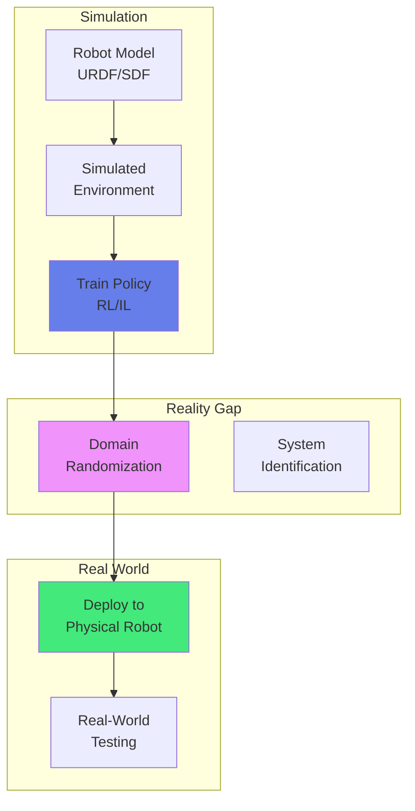
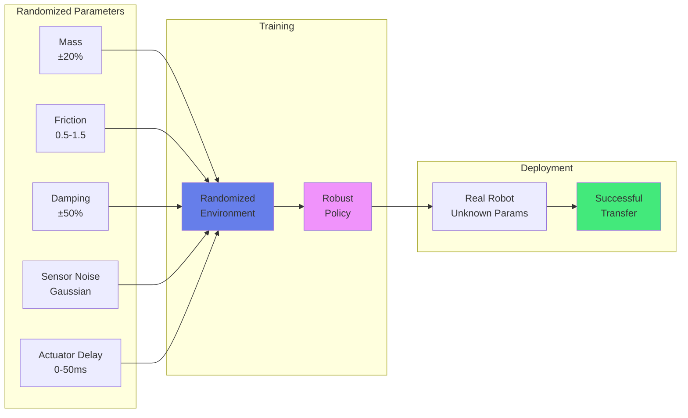

import { useEffect } from 'react';
import AOS from 'aos';
import 'aos/dist/aos.css';
import { ChapterHero, QuizComponent, ExerciseComponent, ChapterNavigation } from '@site/src/components/Chapter';

export function SimulationChapter({ children }) {
  useEffect(() => {
    AOS.init({ duration: 800, easing: 'ease-in-out', once: true, offset: 150 });
  }, []);
  return <div>{children}</div>;
}

<SimulationChapter>

<ChapterHero title="Simulation & Digital Twins" subtitle="Testing Robots in Virtual Worlds" icon="🎮" />

## Overview

Simulation is the backbone of modern robotics development, enabling safe, fast, and cost-effective testing and training of robotic systems. Virtual environments allow engineers to iterate quickly, test edge cases, and train machine learning models with millions of interactions—tasks that would be prohibitively expensive, dangerous, or time-consuming in the real world. With advances in GPU-accelerated physics engines and photorealistic rendering, simulation has become an indispensable tool for developing everything from manipulation policies to autonomous navigation systems.

### Why Simulation?

**Benefits:**

**1. Safety**: Test dangerous scenarios without risking hardware or human safety
- Collision testing at high speeds
- Manipulation of hazardous materials
- Navigation in disaster scenarios
- Failure mode analysis

**2. Speed**: Massively accelerate development cycles
- Run 10-1000× faster than real-time
- Parallelize experiments across thousands of virtual robots
- Train reinforcement learning agents with millions of episodes in hours

**3. Cost**: Eliminate hardware costs and maintenance
- No robot wear and tear from repeated trials
- Test expensive prototypes before physical construction
- Iterate on design without manufacturing costs

**4. Reproducibility**: Perfect experimental control
- Deterministic physics for debugging
- Exact scenario replay for regression testing
- Controlled randomization for robustness testing

**5. Scale**: Massive parallelization
- Train thousands of robots simultaneously on GPU clusters
- Test policies across diverse environments
- Generate synthetic training data at scale

**Challenges:**

**1. Sim-to-Real Gap**: Physics approximations don't perfectly match reality
- Contact dynamics simplified (friction models, soft contact)
- Sensor noise characteristics differ
- Actuator dynamics and delays not perfectly modeled
- Material properties (compliance, deformation) approximated

**2. Computational Cost**: High-fidelity simulation is computationally expensive
- Accurate contact requires small timesteps
- Photorealistic rendering for vision requires GPUs
- Deformable objects exponentially increase complexity

**3. Model Fidelity**: Complex phenomena are difficult to simulate accurately
- Soft bodies and deformables (cloth, liquids)
- Aerodynamics and fluid dynamics
- Cable/rope dynamics
- Granular materials (sand, gravel)

### Popular Simulators

**1. MuJoCo (Multi-Joint dynamics with Contact)**
- Fast, accurate physics engine designed for robotics and biomechanics
- Efficient contact solver with convex optimization
- Native support for articulated bodies
- Python and C++ APIs
- Use cases: Manipulation, locomotion, biomechanics
- Free since 2021 (acquired by DeepMind)

**2. PyBullet**
- Python bindings for Bullet physics engine
- Excellent for reinforcement learning research
- Built-in support for URDF robot models
- Direct/inverse kinematics, collision detection
- Use cases: RL research, educational robotics

**3. NVIDIA Isaac Sim**
- GPU-accelerated physics (PhysX)
- Photorealistic rendering with ray tracing
- Massive parallelization (10,000+ robots on single GPU)
- ROS/ROS2 integration
- Use cases: Warehouse automation, manipulation, perception training

**4. Gazebo**
- Open-source, ROS-integrated simulator
- Wide plugin ecosystem
- Multiple physics engines (ODE, Bullet, DART, Simbody)
- Use cases: Academic research, mobile robotics, multi-robot systems

**5. Webots**
- Cross-platform, user-friendly interface
- Built-in robot models (mobile robots, manipulators, humanoids)
- Python, C++, Java, MATLAB APIs
- Use cases: Education, service robotics



### Bridging the Sim-to-Real Gap

The sim-to-real gap is the performance difference between simulation-trained policies and their real-world deployment. Several techniques mitigate this gap:

**1. Domain Randomization:**

Randomize simulation parameters during training to create robust policies that generalize to real-world variations.

```python
import numpy as np
import mujoco

class DomainRandomizer:
    def __init__(self, model):
        self.model = model
        self.default_params = self.save_defaults()

    def save_defaults(self):
        """Save default simulation parameters"""
        return {
            'body_mass': self.model.body_mass.copy(),
            'geom_friction': self.model.geom_friction.copy(),
            'dof_damping': self.model.dof_damping.copy(),
            'actuator_gainprm': self.model.actuator_gainprm.copy(),
        }

    def randomize(self):
        """Randomize physics parameters"""
        # Randomize link masses (±20%)
        mass_scale = np.random.uniform(0.8, 1.2, len(self.model.body_mass))
        self.model.body_mass[:] = self.default_params['body_mass'] * mass_scale

        # Randomize friction coefficients
        for i in range(len(self.model.geom_friction)):
            self.model.geom_friction[i] = [
                np.random.uniform(0.5, 1.5),  # Sliding friction
                np.random.uniform(0.005, 0.015),  # Torsional friction
                np.random.uniform(0.0001, 0.001)  # Rolling friction
            ]

        # Randomize joint damping (±50%)
        damping_scale = np.random.uniform(0.5, 1.5, len(self.model.dof_damping))
        self.model.dof_damping[:] = self.default_params['dof_damping'] * damping_scale

        # Randomize actuator gains (±30%)
        gain_scale = np.random.uniform(0.7, 1.3, len(self.model.actuator_gainprm))
        self.model.actuator_gainprm[:, 0] = self.default_params['actuator_gainprm'][:, 0] * gain_scale

    def reset_to_defaults(self):
        """Restore default parameters"""
        self.model.body_mass[:] = self.default_params['body_mass']
        self.model.geom_friction[:] = self.default_params['geom_friction']
        self.model.dof_damping[:] = self.default_params['dof_damping']
        self.model.actuator_gainprm[:] = self.default_params['actuator_gainprm']
```

**2. System Identification:**

Measure real robot parameters and update simulation to match physical hardware.

**3. Residual RL:**

Train a correction policy in the real world that compensates for sim-to-real errors:
- π_real(s) = π_sim(s) + π_residual(s)

**4. Adversarial Training:**

Train policies against worst-case simulation perturbations to improve robustness.

**5. Sim-to-Sim Transfer:**

Validate transfer between different simulators before deploying to hardware.



### Digital Twins

A **digital twin** is a virtual replica of a physical robot or system that mirrors its real-time state, behavior, and performance. Digital twins enable continuous monitoring, predictive analytics, and virtual testing without disrupting operations.

**Key Components:**

**1. Physical Robot**: The real hardware equipped with sensors
**2. Virtual Model**: High-fidelity simulation matching physical robot
**3. Data Pipeline**: Real-time sensor data streaming to digital twin
**4. Analytics Engine**: Processes data for insights and predictions
**5. Bi-directional Sync**: Commands tested in twin before deployment

**Applications:**

**1. Predictive Maintenance**
- Monitor motor currents, temperatures, vibrations
- Detect anomalies indicating impending failures
- Schedule maintenance before breakdowns
- Reduce downtime by 30-50%

**2. Performance Optimization**
- Test parameter changes virtually before deployment
- A/B test control algorithms
- Optimize energy efficiency
- Tune trajectories for speed/smoothness

**3. Remote Monitoring and Diagnostics**
- Track fleet status across multiple sites
- Visualize robot states in 3D dashboard
- Replay historical data for debugging
- Remote troubleshooting by experts

**4. Training and Simulation**
- Train operators on digital twin before using real robot
- Simulate emergency scenarios safely
- Test new tasks before deployment

**Example: Digital Twin Architecture**

```python
import asyncio
import numpy as np
from dataclasses import dataclass
from typing import Dict, List

@dataclass
class RobotState:
    timestamp: float
    joint_positions: np.ndarray
    joint_velocities: np.ndarray
    joint_torques: np.ndarray
    end_effector_pose: np.ndarray
    battery_level: float
    temperature: np.ndarray

class DigitalTwin:
    def __init__(self, robot_id: str, sim_model):
        self.robot_id = robot_id
        self.sim_model = sim_model  # MuJoCo/PyBullet model
        self.state_history: List[RobotState] = []
        self.anomaly_threshold = 3.0  # Standard deviations

    async def sync_from_physical(self, physical_state: RobotState):
        """Update digital twin with real robot state"""
        self.state_history.append(physical_state)

        # Update simulation state to match physical robot
        self.sim_model.data.qpos[:] = physical_state.joint_positions
        self.sim_model.data.qvel[:] = physical_state.joint_velocities

        # Run anomaly detection
        anomalies = self.detect_anomalies(physical_state)
        if anomalies:
            await self.alert_operator(anomalies)

    def detect_anomalies(self, state: RobotState) -> List[str]:
        """Detect deviations from expected behavior"""
        anomalies = []

        # Compare measured vs expected torques
        expected_torques = self.sim_model.inverse_dynamics()
        torque_error = np.abs(state.joint_torques - expected_torques)
        torque_std = np.std([s.joint_torques for s in self.state_history[-100:]], axis=0)

        if np.any(torque_error > self.anomaly_threshold * torque_std):
            anomalies.append("Abnormal joint torques detected")

        # Temperature monitoring
        if np.any(state.temperature > 70):  # Celsius
            anomalies.append(f"High temperature: {np.max(state.temperature):.1f}°C")

        # Battery health
        if state.battery_level < 15:
            anomalies.append(f"Low battery: {state.battery_level:.1f}%")

        return anomalies

    def predict_remaining_useful_life(self, component: str) -> float:
        """Predict time until component failure"""
        # Analyze historical degradation patterns
        # Use ML model trained on fleet data
        # Return estimated hours until maintenance needed
        pass

    def test_command_virtually(self, command: np.ndarray) -> Dict:
        """Simulate command before sending to physical robot"""
        # Save current state
        saved_state = self.sim_model.get_state()

        # Execute command in simulation
        for _ in range(100):  # Simulate 1 second
            self.sim_model.set_control(command)
            self.sim_model.step()

        # Check for collisions, joint limits, stability
        results = {
            'safe': self.check_safety(),
            'expected_outcome': self.sim_model.get_end_effector_pose(),
            'energy_consumption': self.estimate_energy(),
        }

        # Restore state
        self.sim_model.set_state(saved_state)

        return results

    async def alert_operator(self, anomalies: List[str]):
        """Send alerts to operator dashboard"""
        print(f"[ALERT] Robot {self.robot_id}: {anomalies}")
        # Send to monitoring system, SMS, email, etc.
```

### MuJoCo Example: Robot Simulation

```python
import mujoco
import numpy as np

class MuJoCoRobotSim:
    def __init__(self, model_path: str):
        """Load robot model from XML"""
        self.model = mujoco.MjModel.from_xml_path(model_path)
        self.data = mujoco.MjData(self.model)
        self.renderer = mujoco.Renderer(self.model, height=480, width=640)

    def step(self, ctrl: np.ndarray, n_steps: int = 1):
        """Simulate n_steps with control input"""
        self.data.ctrl[:] = ctrl
        for _ in range(n_steps):
            mujoco.mj_step(self.model, self.data)

    def get_state(self):
        """Get joint positions and velocities"""
        return {
            'qpos': self.data.qpos.copy(),
            'qvel': self.data.qvel.copy(),
            'time': self.data.time
        }

    def set_state(self, qpos, qvel):
        """Set robot state"""
        self.data.qpos[:] = qpos
        self.data.qvel[:] = qvel
        mujoco.mj_forward(self.model, self.data)

    def render(self):
        """Render current scene"""
        self.renderer.update_scene(self.data)
        return self.renderer.render()

    def inverse_dynamics(self):
        """Compute required torques for current acceleration"""
        qfrc = np.zeros(self.model.nv)
        mujoco.mj_inverse(self.model, self.data)
        return self.data.qfrc_inverse.copy()
```

---

## Exercises

<ExerciseComponent
  exercise={{
    id: 'sim-ex1',
    title: 'Simulation Speedup Calculation',
    objective: 'Calculate training time advantage',
    instructions: 'Real robot collects 1 experience per second. Simulator runs 100× real-time with 10 parallel instances. How much faster is data collection?',
    expectedOutcome: '1000× faster data collection',
    hints: ['Multiply speedup by parallel instances', 'Compare to single real robot'],
    solution: 'speedup = 100 (real-time factor) × 10 (parallel) = 1000× faster than real robot',
    difficulty: 'easy',
    estimatedTime: 5
  }}
/>

<ExerciseComponent
  exercise={{
    id: 'sim-ex2',
    title: 'Domain Randomization Parameters',
    objective: 'Understand randomization for robustness',
    instructions: 'List 5 parameters to randomize in simulation to improve sim-to-real transfer for a mobile robot.',
    expectedOutcome: 'Mass, friction, actuator noise, sensor noise, floor texture',
    hints: ['Think about physics parameters', 'Consider sensor imperfections', 'Vary environmental conditions'],
    solution: '1. Robot mass (±20%), 2. Wheel friction (0.5-1.5), 3. Motor response delay (0-50ms), 4. Sensor noise (Gaussian), 5. Floor material properties',
    difficulty: 'medium',
    estimatedTime: 10
  }}
/>

---

## Quiz

<QuizComponent
  questions={[
    { id: 'sim-q1', question: 'What is the primary advantage of robot simulation?', options: [{ label: 'A', value: 'option-a', text: 'More accurate than real world' }, { label: 'B', value: 'option-b', text: 'Safe, fast, and cost-effective testing and training' }, { label: 'C', value: 'option-c', text: 'Eliminates need for real robots' }, { label: 'D', value: 'option-d', text: 'Perfect physics modeling' }], correctAnswer: 'option-b', explanation: 'Simulation provides safe, fast, and economical development environments, though it complements rather than replaces real-world testing.' },
    { id: 'sim-q2', question: 'What is the sim-to-real gap?', options: [{ label: 'A', value: 'option-a', text: 'Physical distance between simulator and robot' }, { label: 'B', value: 'option-b', text: 'Difference between simulated and real-world physics causing policies to fail in reality' }, { label: 'C', value: 'option-c', text: 'Time delay in simulation' }, { label: 'D', value: 'option-d', text: 'Cost difference' }], correctAnswer: 'option-b', explanation: 'The sim-to-real gap refers to discrepancies between simulated and real physics (friction, contact, dynamics) that cause simulation-trained policies to underperform on real robots.' },
    { id: 'sim-q3', question: 'What is domain randomization?', options: [{ label: 'A', value: 'option-a', text: 'Random robot movements' }, { label: 'B', value: 'option-b', text: 'Training on varied simulation parameters to improve real-world generalization' }, { label: 'C', value: 'option-c', text: 'Random algorithm selection' }, { label: 'D', value: 'option-d', text: 'Shuffling training data' }], correctAnswer: 'option-b', explanation: 'Domain randomization varies physics parameters (mass, friction, noise) during training, creating robust policies that generalize to real-world variations.' },
    { id: 'sim-q4', question: 'What is a digital twin?', options: [{ label: 'A', value: 'option-a', text: 'Two identical robots' }, { label: 'B', value: 'option-b', text: 'A virtual replica that mirrors the real-time state of a physical robot' }, { label: 'C', value: 'option-c', text: 'A backup robot' }, { label: 'D', value: 'option-d', text: 'A simulation algorithm' }], correctAnswer: 'option-b', explanation: 'A digital twin is a virtual model synchronized with a physical robot, enabling monitoring, prediction, and optimization without disrupting operations.' },
    { id: 'sim-q5', question: 'Why is MuJoCo popular for robot learning?', options: [{ label: 'A', value: 'option-a', text: 'It has the best graphics' }, { label: 'B', value: 'option-b', text: 'Fast, accurate physics simulation optimized for contact-rich manipulation and locomotion' }, { label: 'C', value: 'option-c', text: 'It is the only free simulator' }, { label: 'D', value: 'option-d', text: 'It requires no programming' }], correctAnswer: 'option-b', explanation: 'MuJoCo provides fast, stable physics simulation with accurate contact modeling, making it ideal for RL tasks requiring millions of simulated interactions.' }
  ]}
/>

## Summary

Simulation has become the backbone of modern robotics development, enabling safe, fast, and cost-effective testing and training at scales impossible in the physical world. GPU-accelerated physics engines like MuJoCo, Isaac Sim, and PyBullet allow researchers to train policies with millions of interactions in hours rather than months. The sim-to-real gap, while challenging, can be effectively bridged through techniques like domain randomization, system identification, and residual learning. Digital twins extend simulation's value to deployed systems, providing real-time monitoring, predictive maintenance, and virtual testing capabilities that reduce downtime and optimize performance. As simulation fidelity improves and computational costs decrease, the line between virtual and physical robotics development continues to blur, making simulation an indispensable tool for roboticists worldwide.

<ChapterNavigation
  previousChapter={{
    url: '/docs/autonomous-navigation',
    title: 'Chapter 10: Autonomous Navigation'
  }}
  nextChapter={{
    url: '/docs/locomotion',
    title: 'Chapter 12: Humanoid Locomotion'
  }}
/>

</SimulationChapter>
