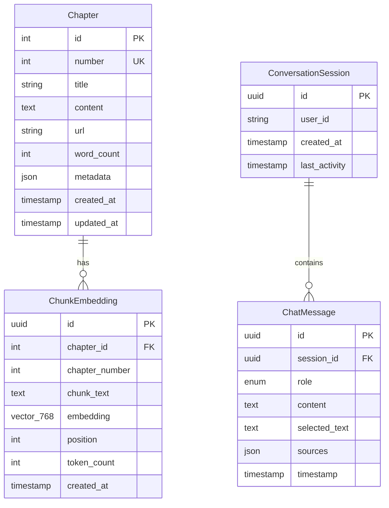

# Data Models: RAG Chatbot

**Feature**: RAG Chatbot for Physical AI Book
**Date**: 2025-12-07
**Purpose**: Define data structures for chapters, embeddings, conversations, and query contexts

---

## Chapter

Represents a single chapter from the Physical AI Docusaurus book.

### Attributes

| Field | Type | Constraints | Description |
|-------|------|-------------|-------------|
| `id` | Integer | Primary Key, Auto-increment | Unique chapter identifier (matches chapter number for simplicity) |
| `number` | Integer | NOT NULL, Unique | Chapter number (1-15 for Physical AI book) |
| `title` | String(255) | NOT NULL | Chapter title (e.g., "Introduction to Physical AI") |
| `content` | Text | NOT NULL | Full markdown content of the chapter (without frontmatter) |
| `url` | String(512) | NOT NULL | Relative URL path in Docusaurus site (e.g., "/docs/intro") |
| `word_count` | Integer | NOT NULL | Total word count for the chapter |
| `metadata` | JSON | Optional | Additional metadata (code_examples: int, diagrams: int, author: str, etc.) |
| `created_at` | Timestamp | NOT NULL, Default: NOW() | When chapter was ingested |
| `updated_at` | Timestamp | NOT NULL, Default: NOW() | Last time chapter was re-ingested |

### Relationships

- **1:N with ChunkEmbedding**: One chapter has many chunk embeddings
- Stored in: Not persisted in Postgres (chapters parsed from Docusaurus markdown on-the-fly during ingestion). Metadata optionally cached in Qdrant payload.

### Validation Rules

- `number` must be unique and positive (1-N)
- `content` must not be empty
- `url` must start with "/" (relative path)
- `word_count` must be >= 0

### State Transitions

N/A (chapters are read-only after ingestion; updates handled by re-running ingestion pipeline)

---

## ChunkEmbedding

Represents a semantic chunk of chapter content with its vector embedding.

### Attributes

| Field | Type | Constraints | Description |
|-------|------|-------------|-------------|
| `id` | UUID | Primary Key | Unique chunk identifier (generated during embedding) |
| `chapter_id` | Integer | NOT NULL, Foreign Key → Chapter.id | Reference to parent chapter |
| `chapter_number` | Integer | NOT NULL | Denormalized chapter number for quick filtering |
| `chunk_text` | Text | NOT NULL | Raw text content of the chunk (512-1024 tokens) |
| `embedding` | Vector(768) | NOT NULL | 768-dimensional embedding vector (Gemini text-embedding-004) |
| `position` | Integer | NOT NULL | Ordinal position of chunk within chapter (0-indexed) |
| `token_count` | Integer | NOT NULL | Exact token count for this chunk |
| `created_at` | Timestamp | NOT NULL, Default: NOW() | When embedding was generated |

### Relationships

- **N:1 with Chapter**: Many chunks belong to one chapter
- Stored in: Qdrant Cloud (vector database)

### Validation Rules

- `chunk_text` must not be empty
- `embedding` must have exactly 768 dimensions (Gemini model size)
- `position` must be >= 0 and unique within a chapter
- `token_count` must be between 256-1024 (chunking strategy bounds)

### State Transitions

N/A (embeddings are immutable; updates handled by deleting old chapter chunks and re-embedding)

### Qdrant Schema

```json
{
  "collection_name": "physical_ai_book_chunks",
  "vector_size": 768,
  "distance": "Cosine",
  "payload_schema": {
    "chapter_id": "integer",
    "chapter_number": "integer",
    "chapter_title": "keyword",
    "chunk_text": "text",
    "position": "integer",
    "token_count": "integer",
    "created_at": "keyword"
  }
}
```

---

## ChatMessage

Represents a single message in a conversation (user query or assistant response).

### Attributes

| Field | Type | Constraints | Description |
|-------|------|-------------|-------------|
| `id` | UUID | Primary Key | Unique message identifier |
| `session_id` | UUID | NOT NULL, Foreign Key → ConversationSession.id | Reference to conversation session |
| `role` | Enum('user', 'assistant') | NOT NULL | Message sender role |
| `content` | Text | NOT NULL | Message text (user query or LLM response) |
| `selected_text` | Text | Optional | User-selected text context (only for user messages) |
| `sources` | JSON | Optional | List of source chunks used for answer (only for assistant messages) |
| `timestamp` | Timestamp | NOT NULL, Default: NOW() | When message was created |

### Relationships

- **N:1 with ConversationSession**: Many messages belong to one session
- Stored in: Neon Postgres

### Validation Rules

- `role` must be 'user' or 'assistant'
- `content` must not be empty
- `selected_text` should only be present when `role='user'`
- `sources` should only be present when `role='assistant'`

### State Transitions

N/A (messages are immutable; append-only log)

### Postgres Schema

```sql
CREATE TABLE chat_messages (
    id UUID PRIMARY KEY DEFAULT gen_random_uuid(),
    session_id UUID NOT NULL REFERENCES conversation_sessions(id) ON DELETE CASCADE,
    role VARCHAR(10) NOT NULL CHECK (role IN ('user', 'assistant')),
    content TEXT NOT NULL,
    selected_text TEXT,
    sources JSONB,
    timestamp TIMESTAMP NOT NULL DEFAULT NOW()
);

CREATE INDEX idx_messages_session_id ON chat_messages(session_id);
CREATE INDEX idx_messages_timestamp ON chat_messages(timestamp DESC);
```

---

## ConversationSession

Represents a user's chat session (groups related messages).

### Attributes

| Field | Type | Constraints | Description |
|-------|------|-------------|-------------|
| `id` | UUID | Primary Key | Unique session identifier |
| `user_id` | String(255) | NOT NULL | Anonymous user identifier (browser fingerprint or cookie) |
| `created_at` | Timestamp | NOT NULL, Default: NOW() | When session started |
| `last_activity` | Timestamp | NOT NULL, Default: NOW() | Last message timestamp in this session |

### Relationships

- **1:N with ChatMessage**: One session has many messages
- Stored in: Neon Postgres

### Validation Rules

- `user_id` must not be empty
- `last_activity` must be >= `created_at`

### State Transitions

- **Active**: Last activity within 24 hours
- **Idle**: Last activity 24 hours - 30 days ago
- **Archived**: Last activity > 30 days ago (eligible for deletion)

### Postgres Schema

```sql
CREATE TABLE conversation_sessions (
    id UUID PRIMARY KEY DEFAULT gen_random_uuid(),
    user_id VARCHAR(255) NOT NULL,
    created_at TIMESTAMP NOT NULL DEFAULT NOW(),
    last_activity TIMESTAMP NOT NULL DEFAULT NOW()
);

CREATE INDEX idx_sessions_user_id ON conversation_sessions(user_id);
CREATE INDEX idx_sessions_last_activity ON conversation_sessions(last_activity DESC);
```

---

## QueryContext

Represents the context for a user query (request-scoped, not persisted).

### Attributes

| Field | Type | Constraints | Description |
|-------|------|-------------|-------------|
| `query` | String | Required | User's question text |
| `selected_text` | String | Optional | User-highlighted book passage |
| `top_k` | Integer | Default: 5 | Number of chunks to retrieve from Qdrant |
| `chapter_filters` | List[Integer] | Optional | Restrict search to specific chapter numbers |
| `session_id` | UUID | Optional | Conversation session for history context |

### Relationships

- N/A (ephemeral, used only during query processing)
- Stored in: Not persisted (request payload only)

### Validation Rules

- `query` must not be empty or only whitespace
- `top_k` must be between 1-20
- `chapter_filters` elements must be valid chapter numbers (1-15)

### Usage

QueryContext is constructed from the incoming API request (`POST /query`) and passed through the RAG pipeline:
1. Frontend → Backend: `QueryRequest` (Pydantic model)
2. Backend processing: `QueryContext` (internal service layer)
3. Backend → Frontend: `QueryResponse` (Pydantic model)

### Pydantic Models

```python
from pydantic import BaseModel, Field
from typing import Optional, List
from uuid import UUID

class QueryRequest(BaseModel):
    query: str = Field(..., min_length=1, max_length=2000)
    selected_text: Optional[str] = Field(None, max_length=5000)
    top_k: int = Field(default=5, ge=1, le=20)
    chapter_filters: Optional[List[int]] = Field(None)
    session_id: Optional[UUID] = None

class QueryResponse(BaseModel):
    answer: str
    sources: List[dict]  # [{chapter_title, chunk_text, position}, ...]
    confidence: float = Field(..., ge=0.0, le=1.0)
    session_id: UUID
```

---

## Entity Relationship Diagram



---

## Data Lifecycle

### Ingestion Phase
1. Parse Docusaurus markdown files (`.md` or `.mdx`)
2. Extract chapter metadata (number, title, content)
3. Chunk content into 512-token segments (128-token overlap)
4. Generate embeddings via Gemini API
5. Upsert chunks to Qdrant (by chapter_id for idempotency)

### Query Phase
1. User submits query (optionally with selected_text)
2. Generate query embedding
3. Search Qdrant for top_k similar chunks (filter by chapter_filters if provided)
4. Build LLM prompt with retrieved chunks + selected_text
5. Generate answer via Gemini Chat API
6. Save user message and assistant response to Neon (if session_id provided)
7. Return answer + sources to frontend

### Cleanup Phase
1. Daily cron job: Delete sessions where `last_activity > 30 days ago`
2. Cascade delete associated messages (via ON DELETE CASCADE)
3. Re-ingestion: Delete old chapter chunks from Qdrant before embedding new versions

---

## Storage Estimates (Revisited with Models)

### Qdrant (Vector Store)
- 15 chapters × 23 chunks/chapter = 345 chunks
- Each chunk: 768-dim vector (3KB) + payload (chapter_id, chunk_text ~500 bytes, metadata ~100 bytes) = ~3.6KB
- Total: 345 × 3.6KB = **1.24MB**
- Free tier limit: 1GB → **0.12% utilization**

### Neon (Relational DB)
- ConversationSessions: 500 active users × 100 bytes = 50KB
- ChatMessages: 60k messages/month × 600 bytes (with UUIDs, content, sources JSON) = 36MB
- Indexes: ~10% overhead = 3.6MB
- Total: **~40MB**
- Free tier limit: 512MB → **7.8% utilization**

### Browser (localStorage)
- Session ID: 36 bytes (UUID string)
- Chat history (client-side cache): 20 messages × 500 bytes = 10KB
- Total per user: **~10KB**
- localStorage limit: 5-10MB → Negligible usage

---

## Summary

All data models defined with clear attributes, relationships, validation rules, and storage schemas. Key design decisions:
- **Chapters**: Not persisted in DB (parsed on-the-fly from markdown); metadata cached in Qdrant payload
- **Chunks**: Stored in Qdrant with denormalized chapter metadata for efficient filtering
- **Messages**: Append-only log in Postgres with cascade delete for sessions
- **Sessions**: Lightweight session tracking with 30-day retention policy
- **QueryContext**: Ephemeral request payload, not persisted

Storage utilization well within free-tier limits (0.12% Qdrant, 7.8% Neon, negligible localStorage).
