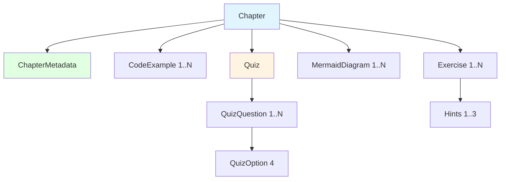

# Data Model: Introduction to Physical AI Chapter

**Version**: 1.0.0
**Date**: 2025-12-04
**Feature**: introduction-to-physical-ai

---

## Overview

This document defines the data structures (entities) used in the Introduction to Physical AI chapter. These entities represent the content, interactive elements, and metadata required for the Docusaurus page implementation.

---

## Entity Definitions

### Entity 1: ChapterMetadata

**Purpose**: Stores metadata about the chapter for navigation, SEO, and display.

**Fields**:
| Field | Type | Required | Description | Example |
|-------|------|----------|-------------|---------|
| `id` | string | Yes | Unique identifier (kebab-case) | `"intro"` |
| `number` | integer | Yes | Chapter number in book sequence | `1` |
| `title` | string | Yes | Chapter title | `"Introduction to Physical AI"` |
| `subtitle` | string | No | Chapter subtitle | `"From Algorithms to Embodied Intelligence"` |
| `wordCount` | integer | Yes | Total word count (excludes code) | `650` |
| `readingTime` | integer | Yes | Estimated reading time in minutes | `3` |
| `learningObjectives` | string[] | Yes | List of learning goals | `["Define Physical AI", "Understand embodied intelligence"]` |
| `prerequisites` | string[] | No | Required prior knowledge | `["Basic programming"]` |
| `nextChapter` | string | No | ID of next chapter | `"foundations"` |
| `previousChapter` | string | No | ID of previous chapter | `null` (first chapter) |

**Relationships**:
- Part of `Book` collection (all chapters)
- References next/previous chapters by ID

**Validation Rules**:
- `wordCount` must be between 500-800 (per constitution)
- `learningObjectives` must have 3-5 items
- `title` and `subtitle` are required for display
- `id` must be unique across all chapters
- `number` must be sequential (1, 2, 3, ...)

**State Transitions**: None (static metadata)

**Example**:
```json
{
  "id": "intro",
  "number": 1,
  "title": "Introduction to Physical AI",
  "subtitle": "From Algorithms to Embodied Intelligence",
  "wordCount": 650,
  "readingTime": 3,
  "learningObjectives": [
    "Define Physical AI and explain how it differs from traditional AI systems",
    "Understand the concept of embodied intelligence and its significance",
    "Identify the key components and capabilities of humanoid robots",
    "Recognize real-world applications and societal impact of Physical AI"
  ],
  "prerequisites": ["Basic programming knowledge", "Interest in AI and robotics"],
  "nextChapter": "foundations",
  "previousChapter": null
}
```

---

### Entity 2: CodeExample

**Purpose**: Represents an executable code snippet within the chapter.

**Fields**:
| Field | Type | Required | Description | Example |
|-------|------|----------|-------------|---------|
| `language` | string | Yes | Programming language | `"python"`, `"typescript"`, `"yaml"` |
| `title` | string | Yes | Code example title | `"SimplePhysicalAI Sensorimotor Loop"` |
| `code` | string | Yes | Multi-line code content | `"class SimplePhysicalAI:\n  ..."` |
| `description` | string | Yes | Explanation of what code does | `"Demonstrates sense → decide → act cycle"` |
| `dependencies` | string[] | Yes | Required packages/libraries | `["python>=3.8"]` |
| `runnable` | boolean | Yes | Whether code can be executed as-is | `true` |
| `filename` | string | No | Suggested filename for download | `"sensorimotor_loop.py"` |

**Relationships**:
- Embedded in Chapter (one chapter can have multiple code examples)

**Validation Rules**:
- `code` must not be empty
- If `runnable` is `true`, `dependencies` must be specified (not empty array)
- `language` must be in allowed list: `["python", "typescript", "javascript", "yaml", "bash", "ros2", "cpp"]`
- `description` must be at least 20 characters (meaningful explanation)

**State Transitions**: None (static content)

**Example**:
```json
{
  "language": "python",
  "title": "SimplePhysicalAI Sensorimotor Loop",
  "code": "import time\n\nclass SimplePhysicalAI:\n    def __init__(self):\n        self.position = 0.0\n        self.target = 10.0\n    \n    def sense(self):\n        error = self.target - self.position\n        return error\n    \n    def decide(self, error):\n        kp = 0.5\n        desired_velocity = kp * error\n        return desired_velocity\n    \n    def act(self, velocity):\n        dt = 0.1\n        self.position += velocity * dt\n    \n    def run(self, steps=50):\n        for step in range(steps):\n            error = self.sense()\n            velocity = self.decide(error)\n            self.act(velocity)\n            print(f\"Step {step}: pos={self.position:.2f}, error={error:.2f}\")\n            if abs(error) < 0.1:\n                print(f\"Reached target in {step} steps!\")\n                break\n            time.sleep(0.05)\n\nrobot = SimplePhysicalAI()\nrobot.run()",
  "description": "This code demonstrates the fundamental sensorimotor loop of Physical AI: sense (measure error), decide (calculate velocity), act (update position), and repeat until target reached.",
  "dependencies": ["python>=3.8"],
  "runnable": true,
  "filename": "sensorimotor_loop.py"
}
```

---

### Entity 3: Exercise

**Purpose**: Represents a hands-on learning exercise for readers.

**Fields**:
| Field | Type | Required | Description | Example |
|-------|------|----------|-------------|---------|
| `id` | string | Yes | Unique identifier within chapter | `"exercise-1"` |
| `title` | string | Yes | Exercise title | `"Identify Physical AI Systems"` |
| `objective` | string | Yes | Learning goal of exercise | `"Distinguish between traditional AI and Physical AI"` |
| `instructions` | string | Yes | Step-by-step instructions | `"1. List 5 AI systems...\n2. For each system..."` |
| `expectedOutcome` | string | Yes | What learner should produce | `"Correct classification of 5 systems"` |
| `hints` | string[] | Yes | Hints to help learners (1-3) | `["Consider whether the system only processes data..."]` |
| `solution` | string | No | Full solution (hidden by default) | `"| System | Classification |\n|--------|----------------|\n..."` |
| `difficulty` | enum | Yes | Difficulty level | `"easy"`, `"medium"`, `"hard"` |
| `estimatedTime` | integer | No | Time to complete (minutes) | `10` |

**Relationships**:
- Embedded in Chapter (one chapter can have multiple exercises)

**Validation Rules**:
- `title` and `instructions` are required
- `hints` array must have 1-3 items (too many hints reduce learning)
- `difficulty` must be one of: `["easy", "medium", "hard"]`
- `solution` is optional (some exercises are open-ended)
- `instructions` must have at least 3 steps (not too simple)

**State Transitions**:
- **Collapsed** (default): Title and difficulty visible
- **Expanded**: Instructions, hints, and solution (if available) visible
- **Hint Revealed**: User clicks "Show Hint" → reveals next hint sequentially
- **Solution Revealed**: User clicks "Show Solution" → reveals full solution

**Example**:
```json
{
  "id": "exercise-1",
  "title": "Identify Physical AI Systems",
  "objective": "Distinguish between traditional AI and Physical AI in real-world systems",
  "instructions": "1. Make a list of 5 AI systems you interact with daily\n2. For each system, identify:\n   - Does it have sensors that perceive the physical world?\n   - Does it have actuators that change the physical world?\n   - Does it operate in a closed-loop (using feedback)?\n3. Classify each as Traditional AI, Physical AI, or Hybrid",
  "expectedOutcome": "Correct classification: Physical AI (robot vacuum, self-driving car), Traditional AI (Netflix recommendations, chatbots), Hybrid (GPS navigation)",
  "hints": [
    "Consider whether the system only processes data or also interacts physically",
    "Feedback loops mean the system's actions affect its future inputs",
    "Hybrid systems may have limited physical interaction (e.g., audio output)"
  ],
  "solution": "| System | Sensors? | Actuators? | Feedback? | Classification |\n|--------|----------|------------|-----------|----------------|\n| Robot Vacuum | ✅ | ✅ | ✅ | Physical AI |\n| GPS Navigation | ✅ | ❌ | Partial | Hybrid |\n| Netflix | ❌ | ❌ | ❌ | Traditional AI |",
  "difficulty": "easy",
  "estimatedTime": 10
}
```

---

### Entity 4: QuizQuestion

**Purpose**: Represents a multiple-choice question in an interactive quiz.

**Fields**:
| Field | Type | Required | Description | Example |
|-------|------|----------|-------------|---------|
| `id` | string | Yes | Unique identifier within quiz | `"q1"` |
| `question` | string | Yes | Question text | `"What is the primary difference between traditional AI and Physical AI?"` |
| `options` | QuizOption[] | Yes | Answer choices (exactly 4) | `[{ label: "A", value: "a", text: "..." }, ...]` |
| `correctAnswer` | string | Yes | Value of correct option | `"b"` (matches `options[1].value`) |
| `explanation` | string | No | Why the answer is correct | `"Physical AI is defined by its embodiment..."` |

**QuizOption Sub-Entity**:
| Field | Type | Required | Description | Example |
|-------|------|----------|-------------|---------|
| `label` | string | Yes | Option label (A, B, C, D) | `"A"` |
| `value` | string | Yes | Option value (for selection) | `"option-a"` |
| `text` | string | Yes | Option text (answer choice) | `"Physical AI uses neural networks"` |

**Relationships**:
- Embedded in Quiz component (one quiz has multiple questions)

**Validation Rules**:
- Must have exactly 4 options (standard multiple choice)
- `correctAnswer` must match one `option.value`
- All fields are required (no optional fields)
- `options[].label` must be unique within question (A, B, C, D)
- `options[].value` must be unique within question

**State Transitions**:
- **Unanswered** (default): No option selected, submit disabled
- **Answered**: One option selected, submit enabled
- **Submitted**: Selected option highlighted, correct/incorrect feedback shown, explanation visible

**Example**:
```json
{
  "id": "q1",
  "question": "What is the primary difference between traditional AI and Physical AI?",
  "options": [
    {
      "label": "A",
      "value": "option-a",
      "text": "Physical AI uses neural networks, traditional AI does not"
    },
    {
      "label": "B",
      "value": "option-b",
      "text": "Physical AI interacts with the physical world through sensors and actuators"
    },
    {
      "label": "C",
      "value": "option-c",
      "text": "Traditional AI is faster than Physical AI"
    },
    {
      "label": "D",
      "value": "option-d",
      "text": "Physical AI only works in simulations"
    }
  ],
  "correctAnswer": "option-b",
  "explanation": "Physical AI is defined by its embodiment—it has sensors to perceive and actuators to affect the physical world. Traditional AI operates purely in digital space."
}
```

---

### Entity 5: MermaidDiagram

**Purpose**: Represents a Mermaid diagram embedded in the chapter.

**Fields**:
| Field | Type | Required | Description | Example |
|-------|------|----------|-------------|---------|
| `id` | string | Yes | Unique identifier within chapter | `"diagram-1"` |
| `title` | string | Yes | Diagram title | `"Traditional AI vs. Physical AI"` |
| `type` | enum | Yes | Diagram type | `"flowchart"`, `"sequence"`, `"architecture"`, `"comparison"` |
| `mermaidCode` | string | Yes | Mermaid syntax code | `"graph LR\n  A[Start] --> B[End]"` |
| `description` | string | Yes | Alt-text and context (accessibility) | `"Comparison diagram showing..."` |
| `caption` | string | No | Caption displayed below diagram | `"Figure 1: AI comparison"` |

**Relationships**:
- Embedded in Chapter (one chapter can have multiple diagrams)

**Validation Rules**:
- `mermaidCode` must be valid Mermaid syntax (validated by Mermaid parser)
- `description` is required for accessibility (alt-text for screen readers)
- `type` must be one of: `["flowchart", "sequence", "class", "state", "er", "gantt", "pie", "git", "mindmap", "timeline", "architecture", "comparison"]`
- `mermaidCode` must not be empty

**State Transitions**: None (static content, Mermaid renders at build/client time)

**Example**:
```json
{
  "id": "diagram-1",
  "title": "Traditional AI vs. Physical AI",
  "type": "comparison",
  "mermaidCode": "graph LR\n    subgraph \"Traditional AI\"\n        A[Data Input] --> B[AI Algorithm]\n        B --> C[Digital Output]\n    end\n\n    subgraph \"Physical AI\"\n        D[Sensors] --> E[AI Processing]\n        E --> F[Actuators]\n        F --> G[Physical Environment]\n        G -.Feedback.-> D\n    end\n\n    style A fill:#e1f5ff\n    style C fill:#e1f5ff\n    style D fill:#ffe1e1\n    style G fill:#ffe1e1",
  "description": "Comparison diagram showing Traditional AI as a linear flow from data input to digital output, versus Physical AI as a closed loop with sensors, AI processing, actuators, and environmental feedback.",
  "caption": "Figure 1: Traditional AI vs. Physical AI architecture"
}
```

---

## Entity Relationships Diagram



---

## Data Storage

**Note**: This is a static site (Docusaurus), not a dynamic application. Data is stored as:
- **Content**: MDX files (`docs/intro.mdx`)
- **Metadata**: Frontmatter in MDX files (YAML)
- **Interactive State**: React component state (`useState`) - ephemeral (not persisted)
- **Future**: Quiz/exercise progress could be saved to `localStorage` (browser-side)

---

## Example: Complete Chapter Data Structure

```json
{
  "metadata": {
    "id": "intro",
    "number": 1,
    "title": "Introduction to Physical AI",
    "subtitle": "From Algorithms to Embodied Intelligence",
    "wordCount": 650,
    "readingTime": 3,
    "learningObjectives": ["...", "...", "...", "..."],
    "prerequisites": ["Basic programming"],
    "nextChapter": "foundations",
    "previousChapter": null
  },
  "codeExamples": [
    {
      "language": "python",
      "title": "SimplePhysicalAI Sensorimotor Loop",
      "code": "...",
      "description": "...",
      "dependencies": ["python>=3.8"],
      "runnable": true
    }
  ],
  "exercises": [
    {
      "id": "exercise-1",
      "title": "Identify Physical AI Systems",
      "objective": "...",
      "instructions": "...",
      "expectedOutcome": "...",
      "hints": ["...", "..."],
      "solution": "...",
      "difficulty": "easy"
    },
    {
      "id": "exercise-2",
      "title": "Design a Sensorimotor Loop",
      "objective": "...",
      "instructions": "...",
      "expectedOutcome": "...",
      "hints": ["...", "..."],
      "solution": "...",
      "difficulty": "medium"
    }
  ],
  "diagrams": [
    {
      "id": "diagram-1",
      "title": "Traditional AI vs. Physical AI",
      "type": "comparison",
      "mermaidCode": "...",
      "description": "...",
      "caption": "Figure 1"
    },
    {
      "id": "diagram-2",
      "title": "Humanoid Robot Architecture",
      "type": "architecture",
      "mermaidCode": "...",
      "description": "...",
      "caption": "Figure 2"
    },
    {
      "id": "diagram-3",
      "title": "Sensorimotor Loop",
      "type": "flowchart",
      "mermaidCode": "...",
      "description": "...",
      "caption": "Figure 3"
    }
  ],
  "quiz": {
    "questions": [
      {
        "id": "q1",
        "question": "...",
        "options": [{...}, {...}, {...}, {...}],
        "correctAnswer": "option-b",
        "explanation": "..."
      },
      // ... 4 more questions
    ]
  }
}
```

---

**Data Model Version**: 1.0.0
**Last Updated**: 2025-12-04
**Status**: Finalized, ready for TypeScript interface generation
