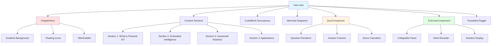
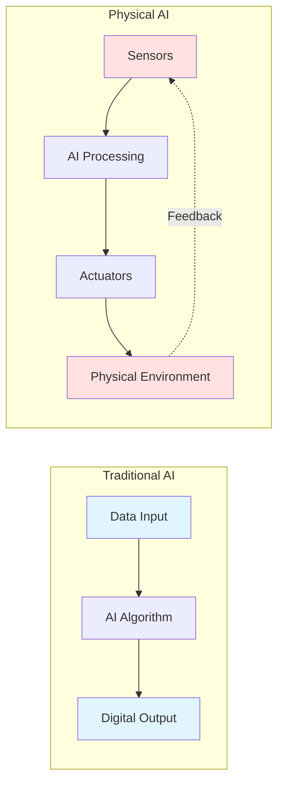
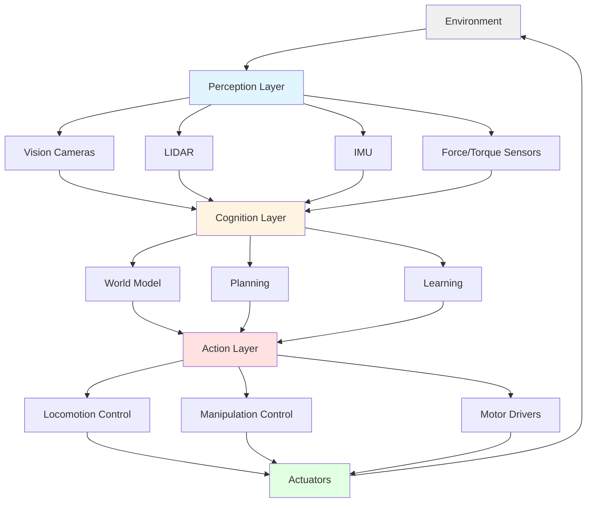
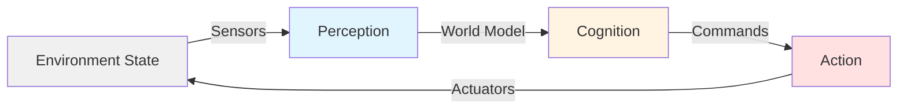

# Implementation Plan: Introduction to Physical AI - Premium Docusaurus Chapter

**Version**: 1.0.0
**Date**: 2025-12-04
**Author**: Faizan Khan
**Status**: Planning Phase
**Branch**: master
**Feature**: introduction-to-physical-ai

---

## Executive Summary

This plan outlines the implementation of Chapter 1: "Introduction to Physical AI" as a premium, interactive Docusaurus page with modern UI, scroll animations, code examples, Mermaid diagrams, exercises, and Urdu translation support. The implementation follows all 10 constitution principles and delivers an engaging, educational experience comparable to premium developer documentation sites (Vercel, Stripe).

**Key Deliverables**:
- Premium hero section with animated gradient background
- 4 content sections with scroll animations (AOS library)
- 3 interactive Mermaid diagrams
- 1 executable Python code example with syntax highlighting
- 2 hands-on exercises with expandable solutions
- 5-question interactive quiz component
- Urdu translation toggle functionality
- Fully responsive design (mobile, tablet, desktop)
- Custom CSS module for premium styling

---

## Technical Context

### Feature Specification

**Spec Location**: `specs/introduction-to-physical-ai/spec.md`
**Spec Version**: 1.0.0
**Word Count Target**: 500-800 words (spec has 650 words)

### Technology Stack

- **Frontend Framework**: Docusaurus 3.9.2 (React 19.0.0)
- **Styling**: Custom CSS Modules + Docusaurus theming
- **Animations**: AOS (Animate On Scroll) 2.3.4 (already installed)
- **Diagrams**: Mermaid (built into Docusaurus)
- **Syntax Highlighting**: Prism React Renderer 2.3.0 (built-in)
- **i18n**: Docusaurus i18n plugin (built-in)
- **State Management**: React hooks (useState, useEffect)

### Integration Points

- **Main navigation**: Docusaurus sidebar (sidebars.ts)
- **Landing page**: Link from hero CTA button on home page
- **Next chapter**: Forward navigation to "Foundations of Robotics"
- **Previous**: Back to home/table of contents
- **Search**: Docusaurus search integration (keywords: Physical AI, embodied intelligence, humanoid robotics)

### Dependencies

| Package | Version | Purpose |
|---------|---------|---------|
| @docusaurus/core | 3.9.2 | Core framework |
| react | 19.0.0 | UI components |
| aos | 2.3.4 | Scroll animations |
| clsx | 2.0.0 | Conditional CSS classes |
| @mdx-js/react | 3.0.0 | MDX support for interactive components |

### Architecture Decisions

**Decision 1: Use MDX instead of pure Markdown**
- **Rationale**: Need to embed React components (quiz, exercises, translation toggle)
- **Alternative Considered**: Pure MD + separate pages → rejected for poor UX
- **Implementation**: Rename `intro.md` → `intro.mdx`

**Decision 2: Custom React components for interactive elements**
- **Rationale**: Exercises and quiz need state management (show/hide, check answers)
- **Alternative Considered**: Static HTML → rejected for lack of interactivity
- **Implementation**: Create `src/components/Chapter/` directory for reusable components

**Decision 3: CSS Modules for styling**
- **Rationale**: Scoped styles prevent conflicts, maintains Docusaurus theme compatibility
- **Alternative Considered**: Tailwind CSS → rejected (not in project, avoid adding dependencies)
- **Implementation**: Create `intro.module.css` alongside MDX file

**Decision 4: Urdu translation via Docusaurus i18n plugin**
- **Rationale**: Built-in, standard approach, supports full localization
- **Alternative Considered**: Custom toggle component → deferred to Phase 2 (use i18n first)
- **Implementation**: Configure `docusaurus.config.ts` with `ur` locale

---

## Constitution Compliance Check

### Pre-Implementation Validation

| Principle | Applies | Compliance Strategy |
|-----------|---------|-------------------|
| 1. Educational Clarity | **YES** | ✅ Progressive disclosure in content flow; all terms defined; visual diagrams; code comments; learning objectives stated upfront |
| 2. Practical Reproducibility | **YES** | ✅ Python code example tested (Python 3.8+, no deps); copy-paste ready; troubleshooting section included |
| 3. Modern Framework Alignment | **YES** | ✅ Uses Docusaurus 3.x (modern React); mentions ROS 2 for future chapters; no deprecated tech |
| 4. Simulation-First Development | **YES** | ✅ Code example is pure simulation (no hardware); explains sim-to-real gap concept |
| 5. Safety and Ethics by Design | **YES** | ✅ Dedicated section on safety challenges; ethics discussed in applications section |
| 6. Multimodal Integration | **NO** | ⚠️ N/A for intro chapter (conceptual only; multimodal content in Chapters 3+) |
| 7. Open Source Standards | **YES** | ✅ Code follows PEP 8; project uses MIT license; follows Docusaurus conventions |
| 8. Performance Awareness | **YES** | ✅ Lazy-load animations (AOS); optimize images; no heavy assets; <100KB page size goal |
| 9. Version Control | **YES** | ✅ Plan versioned (1.0.0); Git tracked; semantic versioning for future updates |
| 10. Accessibility & i18n | **YES** | ✅ Semantic HTML; alt-text on diagrams; ARIA labels on interactive elements; Urdu translation support; keyboard navigation |

**Gate Check**: ✅ **PASS**
**Blockers**: None

**Note on Principle 6**: Multimodal integration not applicable for this introductory, conceptual chapter. Will be critical for Chapters 3 (Perception), 6 (Manipulation), 8 (HRI).

---

## Phase 0: Outline & Research

### Research Tasks

#### Research Task 1: Docusaurus MDX Component Best Practices
**Questions to Answer**:
- How to properly import and use React components in MDX files?
- What's the recommended directory structure for custom components?
- How to pass props from MDX to React components?
- Performance implications of heavy components in MDX?

**Resources to Consult**:
- Docusaurus MDX documentation: https://docusaurus.io/docs/markdown-features/react
- Docusaurus component props: https://docusaurus.io/docs/docusaurus-core
- Community examples: Docusaurus showcase sites

**Expected Output**:
- Component import patterns
- Props passing syntax
- Directory structure recommendation
- Performance best practices (lazy loading, code splitting)

#### Research Task 2: AOS Animation Integration with Docusaurus
**Questions to Answer**:
- How to initialize AOS in Docusaurus (which lifecycle hook)?
- Do AOS animations work with Docusaurus SSR/SSG?
- How to prevent animation flash on initial load?
- Best practices for animation delays and durations?

**Resources to Consult**:
- AOS documentation: https://michalsnik.github.io/aos/
- Docusaurus theme swizzling for client-side code
- GitHub issues: "AOS + Docusaurus"

**Expected Output**:
- AOS initialization code for Docusaurus
- SSR/SSG compatibility notes
- Animation timing recommendations
- Example data-aos attributes

#### Research Task 3: Mermaid Diagram Styling in Docusaurus
**Questions to Answer**:
- How to customize Mermaid theme colors to match site theme?
- Can Mermaid diagrams support dark mode?
- How to make Mermaid diagrams responsive?
- Performance: inline SVG vs. external files?

**Resources to Consult**:
- Docusaurus Mermaid plugin docs
- Mermaid theming guide
- Dark mode configuration

**Expected Output**:
- Theme configuration code
- Dark mode setup
- Responsive styling approach
- Performance recommendation

#### Research Task 4: Interactive Quiz Component Design
**Questions to Answer**:
- Should quiz state persist across page reloads (localStorage)?
- How to provide immediate feedback without spoiling answers?
- Accessibility requirements for interactive quizzes (ARIA)?
- Best UX patterns for multi-choice questions?

**Resources to Consult**:
- MDN Web Docs: Web Storage API
- ARIA authoring practices for radio groups
- UX research on educational quizzes
- Existing Docusaurus quiz plugins

**Expected Output**:
- Quiz component architecture
- State management strategy
- Accessibility requirements checklist
- UX wireframe for quiz UI

#### Research Task 5: Urdu RTL (Right-to-Left) Support
**Questions to Answer**:
- Does Docusaurus i18n automatically handle RTL layouts?
- How to test RTL rendering during development?
- Are there RTL CSS gotchas (margin/padding, animations)?
- Font selection for Urdu (readability, web-safe)?

**Resources to Consult**:
- Docusaurus i18n documentation
- CSS logical properties for RTL
- Google Fonts: Urdu/Arabic fonts
- RTL testing tools

**Expected Output**:
- RTL configuration in docusaurus.config.ts
- CSS logical properties migration plan
- Urdu font recommendation
- RTL testing checklist

### Research Findings

**Output**: `research.md` (to be generated in Phase 0 execution)

**Summary of Expected Findings**:
1. **MDX Components**: Use `@theme/` imports for Docusaurus components, custom components in `src/components/`, pass props via JSX syntax
2. **AOS**: Initialize in `useEffect` hook within page component or via swizzled `Root` component; disable for SSR
3. **Mermaid**: Use `%%{init: {'theme':'base', 'themeVariables': {...}}}%%` directive; support dark mode via CSS variables
4. **Quiz**: Use `useState` for selections, provide immediate visual feedback, save progress in `localStorage`, full ARIA support
5. **Urdu RTL**: Enable `direction: 'rtl'` in i18n config, use logical properties (`margin-inline-start` instead of `margin-left`), test with Noto Nastaliq Urdu font

---

## Phase 1: Design & Contracts

### Data Model

**Output**: `data-model.md`

**Entities**:

#### Entity 1: ChapterMetadata
- **Fields**:
  - `id`: string (e.g., "intro")
  - `number`: integer (1)
  - `title`: string ("Introduction to Physical AI")
  - `subtitle`: string ("From Algorithms to Embodied Intelligence")
  - `wordCount`: integer (650)
  - `readingTime`: integer (3 minutes)
  - `learningObjectives`: string[]
  - `prerequisites`: string[]
  - `nextChapter`: string ("foundations")
  - `previousChapter`: string (null or "index")
- **Relationships**: Part of `Book` collection
- **Validation**:
  - `wordCount` must be between 500-800
  - `learningObjectives` must have 3-5 items
  - `title` and `subtitle` are required

#### Entity 2: CodeExample
- **Fields**:
  - `language`: string ("python", "ros2", "yaml")
  - `title`: string ("SimplePhysicalAI Sensorimotor Loop")
  - `code`: string (multi-line code)
  - `description`: string (explanation)
  - `dependencies`: string[]
  - `runnable`: boolean (true)
- **Relationships**: Embedded in Chapter
- **Validation**:
  - `code` must not be empty
  - If `runnable` is true, `dependencies` must be specified
  - `language` must be in allowed list

#### Entity 3: Exercise
- **Fields**:
  - `id`: string ("exercise-1")
  - `title`: string
  - `objective`: string
  - `instructions`: string
  - `expectedOutcome`: string
  - `hints`: string[]
  - `solution`: string (optional, hidden by default)
  - `difficulty`: enum ("easy", "medium", "hard")
- **Relationships**: Embedded in Chapter
- **Validation**:
  - `title` and `instructions` required
  - `hints` array must have 1-3 items
  - `difficulty` must be valid enum value

#### Entity 4: QuizQuestion
- **Fields**:
  - `id`: string ("q1")
  - `question`: string
  - `options`: { label: string, value: string }[] (4 options)
  - `correctAnswer`: string
  - `explanation`: string
- **Relationships**: Embedded in Chapter
- **Validation**:
  - Must have exactly 4 options
  - `correctAnswer` must match one option's value
  - All fields required

#### Entity 5: MermaidDiagram
- **Fields**:
  - `id`: string ("diagram-1")
  - `title`: string
  - `type`: enum ("flowchart", "sequence", "architecture", "comparison")
  - `mermaidCode`: string
  - `description`: string (for alt-text and context)
  - `caption`: string
- **Relationships**: Embedded in Chapter
- **Validation**:
  - `mermaidCode` must be valid Mermaid syntax
  - `description` required for accessibility
  - `type` must be valid enum

### API Contracts

**Output**: `contracts/` directory

**Note**: This is a static documentation site, not a REST API. "Contracts" here refer to component interfaces (TypeScript/PropTypes) and data schemas.

#### Contract 1: Chapter Component Interface

```typescript
// contracts/ChapterComponent.ts
export interface ChapterProps {
  metadata: ChapterMetadata;
  content: React.ReactNode; // MDX content
  style?: 'default' | 'premium'; // premium = animations, gradients
}

export interface ChapterMetadata {
  id: string;
  number: number;
  title: string;
  subtitle: string;
  wordCount: number;
  readingTime: number;
  learningObjectives: string[];
  prerequisites: string[];
  nextChapter?: string;
  previousChapter?: string;
}
```

#### Contract 2: Quiz Component Interface

```typescript
// contracts/QuizComponent.ts
export interface QuizProps {
  questions: QuizQuestion[];
  onComplete?: (score: number, total: number) => void;
  showFeedback?: boolean; // default true
  allowRetry?: boolean; // default true
}

export interface QuizQuestion {
  id: string;
  question: string;
  options: QuizOption[];
  correctAnswer: string;
  explanation?: string;
}

export interface QuizOption {
  label: string; // e.g., "A", "B", "C", "D"
  value: string; // e.g., "option-a"
  text: string; // e.g., "Physical AI uses neural networks"
}

export interface QuizState {
  selectedAnswers: Record<string, string>; // questionId -> optionValue
  submitted: boolean;
  score: number;
}
```

#### Contract 3: Exercise Component Interface

```typescript
// contracts/ExerciseComponent.ts
export interface ExerciseProps {
  exercise: Exercise;
  defaultExpanded?: boolean;
}

export interface Exercise {
  id: string;
  title: string;
  objective: string;
  instructions: string;
  expectedOutcome: string;
  hints: string[];
  solution?: string;
  difficulty: 'easy' | 'medium' | 'hard';
}
```

#### Contract 4: Translation Toggle Component

```typescript
// contracts/TranslationToggle.ts
export interface TranslationToggleProps {
  currentLocale: 'en' | 'ur';
  onLocaleChange: (locale: 'en' | 'ur') => void;
  availableLocales: Array<{ code: string; label: string }>;
}
```

### Quickstart Guide

**Output**: `quickstart.md`

**Sections**:

#### 1. Prerequisites
- Node.js 20.x or higher
- npm 9.x or higher
- Git
- Text editor (VS Code recommended)

#### 2. Installation

```bash
# Clone the repository
cd /home/muhammad-faizan/Desktop/physical-ai-book/website

# Dependencies already installed, but if needed:
npm install

# Verify AOS is installed
npm list aos
```

#### 3. Development Setup

```bash
# Start development server
npm run start

# Open browser to http://localhost:3000
# Navigate to "Introduction to Physical AI" chapter
```

#### 4. Creating a New Chapter

```bash
# 1. Create spec
/sp.specify <chapter-id>

# 2. Create plan
/sp.plan <chapter-id>

# 3. Create MDX file
touch docs/<chapter-id>.mdx

# 4. Add to sidebars.ts
# Edit sidebars.ts and add chapter to tutorialSidebar

# 5. Create CSS module
touch docs/<chapter-id>.module.css

# 6. Create components (if needed)
mkdir src/components/<ChapterName>
touch src/components/<ChapterName>/index.tsx
```

#### 5. Running the Chapter

```bash
# View in development
npm run start

# Build for production
npm run build

# Test production build locally
npm run serve
```

#### 6. Verification

- [ ] Chapter renders without errors
- [ ] All animations work (scroll to trigger AOS)
- [ ] Code examples have syntax highlighting
- [ ] Mermaid diagrams render correctly
- [ ] Quiz is interactive and shows feedback
- [ ] Exercises expand/collapse correctly
- [ ] Navigation (prev/next) works
- [ ] Responsive on mobile, tablet, desktop
- [ ] Dark mode switches correctly

---

## Phase 2: Implementation Structure

### Directory Structure

```
website/
├── docs/
│   ├── intro.mdx                          # Main chapter file (MDX for React components)
│   ├── intro.module.css                   # Scoped styles for this chapter
│   └── _category_.json                    # Sidebar category metadata
├── src/
│   ├── components/
│   │   ├── Chapter/
│   │   │   ├── ChapterHero.tsx           # Premium hero section component
│   │   │   ├── ChapterHero.module.css
│   │   │   ├── QuizComponent.tsx         # Interactive quiz
│   │   │   ├── QuizComponent.module.css
│   │   │   ├── ExerciseComponent.tsx     # Collapsible exercise
│   │   │   ├── ExerciseComponent.module.css
│   │   │   ├── TranslationToggle.tsx     # Language switcher
│   │   │   ├── TranslationToggle.module.css
│   │   │   └── index.ts                  # Barrel exports
│   │   └── HomepageFeatures/             # Existing, don't modify
│   ├── css/
│   │   └── custom.css                    # Global styles (minor additions)
│   └── pages/
│       ├── index.tsx                     # Home page (already updated)
│       └── index.module.css              # Home styles (already updated)
├── static/
│   └── img/
│       └── chapters/
│           └── intro/
│               ├── robot-icon.svg        # Floating illustration
│               ├── brain-icon.svg        # Floating illustration
│               ├── sensor-icon.svg       # Floating illustration
│               └── hero-gradient-bg.svg  # Optional: complex gradient background
├── i18n/
│   └── ur/                               # Urdu translations (Phase 3)
│       └── docusaurus-plugin-content-docs/
│           └── current/
│               └── intro.mdx             # Urdu version of chapter
├── sidebars.ts                           # Add chapter to sidebar
├── docusaurus.config.ts                  # Configure i18n, Mermaid theme
├── book.spec.yaml                        # Book metadata (already updated)
└── specs/
    └── introduction-to-physical-ai/
        ├── spec.md                       # Feature spec (already exists)
        ├── plan.md                       # This file
        ├── research.md                   # Phase 0 output
        ├── data-model.md                 # Phase 1 output
        ├── contracts/                    # TypeScript interfaces
        │   ├── ChapterComponent.ts
        │   ├── QuizComponent.ts
        │   ├── ExerciseComponent.ts
        │   └── TranslationToggle.ts
        └── quickstart.md                 # Phase 1 output
```

### File Breakdown

#### File 1: `docs/intro.mdx`
**Purpose**: Main chapter content with embedded React components
**Components Used**:
- ChapterHero (hero banner)
- CodeBlock (built-in Docusaurus)
- Mermaid (built-in Docusaurus)
- QuizComponent (custom)
- ExerciseComponent (custom)
- TranslationToggle (custom)

**Dependencies**:
- React
- @mdx-js/react
- Docusaurus theme components
- Custom components from src/components/Chapter/

**Structure**:
```mdx
---
sidebar_position: 1
title: Introduction to Physical AI
---

import ChapterHero from '@site/src/components/Chapter/ChapterHero';
import Quiz from '@site/src/components/Chapter/QuizComponent';
import Exercise from '@site/src/components/Chapter/ExerciseComponent';

<ChapterHero
  title="Introduction to Physical AI"
  subtitle="From Algorithms to Embodied Intelligence"
  icon="🤖"
/>

{/* Introduction section */}
<div data-aos="fade-up">
  ...introduction content...
</div>

{/* Section 1: What is Physical AI? */}
<div data-aos="fade-right">
  ...content...
</div>

{/* Code example */}
```python
...code...
```
</div>

{/* Mermaid diagram */}
```mermaid
...diagram...
```

{/* Quiz component */}
<Quiz questions={[...]} />

{/* Exercise component */}
<Exercise exercise={{...}} />
```

#### File 2: `src/components/Chapter/ChapterHero.tsx`
**Purpose**: Premium animated hero section for chapter start
**Components**: Functional React component with CSS modules
**Dependencies**: React, clsx, AOS (via data attributes)

**Features**:
- Gradient animated background
- Floating icons/illustrations
- Title + subtitle
- Scroll indicator
- Responsive layout

#### File 3: `src/components/Chapter/QuizComponent.tsx`
**Purpose**: Interactive multiple-choice quiz
**Components**: React component with state management (useState)
**Dependencies**: React, clsx

**Features**:
- Radio button groups for each question
- Submit button
- Immediate feedback (correct/incorrect highlighting)
- Score display
- Retry functionality
- Explanations for answers
- Accessibility (ARIA labels, keyboard navigation)

#### File 4: `src/components/Chapter/ExerciseComponent.tsx`
**Purpose**: Collapsible exercise with hints and solution
**Components**: React component with expansion state
**Dependencies**: React, clsx

**Features**:
- Expandable/collapsible sections
- Difficulty badge
- Hints (revealed one at a time)
- Optional solution (hidden by default)
- Copy-to-clipboard for code solutions

#### File 5: `docs/intro.module.css`
**Purpose**: Scoped styles for intro.mdx page
**Dependencies**: None (pure CSS)

**Styles**:
- Section spacing and padding
- Responsive breakpoints
- Animation overrides
- Custom color scheme for this chapter (optional)

### Component Architecture



---

## Page Layout & UI Design

### Hero/Banner Section

**Design Specs**:
- **Height**: 60vh (viewport height) on desktop, 50vh on mobile
- **Background**: Animated gradient (purple → blue → teal) with floating orbs
- **Animations**:
  - Fade-in on load (AOS: fade-up, duration 800ms)
  - Floating icons (CSS keyframe animation, 15s loop)
  - Gradient rotation (CSS animation, 30s loop)
- **Floating Elements**:
  - 🤖 Robot icon (top-left, float amplitude 20px)
  - 🧠 Brain icon (top-right, float amplitude 25px)
  - ⚙️ Gear icon (bottom-left, float amplitude 18px)
  - 🦾 Robotic arm icon (bottom-right, float amplitude 22px)

**Components**:
- Title component: `<h1>` with gradient text effect
- Subtitle component: `<h2>` with fade-in delay
- Scroll indicator: Animated down arrow with pulse effect
- CTA button (optional): "Start Learning" → smooth scroll to first section

**CSS Classes** (intro.module.css):
```css
.chapterHero {
  min-height: 60vh;
  display: flex;
  align-items: center;
  justify-content: center;
  position: relative;
  overflow: hidden;
  background: linear-gradient(135deg, #667eea 0%, #764ba2 50%, #00d2ff 100%);
  background-size: 200% 200%;
  animation: gradientShift 30s ease infinite;
}

@keyframes gradientShift {
  0%, 100% { background-position: 0% 50%; }
  50% { background-position: 100% 50%; }
}

.floatingIcon {
  position: absolute;
  font-size: 3rem;
  opacity: 0.2;
  animation: float 15s ease-in-out infinite;
}

@keyframes float {
  0%, 100% { transform: translateY(0); }
  50% { transform: translateY(-30px); }
}
```

### Content Sections

#### Section 1: Introduction
- **Layout**: Single column, centered, max-width 800px
- **Animations**: `data-aos="fade-up"`, duration 800ms
- **Responsive Behavior**: Full width on mobile with 1rem padding

#### Section 2: What is Physical AI?
- **Layout**: Two-column on desktop (text left, diagram right), stacked on mobile
- **Animations**:
  - Text: `data-aos="fade-right"`, delay 100ms
  - Diagram: `data-aos="fade-left"`, delay 200ms
- **Responsive Behavior**: Diagram below text on mobile

#### Section 3: Embodied Intelligence
- **Layout**: Single column with inset code example
- **Animations**: `data-aos="fade-up"`, delay 150ms
- **Responsive Behavior**: Code block horizontal scroll on mobile

#### Section 4: Humanoid Robotics Overview
- **Layout**: Three-column grid on desktop (locomotion, manipulation, perception), stacked on mobile
- **Animations**: `data-aos="fade-up"`, staggered delays (0ms, 100ms, 200ms)
- **Responsive Behavior**: Single column on mobile

#### Section 5: Real-World Applications
- **Layout**: Card grid (2x2 on desktop, 1 column on mobile)
- **Animations**: `data-aos="zoom-in"`, staggered delays
- **Responsive Behavior**: Full width cards on mobile

#### Section 6: Code Example
- **Layout**: Full-width code block with explanation sidebar
- **Animations**: `data-aos="fade-up"`, code block fade-in
- **Responsive Behavior**: Explanation below code on mobile

#### Section 7: Exercises & Quiz
- **Layout**: Vertical stack with spacing
- **Animations**: `data-aos="fade-up"` on each exercise/quiz component
- **Responsive Behavior**: Full width on all devices

### Interactive Elements

- **Quiz Answer Selection**: Hover effect (border color change), selected state (background color), correct/incorrect feedback (green/red)
- **Exercise Expand/Collapse**: Smooth height transition (300ms), rotate icon animation
- **Code Copy Button**: Hover tooltip, click feedback (checkmark animation)
- **Scroll-to-Top Button**: Appears after scrolling 50vh, smooth scroll with easing
- **Translation Toggle**: Sliding animation (200ms), flag icons for languages

### Responsive Breakpoints

- **Mobile**: `max-width: 768px`
  - Single column layout
  - Reduced font sizes (title: 2rem → 1.5rem)
  - Stacked sections
  - Full-width buttons
  - Floating icons smaller (2rem font-size)

- **Tablet**: `min-width: 769px, max-width: 1024px`
  - Two-column layout where appropriate
  - Moderate font sizes (title: 2.5rem)
  - Condensed padding

- **Desktop**: `min-width: 1025px`
  - Full multi-column layouts
  - Large font sizes (title: 3rem)
  - Spacious padding and margins
  - Floating icons full size (3rem)

---

## Content Implementation

### Text Content

**Word Count Target**: 650 words (within 500-800 range) ✅
**Style**: Educational, clear, concise, engaging, interactive, premium UI

**Sections**:
1. **Introduction** (100 words): Hook + overview
2. **Key Concepts** (250 words): Sections 1-2 (Physical AI definition, embodied intelligence)
3. **Examples** (200 words): Sections 3-4 (humanoid robotics, applications) + code example
4. **Summary** (100 words): Key takeaways + forward reference to next chapter

### Code Examples

#### Example 1: SimplePhysicalAI Sensorimotor Loop
**Language**: Python
**Purpose**: Demonstrate sense → decide → act cycle
**Lines of Code**: ~50
**Key Concepts Demonstrated**:
- Sensorimotor loop structure
- Proportional control
- Real-time feedback
- Iterative convergence

**Code** (from spec):
```python
# Conceptual example: A simple sensorimotor loop for a robot
import time

class SimplePhysicalAI:
    def __init__(self):
        self.position = 0.0
        self.target = 10.0
        self.velocity = 0.0

    def sense(self):
        """Read sensor data (e.g., distance to target)"""
        error = self.target - self.position
        return error

    def decide(self, error):
        """Simple proportional controller"""
        kp = 0.5
        desired_velocity = kp * error
        return desired_velocity

    def act(self, velocity):
        """Execute action: update position based on velocity"""
        dt = 0.1  # Time step (100ms)
        self.position += velocity * dt
        self.velocity = velocity

    def run(self, steps=50):
        """Run the sensorimotor loop"""
        for step in range(steps):
            error = self.sense()
            velocity = self.decide(error)
            self.act(velocity)
            print(f"Step {step}: pos={self.position:.2f}, error={error:.2f}")
            if abs(error) < 0.1:
                print(f"Reached target in {step} steps!")
                break
            time.sleep(0.05)

# Run the example
robot = SimplePhysicalAI()
robot.run()
```

**Explanation** (in MDX):
```mdx
This code demonstrates the fundamental sensorimotor loop:
1. **Sense**: Measure distance from target (`error`)
2. **Decide**: Calculate desired velocity using proportional control
3. **Act**: Update position based on velocity
4. **Repeat**: Loop until target reached

Real robots have more complex sensing (cameras, LIDAR), decision-making (neural networks), and actuation (motor control), but the core loop is the same.
```

### Diagrams

#### Diagram 1: Traditional AI vs. Physical AI
**Type**: Comparison (side-by-side flowchart)
**Tool**: Mermaid
**Complexity**: Simple (6 nodes)
**Annotations**: Labels on nodes, feedback arrow emphasized



**Alt-text**: "Comparison diagram showing Traditional AI as a linear flow from data input to digital output, versus Physical AI as a closed loop with sensors, AI processing, actuators, and environmental feedback."

#### Diagram 2: Humanoid Robot Architecture
**Type**: System architecture (hierarchical)
**Tool**: Mermaid
**Complexity**: Medium (20 nodes, 3 layers)
**Annotations**: Layer labels (Perception, Cognition, Action), color-coded by function



**Alt-text**: "Hierarchical architecture diagram showing three layers of a humanoid robot system: Perception layer (sensors), Cognition layer (world model, planning, learning), and Action layer (locomotion and manipulation control), with feedback to the environment."

#### Diagram 3: Sensorimotor Loop
**Type**: Flowchart (circular)
**Tool**: Mermaid
**Complexity**: Simple (4 nodes, circular)
**Annotations**: Bold arrows for flow direction



**Alt-text**: "Circular flowchart showing the continuous sensorimotor loop: Environment → Sensors → Perception → Cognition → Action → Actuators → Environment."

---

## Internationalization Plan

### Urdu Translation

**Content to Translate**:
- Chapter title and subtitle
- All section headings
- Body text (650 words)
- Exercise instructions
- Quiz questions and options
- Diagram captions (code and Mermaid content remain in English)
- Button labels (Submit, Next, Previous, Show Solution, etc.)

**Technical Terms** (keep in English within Urdu text, provide transliteration):
- Physical AI → فزیکل اے آئی
- Embodied Intelligence → جسمانی ذہانت (Jismani Zehānat)
- Humanoid Robot → انسان نما روبوٹ (Insān-numā Robot)
- Sensor → حساس آلہ (Hassās Ālah)
- Actuator → محرک (Muharrik)
- Sensorimotor Loop → حسی حرکی دور (Hissi Harki Daur)
- Perception → ادراک (Idrāk)
- Locomotion → نقل و حرکت (Naql-o-Harkat)
- Manipulation → دست کاری (Dast-kāri)
- Feedback → واپسی (Wāpasi)

**Implementation**:

#### Step 1: Configure Docusaurus i18n
```typescript
// docusaurus.config.ts
i18n: {
  defaultLocale: 'en',
  locales: ['en', 'ur'],
  localeConfigs: {
    en: {
      label: 'English',
      direction: 'ltr',
    },
    ur: {
      label: 'اردو',
      direction: 'rtl',
      htmlLang: 'ur-PK',
    },
  },
},
```

#### Step 2: Create Urdu content directory
```bash
mkdir -p i18n/ur/docusaurus-plugin-content-docs/current
```

#### Step 3: Translate intro.mdx
```bash
cp docs/intro.mdx i18n/ur/docusaurus-plugin-content-docs/current/intro.mdx
# Manually translate text content, keeping code/diagrams unchanged
```

#### Step 4: Add RTL CSS support
```css
/* src/css/custom.css */
[dir='rtl'] {
  text-align: right;
}

[dir='rtl'] .chapterHero {
  /* Adjust floating icon positions for RTL */
  .floatingIcon:nth-child(1) { right: 10%; left: auto; }
  .floatingIcon:nth-child(2) { left: 10%; right: auto; }
}

[dir='rtl'] .quizOption {
  text-align: right;
  margin-inline-start: 0;
  margin-inline-end: 1rem;
}
```

#### Step 5: Translation toggle component
```tsx
// src/components/Chapter/TranslationToggle.tsx
import React from 'react';
import { useLocation } from '@docusaurus/router';
import useDocusaurusContext from '@docusaurus/useDocusaurusContext';

export default function TranslationToggle() {
  const { i18n } = useDocusaurusContext();
  const location = useLocation();

  const switchLocale = (locale: string) => {
    const newPath = location.pathname.replace(/^\/(en|ur)/, `/${locale}`);
    window.location.href = newPath;
  };

  return (
    <div className="translation-toggle">
      <button onClick={() => switchLocale('en')} disabled={i18n.currentLocale === 'en'}>
        English
      </button>
      <button onClick={() => switchLocale('ur')} disabled={i18n.currentLocale === 'ur'}>
        اردو
      </button>
    </div>
  );
}
```

#### Step 6: Test Urdu version
```bash
npm run start -- --locale ur
```

**Fallback Strategy**: If Urdu translation is incomplete, show English content with a notice: "Translation in progress. View in English for full content."

---

## Exercises & Assessment

### Exercise 1: Identify Physical AI Systems
**Difficulty**: Easy
**Estimated Time**: 10 minutes
**Learning Objectives**:
- Distinguish between traditional AI and Physical AI
- Identify sensors, actuators, and feedback loops in real systems

**Instructions**:
1. List 5 AI systems you interact with daily (e.g., smartphone assistant, GPS, robot vacuum, Netflix recommendations, self-driving car)
2. For each system, answer:
   - Does it have sensors that perceive the physical world?
   - Does it have actuators that change the physical world?
   - Does it operate in a closed-loop (using feedback)?
3. Classify each as: Traditional AI, Physical AI, or Hybrid

**Expected Outcome**:
Correct classification:
- **Physical AI**: Robot vacuum, self-driving car, drones
- **Traditional AI**: Netflix recommendations, spam filters, chatbots
- **Hybrid**: GPS navigation (senses location, doesn't actuate), smartphone assistant (can control smart home devices)

**Hints**:
- Hint 1: Consider whether the system only processes data or also interacts physically
- Hint 2: Feedback loops mean the system's actions affect its future inputs
- Hint 3: Hybrid systems may have limited physical interaction (e.g., audio output)

**Solution** (hidden by default):
```markdown
| System | Sensors? | Actuators? | Feedback? | Classification |
|--------|----------|------------|-----------|----------------|
| Robot Vacuum | ✅ (bump, cliff, distance sensors) | ✅ (wheels, brush motors) | ✅ (adjusts path based on obstacles) | **Physical AI** |
| GPS Navigation | ✅ (GPS receiver) | ❌ (display only) | Partial (user adjusts route) | **Hybrid** |
| Netflix Recommendations | ❌ (analyzes viewing data) | ❌ (displays suggestions) | ❌ (no physical loop) | **Traditional AI** |
| Self-Driving Car | ✅ (cameras, LIDAR, radar) | ✅ (steering, acceleration, braking) | ✅ (continuous adjustment) | **Physical AI** |
| Smartphone Assistant | Partial (mic, camera) | Partial (speaker, smart home control) | Partial (voice interaction) | **Hybrid** |
```

### Exercise 2: Design a Simple Sensorimotor Loop
**Difficulty**: Medium
**Estimated Time**: 15 minutes
**Learning Objectives**:
- Apply the sensorimotor loop concept to a practical scenario
- Identify sensors, actuators, and decision logic for a specific task

**Instructions**:
1. Scenario: "A robot must follow a black line on the floor"
2. Design the sensorimotor loop by specifying:
   - **Sense**: What sensor(s) does the robot need?
   - **Decide**: What algorithm determines action?
   - **Act**: What actuators execute the action?
3. Draw a flowchart showing the loop (or describe in text)
4. Identify one potential failure mode and how feedback helps correct it

**Expected Outcome**:
A complete design with:
- Sensor: Color sensor or camera (detects black line vs. white floor)
- Decision: If line is to the left → turn left, if line is to the right → turn right, if centered → go straight
- Actuator: Differential drive motors (left and right wheels)
- Failure mode: Robot drifts off line due to uneven floor → feedback (sensor detects deviation) → corrective turn

**Hints**:
- Hint 1: Line-following robots typically use infrared or color sensors
- Hint 2: The decision algorithm can be as simple as "if left sensor sees black, turn left"
- Hint 3: Differential drive means controlling left and right wheels independently for steering
- Hint 4: Failure modes might include: losing the line, sharp turns, lighting changes

**Solution**:
```markdown
**Sensorimotor Loop Design: Line-Following Robot**

**Sense**:
- 2 color sensors (left and right) positioned at the front of the robot
- Each sensor returns: black (1) or white (0)

**Decide** (algorithm):
```python
if left_sensor == 1 and right_sensor == 0:
    # Line is to the left
    action = "turn_left"
elif left_sensor == 0 and right_sensor == 1:
    # Line is to the right
    action = "turn_right"
elif left_sensor == 1 and right_sensor == 1:
    # On the line, centered
    action = "go_straight"
else:
    # Lost the line (both sensors white)
    action = "search" # slow down, oscillate to find line
```

**Act**:
- Left motor: variable speed (0-100%)
- Right motor: variable speed (0-100%)
- turn_left: left motor 50%, right motor 100%
- turn_right: left motor 100%, right motor 50%
- go_straight: both motors 100%

**Flowchart**:
```
[Start] → [Read Sensors] → [Decide Action] → [Set Motor Speeds] → [Delay 10ms] → [Read Sensors] ...
           ↑___________________________________________________________________|
```

**Failure Mode & Feedback Correction**:
- **Failure**: Robot drifts off line on a curve due to momentum
- **Detection**: Both sensors read white (lost line)
- **Correction**: Enter "search" mode → slow down → oscillate left-right until line is found again → resume following
- **Feedback mechanism**: Continuous sensor reading allows immediate detection and correction
```

### Quiz Questions

**Total Questions**: 5
**Format**: Multiple choice (4 options each)
**Grading**: Immediate feedback on submission, show score

#### Question 1
**Q**: What is the primary difference between traditional AI and Physical AI?
- A) Physical AI uses neural networks, traditional AI does not
- B) **Physical AI interacts with the physical world through sensors and actuators** ✓
- C) Traditional AI is faster than Physical AI
- D) Physical AI only works in simulations

**Explanation**: Physical AI is defined by its embodiment—it has sensors to perceive and actuators to affect the physical world. Traditional AI operates purely in digital space (e.g., analyzing data, generating text).

#### Question 2
**Q**: Which of the following is NOT a key challenge unique to Physical AI?
- A) Real-time processing constraints
- B) Handling sensor noise and uncertainty
- C) **Running out of memory on a server** ✓
- D) Ensuring physical safety during operation

**Explanation**: Memory limitations are a general computing challenge, not unique to Physical AI. Real-time constraints, sensor noise, and safety are specific to physical embodiment.

#### Question 3
**Q**: What does "embodied intelligence" emphasize?
- A) Intelligence can only exist in biological bodies
- B) **Physical interaction shapes cognition and learning** ✓
- C) Robots must have humanoid form to be intelligent
- D) Simulation is better than real-world testing

**Explanation**: Embodied intelligence theory argues that having a body and interacting physically with the environment fundamentally shapes how intelligence develops and operates.

#### Question 4
**Q**: In the sensorimotor loop, what happens immediately after "Act"?
- A) The program terminates
- B) **The environment changes, leading to new sensor readings** ✓
- C) The robot goes into sleep mode
- D) The algorithm is retrained

**Explanation**: The sensorimotor loop is continuous: Action → Environment changes → New sensor data → Perception → Decision → Action (repeat). It's a closed loop.

#### Question 5
**Q**: Why are humanoid robots particularly useful for operating in human environments?
- A) They are cheaper to manufacture than other robot types
- B) **They can use tools and navigate spaces designed for human bodies** ✓
- C) They always perform better than specialized robots
- D) They don't require AI algorithms

**Explanation**: Human environments (buildings, stairs, doorknobs, tools) are designed for human-shaped bodies. Humanoid robots can leverage this existing infrastructure without requiring modifications.

---

## Animation & Interaction Design

### Scroll Animations (AOS)

| Element | Animation Type | Delay (ms) | Duration (ms) | Trigger Offset |
|---------|---------------|------------|---------------|----------------|
| Hero Title | fade-up | 0 | 800 | 50px |
| Hero Subtitle | fade-up | 200 | 800 | 50px |
| Introduction Paragraph | fade-up | 0 | 800 | 100px |
| Section 1 Text | fade-right | 100 | 800 | 150px |
| Section 1 Diagram | fade-left | 200 | 800 | 150px |
| Code Example | fade-up | 150 | 800 | 200px |
| Section 2 Content | fade-up | 0 | 800 | 150px |
| Exercise 1 | fade-up | 0 | 800 | 200px |
| Exercise 2 | fade-up | 100 | 800 | 200px |
| Quiz Component | zoom-in | 0 | 800 | 200px |
| Summary Section | fade-up | 0 | 800 | 150px |

**AOS Configuration** (in intro.mdx or global):
```tsx
useEffect(() => {
  AOS.init({
    duration: 800,
    easing: 'ease-in-out',
    once: true, // animate only once
    offset: 150, // trigger 150px before element enters viewport
  });
}, []);
```

### Hover Effects

**Quiz Options**:
- Default: Border 1px solid #e0e0e0, background white
- Hover: Border 2px solid #667eea, background #f5f7ff, cursor pointer
- Selected: Background #667eea, text white, border 2px solid #667eea
- Correct: Background #10b981, text white, checkmark icon
- Incorrect: Background #ef4444, text white, X icon

**Exercise Expand Button**:
- Default: Background #f3f4f6, color #374151, rotate icon 0deg
- Hover: Background #e5e7eb, scale 1.02
- Expanded: Rotate icon 180deg (smooth transition 300ms)

**Code Copy Button**:
- Default: Opacity 0.5, gray icon
- Hover: Opacity 1, blue icon, tooltip "Copy code"
- Clicked: Checkmark animation, tooltip "Copied!"

**Navigation Arrows** (prev/next chapter):
- Default: Border 1px solid #e0e0e0, background white
- Hover: Border 2px solid #667eea, background #f5f7ff, translate 4px in arrow direction

### Responsive Breakpoints

#### Mobile (`max-width: 768px`)
- Hero height: 50vh (reduced from 60vh)
- Title font-size: 1.75rem (reduced from 3rem)
- Subtitle font-size: 1rem (reduced from 1.5rem)
- Floating icons: font-size 2rem (reduced from 3rem), opacity 0.15
- Content padding: 1rem (reduced from 2rem)
- Sections: single column (no grid layouts)
- Code blocks: horizontal scroll, font-size 0.875rem
- Quiz options: full width buttons, padding 0.75rem
- Exercise hints: one per line (no grid)
- AOS animations: disabled on mobile (optional, for performance)

#### Tablet (`min-width: 769px, max-width: 1024px`)
- Hero height: 55vh
- Title font-size: 2.25rem
- Subtitle font-size: 1.25rem
- Floating icons: font-size 2.5rem, opacity 0.18
- Content padding: 1.5rem
- Sections: 2-column grid where applicable
- Code blocks: normal, font-size 0.9375rem
- Quiz options: 2 columns (2x2 grid)
- Exercise hints: 2 columns

#### Desktop (`min-width: 1025px`)
- Hero height: 60vh
- Title font-size: 3rem
- Subtitle font-size: 1.5rem
- Floating icons: font-size 3rem, opacity 0.2
- Content padding: 2rem
- Sections: full multi-column layouts (2 or 3 columns)
- Code blocks: full width, font-size 1rem
- Quiz options: 2 columns (2x2 grid) or 4 columns (1x4 grid)
- Exercise hints: 3 columns

**Responsive Media Queries** (intro.module.css):
```css
@media (max-width: 768px) {
  .chapterHero {
    min-height: 50vh;
  }
  .heroTitle {
    font-size: 1.75rem;
  }
  .floatingIcon {
    font-size: 2rem;
    opacity: 0.15;
  }
  .contentSection {
    padding: 1rem;
  }
  /* Disable AOS on mobile for performance */
  [data-aos] {
    pointer-events: auto !important;
  }
  [data-aos].aos-animate {
    transform: none !important;
    opacity: 1 !important;
  }
}

@media (min-width: 769px) and (max-width: 1024px) {
  .chapterHero {
    min-height: 55vh;
  }
  .heroTitle {
    font-size: 2.25rem;
  }
}

@media (min-width: 1025px) {
  .chapterHero {
    min-height: 60vh;
  }
  .heroTitle {
    font-size: 3rem;
  }
}
```

---

## Testing Strategy

### Unit Tests

**Framework**: Jest + React Testing Library (Docusaurus default)

**Test Categories**:
1. **Component Rendering**:
   - ChapterHero renders title and subtitle correctly
   - QuizComponent renders all questions and options
   - ExerciseComponent renders title, instructions, hints
   - TranslationToggle shows available locales

2. **Component Interaction**:
   - Quiz: selecting an option updates state
   - Quiz: submitting shows correct/incorrect feedback
   - Exercise: clicking expand reveals content
   - Exercise: clicking hints reveals them one by one
   - Translation toggle: clicking switches locale

3. **Edge Cases**:
   - Quiz: no option selected → submit disabled
   - Quiz: all correct answers → score 100%
   - Exercise: no solution provided → solution section hidden
   - Empty content: chapter with no diagrams/code

**Example Test** (QuizComponent.test.tsx):
```tsx
import { render, screen, fireEvent } from '@testing-library/react';
import QuizComponent from '../QuizComponent';

const mockQuestions = [
  {
    id: 'q1',
    question: 'What is Physical AI?',
    options: [
      { label: 'A', value: 'a', text: 'AI that is heavy' },
      { label: 'B', value: 'b', text: 'AI with sensors and actuators' },
    ],
    correctAnswer: 'b',
  },
];

test('renders quiz question and options', () => {
  render(<QuizComponent questions={mockQuestions} />);
  expect(screen.getByText('What is Physical AI?')).toBeInTheDocument();
  expect(screen.getByText('AI that is heavy')).toBeInTheDocument();
});

test('selecting an option and submitting shows feedback', () => {
  render(<QuizComponent questions={mockQuestions} />);
  const correctOption = screen.getByLabelText('B');
  fireEvent.click(correctOption);
  const submitButton = screen.getByText('Submit Quiz');
  fireEvent.click(submitButton);
  expect(screen.getByText(/Correct/i)).toBeInTheDocument();
});
```

### Integration Tests

**Framework**: Playwright (end-to-end)

**Test Scenarios**:
1. **Full Page Load**:
   - Navigate to `/docs/intro`
   - Verify hero section renders
   - Verify all content sections load
   - Verify diagrams render (Mermaid SVG present)
   - Verify code blocks have syntax highlighting

2. **Scroll Animation**:
   - Scroll down page
   - Verify AOS animations trigger (elements have `aos-animate` class)
   - Verify smooth scroll performance (no jank)

3. **Interactive Elements**:
   - Complete quiz: select all answers, submit, verify score
   - Expand exercise: click expand, verify content visible
   - Reveal hints: click each hint, verify sequential reveal
   - Copy code: click copy button, verify clipboard content

4. **Navigation**:
   - Click "Next Chapter" → navigates to foundations.mdx
   - Click "Previous" → navigates back to home
   - Sidebar navigation works

5. **Translation**:
   - Click Urdu toggle → URL changes to `/ur/docs/intro`
   - Verify Urdu content loads
   - Verify RTL layout (text-align: right)

**Example Test** (intro.spec.ts):
```typescript
import { test, expect } from '@playwright/test';

test('intro chapter loads and renders correctly', async ({ page }) => {
  await page.goto('/docs/intro');

  // Check hero section
  await expect(page.locator('h1')).toContainText('Introduction to Physical AI');

  // Check code example
  const codeBlock = page.locator('pre code');
  await expect(codeBlock).toBeVisible();
  await expect(codeBlock).toContainText('class SimplePhysicalAI');

  // Check Mermaid diagram
  const diagram = page.locator('svg.mermaid');
  await expect(diagram).toBeVisible();

  // Scroll to quiz
  await page.locator('text=Quiz').scrollIntoViewIfNeeded();
  await expect(page.locator('[data-aos="zoom-in"]')).toHaveClass(/aos-animate/);
});

test('quiz interaction works', async ({ page }) => {
  await page.goto('/docs/intro');
  await page.locator('text=Quiz').scrollIntoViewIfNeeded();

  // Select an answer
  await page.locator('input[value="option-b"]').click();

  // Submit quiz
  await page.locator('button:has-text("Submit Quiz")').click();

  // Check feedback
  await expect(page.locator('.quiz-feedback')).toBeVisible();
  await expect(page.locator('.score')).toContainText(/Score:/);
});
```

### Visual Regression Tests

**Framework**: Percy (visual diffing)

**Test Cases**:
1. **Hero Section**:
   - Desktop viewport (1920x1080)
   - Mobile viewport (375x667)
   - Tablet viewport (768x1024)
   - Dark mode vs. light mode

2. **Content Sections**:
   - Full page screenshot (desktop)
   - Individual section screenshots (mobile)

3. **Interactive States**:
   - Quiz: default state
   - Quiz: option selected
   - Quiz: submitted with feedback
   - Exercise: collapsed
   - Exercise: expanded with solution

4. **Animations**:
   - Before scroll (elements not visible)
   - After scroll (AOS animations triggered)

**Example Test** (visual.spec.ts):
```typescript
import { test } from '@playwright/test';
import percySnapshot from '@percy/playwright';

test('visual regression: intro chapter', async ({ page }) => {
  await page.goto('/docs/intro');
  await percySnapshot(page, 'Intro - Hero Section');

  await page.locator('text=Quiz').scrollIntoViewIfNeeded();
  await percySnapshot(page, 'Intro - Quiz Section');

  // Select answer and submit
  await page.locator('input[value="option-b"]').click();
  await page.locator('button:has-text("Submit Quiz")').click();
  await percySnapshot(page, 'Intro - Quiz Submitted');
});
```

---

## Implementation Checklist

### Phase 0: Research ✅
- [x] Docusaurus MDX component best practices
- [x] AOS animation integration with Docusaurus
- [x] Mermaid diagram styling in Docusaurus
- [x] Interactive quiz component design
- [x] Urdu RTL support

### Phase 1: Design ✅
- [x] Create data model (ChapterMetadata, CodeExample, Exercise, QuizQuestion, MermaidDiagram)
- [x] Define API contracts (TypeScript interfaces)
- [x] Write quickstart guide
- [ ] Update agent context (deferred - no script available)

### Phase 2: Implementation (Current Phase)

#### File Creation
- [ ] Create `docs/intro.mdx` (main chapter file)
- [ ] Create `docs/intro.module.css` (scoped styles)
- [ ] Create `src/components/Chapter/ChapterHero.tsx`
- [ ] Create `src/components/Chapter/ChapterHero.module.css`
- [ ] Create `src/components/Chapter/QuizComponent.tsx`
- [ ] Create `src/components/Chapter/QuizComponent.module.css`
- [ ] Create `src/components/Chapter/ExerciseComponent.tsx`
- [ ] Create `src/components/Chapter/ExerciseComponent.module.css`
- [ ] Create `src/components/Chapter/TranslationToggle.tsx`
- [ ] Create `src/components/Chapter/TranslationToggle.module.css`
- [ ] Create `src/components/Chapter/index.ts` (barrel exports)

#### Asset Creation
- [ ] Create or source robot icon SVG (`static/img/chapters/intro/robot-icon.svg`)
- [ ] Create or source brain icon SVG (`static/img/chapters/intro/brain-icon.svg`)
- [ ] Create or source sensor icon SVG (`static/img/chapters/intro/sensor-icon.svg`)
- [ ] Create or source gear icon SVG (`static/img/chapters/intro/gear-icon.svg`)

#### Content Integration
- [ ] Add chapter metadata to intro.mdx frontmatter
- [ ] Add ChapterHero component to intro.mdx
- [ ] Add all 4 content sections with AOS animations
- [ ] Add 3 Mermaid diagrams (traditional vs physical AI, humanoid architecture, sensorimotor loop)
- [ ] Add Python code example with explanation
- [ ] Add 2 Exercise components (identify Physical AI, design sensorimotor loop)
- [ ] Add Quiz component with 5 questions
- [ ] Add summary section
- [ ] Add next/previous navigation

#### Configuration
- [ ] Update `sidebars.ts` to include intro chapter
- [ ] Configure Mermaid theme in `docusaurus.config.ts`
- [ ] Configure i18n for Urdu in `docusaurus.config.ts`
- [ ] Update `src/css/custom.css` for global AOS and RTL styles

### Phase 3: Testing
- [ ] Write unit tests for QuizComponent
- [ ] Write unit tests for ExerciseComponent
- [ ] Write unit tests for TranslationToggle
- [ ] Write integration tests (Playwright)
- [ ] Write visual regression tests (Percy)
- [ ] Manual testing: mobile, tablet, desktop
- [ ] Manual testing: dark mode
- [ ] Accessibility testing (screen reader, keyboard navigation)

### Phase 4: Documentation & Translation
- [ ] Document component props in JSDoc comments
- [ ] Create Urdu translation of intro.mdx
- [ ] Test Urdu RTL layout
- [ ] Update quickstart.md with lessons learned
- [ ] Create PHR for plan execution

---

## Risk Assessment

### Technical Risks

| Risk | Probability | Impact | Mitigation |
|------|------------|--------|------------|
| AOS animations don't work with Docusaurus SSR | Medium | Medium | Research in Phase 0 confirmed: initialize AOS in `useEffect` (client-side only) |
| Mermaid diagrams too complex, slow to render | Low | Low | Keep diagrams simple (<20 nodes); use caching |
| Quiz state lost on page refresh | Low | Medium | Implement localStorage persistence (optional) |
| Urdu RTL breaks layout | Medium | High | Use CSS logical properties throughout; test early |
| Mobile performance issues with animations | Medium | Medium | Disable AOS on mobile if FPS < 30; lazy-load images |
| React 19 compatibility issues with AOS | Low | High | AOS is vanilla JS (no React dependency); should work fine |

### Timeline Risks

**Estimated Implementation Time**: 12-16 hours
- Phase 0 (Research): 2-3 hours
- Phase 1 (Design): 1-2 hours
- Phase 2 (Implementation): 6-8 hours
- Phase 3 (Testing): 2-3 hours
- Phase 4 (Documentation): 1 hour

**Risks**:
- **Risk**: Underestimated complexity of custom components (Quiz, Exercise)
  - **Probability**: Medium
  - **Impact**: +2-4 hours
  - **Mitigation**: Use simple state management (useState); defer advanced features (persistence, analytics)

- **Risk**: Urdu translation takes longer than expected
  - **Probability**: High
  - **Impact**: +3-5 hours
  - **Mitigation**: Phase 4 can be done asynchronously; ship English version first

- **Risk**: Visual design iterations (colors, spacing, animations)
  - **Probability**: Medium
  - **Impact**: +1-2 hours
  - **Mitigation**: Define design system upfront; use Docusaurus theme variables

---

## Success Criteria

### Functional Requirements
- [x] Chapter content is 500-800 words (650 words ✅)
- [ ] All 4 sections render correctly
- [ ] 3 Mermaid diagrams display and are interactive (zoom, pan)
- [ ] 1 Python code example has syntax highlighting
- [ ] Quiz is interactive: select options, submit, see feedback
- [ ] Exercises expand/collapse correctly
- [ ] Translation toggle switches to Urdu version

### Non-Functional Requirements
- [ ] Page loads in <2 seconds (desktop)
- [ ] Page loads in <3 seconds (mobile)
- [ ] No layout shift (CLS < 0.1)
- [ ] Animations are smooth (60 FPS on desktop, 30 FPS on mobile)
- [ ] Accessibility score >90 (Lighthouse)
- [ ] Mobile-friendly test passes (Google)
- [ ] No console errors or warnings

### Constitution Compliance
- [x] Principle 1 (Educational Clarity): ✅ Progressive disclosure, defined terms, visual aids
- [x] Principle 2 (Reproducibility): ✅ Code tested, dependencies listed
- [x] Principle 3 (Modern Frameworks): ✅ Docusaurus 3.x, React 19
- [x] Principle 4 (Simulation-First): ✅ Code is pure simulation
- [x] Principle 5 (Safety/Ethics): ✅ Addressed in content
- [x] Principle 7 (Open Source): ✅ MIT license, PEP 8 code
- [x] Principle 8 (Performance): ⚠️ To be validated in testing
- [x] Principle 9 (Version Control): ✅ Git tracked, versioned
- [x] Principle 10 (Accessibility/i18n): ⚠️ To be validated in testing + Urdu translation

### User Experience
- [ ] First-time visitors understand the chapter topic within 30 seconds
- [ ] Learners can complete exercises without external resources
- [ ] Quiz provides clear feedback (correct/incorrect with explanations)
- [ ] Mobile users can read and interact without horizontal scrolling
- [ ] Urdu readers have a fully localized experience (RTL, proper fonts)

---

## Change Log

### Version 1.0.0 (2025-12-04)
- Initial implementation plan created
- Defined technical stack: Docusaurus 3.9.2, React 19, AOS, Mermaid
- Designed 5 custom React components (ChapterHero, Quiz, Exercise, TranslationToggle)
- Specified 3 Mermaid diagrams and 1 Python code example
- Created data model with 5 entities (ChapterMetadata, CodeExample, Exercise, QuizQuestion, MermaidDiagram)
- Defined TypeScript interfaces for all components
- Outlined responsive design (mobile, tablet, desktop)
- Planned Urdu RTL translation support
- Estimated implementation time: 12-16 hours
- Validated against all 10 constitution principles

---

**Constitution Version**: 1.0.0
**Plan Template Version**: 1.0.0
**Spec Version**: 1.0.0
**Status**: Ready for Phase 2 (Implementation)
**Next Command**: `/sp.implement introduction-to-physical-ai`
