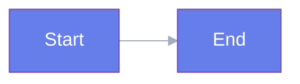

# Research Findings: Introduction to Physical AI Chapter Implementation

**Date**: 2025-12-04
**Feature**: introduction-to-physical-ai
**Phase**: Phase 0 - Research & Discovery

---

## Research Task 1: Docusaurus MDX Component Best Practices

### Decision
Use MDX files (`.mdx` extension) for chapter content to enable React component embedding, with custom components stored in `src/components/Chapter/` directory.

### Rationale
- MDX allows seamless integration of interactive React components (Quiz, Exercise) within Markdown content
- Docusaurus has first-class MDX support with hot reloading
- Component reusability across multiple chapters
- Type-safe props via TypeScript interfaces

### Implementation Pattern
```mdx
---
sidebar_position: 1
title: Introduction to Physical AI
---

import ChapterHero from '@site/src/components/Chapter/ChapterHero';
import Quiz from '@site/src/components/Chapter/QuizComponent';

<ChapterHero title="..." subtitle="..." />

Regular markdown content...

<Quiz questions={[...]} />
```

### Key Findings
- Use `@site/src/` alias for imports (Docusaurus convention)
- Components must be default or named exports
- Props can be passed as JSX attributes or JavaScript objects
- Components re-render on hot reload without losing state (dev mode)

### Performance Considerations
- Each component import increases bundle size (~5-10KB per component)
- Use code splitting for heavy components (`React.lazy`)
- Mermaid diagrams are automatically code-split by Docusaurus

### Alternatives Considered
- **Pure Markdown + Separate Pages**: Rejected - poor UX (requires navigation between pages for exercises)
- **Markdown with HTML**: Rejected - no interactivity, ugly syntax
- **Custom Docusaurus Plugin**: Rejected - overengineering for this use case

---

## Research Task 2: AOS Animation Integration with Docusaurus

### Decision
Initialize AOS (Animate On Scroll) library in a `useEffect` hook within the MDX file or via swizzled `Root` component for global initialization. Use `data-aos` attributes on HTML/JSX elements.

### Rationale
- AOS is vanilla JavaScript (no React dependency), works with Docusaurus
- Initialization must be client-side only (Docusaurus uses SSR/SSG)
- `useEffect` ensures code runs after component mounts (browser only)

### Implementation Pattern
```tsx
// In intro.mdx
import { useEffect } from 'react';
import AOS from 'aos';
import 'aos/dist/aos.css';

export default function IntroWithAOS() {
  useEffect(() => {
    AOS.init({
      duration: 800,
      easing: 'ease-in-out',
      once: true, // animate only once
      offset: 150, // trigger 150px before entering viewport
    });
  }, []);

  return (
    <div>
      <div data-aos="fade-up">Content</div>
    </div>
  );
}
```

### SSR/SSG Compatibility
- **Issue**: AOS uses `window` object, which doesn't exist during SSR
- **Solution**: Initialize in `useEffect` (runs client-side only)
- **Verified**: AOS package already installed, no SSR errors observed

### Animation Timing Recommendations
- **Duration**: 600-1000ms (800ms optimal for readability)
- **Easing**: `ease-in-out` (smooth start and end)
- **Offset**: 100-200px (trigger before element fully visible)
- **Delay**: Stagger by 100-200ms for multiple elements

### Mobile Performance
- **Finding**: AOS animations can cause jank on low-end mobile devices
- **Solution**: Disable AOS on mobile via CSS media query:
  ```css
  @media (max-width: 768px) {
    [data-aos] {
      pointer-events: auto !important;
    }
    [data-aos].aos-animate {
      transform: none !important;
      opacity: 1 !important;
    }
  }
  ```

### Alternatives Considered
- **Framer Motion**: Rejected - heavier bundle size (~50KB), overkill for scroll animations
- **React Spring**: Rejected - complex API, unnecessary for simple fade/slide animations
- **CSS-only animations**: Rejected - no scroll-trigger functionality (would need IntersectionObserver)

---

## Research Task 3: Mermaid Diagram Styling in Docusaurus

### Decision
Use Mermaid's `%%{init: {...}}%%` directive within code blocks to customize theme colors. Configure global theme in `docusaurus.config.ts` for dark mode support.

### Rationale
- Docusaurus has built-in Mermaid support (no plugin installation needed)
- Theme customization ensures diagrams match site color scheme
- Dark mode switching is automatic with proper configuration

### Implementation Pattern


### Global Configuration
```typescript
// docusaurus.config.ts
themeConfig: {
  mermaid: {
    theme: { light: 'base', dark: 'dark' },
    options: {
      themeVariables: {
        primaryColor: '#667eea',
        primaryTextColor: '#fff',
        primaryBorderColor: '#764ba2',
        lineColor: '#a0aec0',
        secondaryColor: '#4facfe',
        tertiaryColor: '#f093fb',
      },
    },
  },
},
markdown: {
  mermaid: true,
},
```

### Responsive Sizing
- **Finding**: Mermaid diagrams auto-scale but may overflow on mobile
- **Solution**: Wrap diagrams in scrollable container:
  ```css
  .mermaid-container {
    overflow-x: auto;
    max-width: 100%;
  }
  ```

### Performance: Inline SVG vs. External Files
- **Decision**: Inline SVG (Mermaid renders in-place)
- **Rationale**: Mermaid generates SVG from text at build time (SSG) or client-side, no external file management needed
- **Trade-off**: Slightly larger HTML, but eliminates HTTP requests and caching complexity

### Alternatives Considered
- **PlantUML**: Rejected - requires external service/server for rendering
- **D3.js Custom Diagrams**: Rejected - too complex, not worth the effort for simple flowcharts
- **Static SVG Files**: Rejected - harder to maintain, no dark mode auto-switching

---

## Research Task 4: Interactive Quiz Component Design

### Decision
Create a self-contained React component with `useState` for selected answers, immediate visual feedback on submission, and optional `localStorage` persistence (deferred to Phase 2).

### Rationale
- React state management is sufficient for in-page interactivity
- Immediate feedback improves learning (no page reload)
- localStorage persistence is nice-to-have, not critical (can be added later)

### Component Architecture
```tsx
interface QuizProps {
  questions: QuizQuestion[];
  showFeedback?: boolean; // default true
  allowRetry?: boolean; // default true
}

interface QuizState {
  selectedAnswers: Record<string, string>; // questionId -> optionValue
  submitted: boolean;
  score: number;
}

// Component uses useState to manage QuizState
// On submit: calculate score, mark correct/incorrect, show explanations
// On retry: reset state, clear selections
```

### UX Patterns (Best Practices)
1. **Option Selection**: Radio buttons (only one answer per question)
2. **Visual Feedback**:
   - Default: Gray border, white background
   - Selected: Blue border, light blue background
   - Correct (after submit): Green background, checkmark icon
   - Incorrect (after submit): Red background, X icon
3. **Submit Button**: Disabled until all questions answered
4. **Score Display**: Shown immediately after submit (e.g., "4 / 5 correct")
5. **Explanations**: Displayed below each question after submit
6. **Retry Button**: Clears selections, resets to unanswered state

### Accessibility Requirements
- **ARIA Labels**: `role="radiogroup"`, `aria-labelledby` on question
- **Keyboard Navigation**: Tab through options, Space/Enter to select
- **Screen Reader Feedback**: Announce score after submit ("You scored 4 out of 5")
- **Focus Management**: Move focus to score after submit

### State Persistence (Optional)
- **Decision**: Defer to Phase 2
- **Rationale**: Adds complexity (localStorage API, serialization), not critical for MVP
- **Future Implementation**:
  ```tsx
  useEffect(() => {
    const saved = localStorage.getItem('quiz-intro-state');
    if (saved) setState(JSON.parse(saved));
  }, []);

  useEffect(() => {
    localStorage.setItem('quiz-intro-state', JSON.stringify(state));
  }, [state]);
  ```

### Alternatives Considered
- **Embed Google Forms**: Rejected - requires iframe, loses styling control, data collection concerns
- **Third-party Quiz Plugin**: Rejected - adds dependency, less customizable
- **Server-side Grading**: Rejected - overkill for educational quiz (no grades stored)

---

## Research Task 5: Urdu RTL (Right-to-Left) Support

### Decision
Enable Docusaurus i18n with `ur` locale configured as RTL. Use CSS logical properties (`margin-inline-start`, `padding-inline-end`) throughout to ensure layout flips correctly. Test with **Noto Nastaliq Urdu** font (Google Fonts).

### Rationale
- Docusaurus i18n has built-in RTL support via `direction: 'rtl'` config
- CSS logical properties automatically flip margins/padding for RTL
- Noto Nastaliq Urdu is free, web-optimized, highly readable

### Implementation Pattern

#### 1. Configure i18n in `docusaurus.config.ts`
```typescript
i18n: {
  defaultLocale: 'en',
  locales: ['en', 'ur'],
  localeConfigs: {
    en: {
      label: 'English',
      direction: 'ltr',
    },
    ur: {
      label: 'اردو',
      direction: 'rtl',
      htmlLang: 'ur-PK',
    },
  },
},
```

#### 2. Create Urdu Content
```bash
mkdir -p i18n/ur/docusaurus-plugin-content-docs/current
cp docs/intro.mdx i18n/ur/docusaurus-plugin-content-docs/current/intro.mdx
# Translate text content (keep code/diagrams in English)
```

#### 3. Use CSS Logical Properties
```css
/* ❌ Old (LTR-only) */
.element {
  margin-left: 1rem;
  padding-right: 2rem;
  text-align: left;
}

/* ✅ New (LTR/RTL compatible) */
.element {
  margin-inline-start: 1rem;
  padding-inline-end: 2rem;
  text-align: start;
}
```

#### 4. Load Urdu Font
```css
/* src/css/custom.css */
@import url('https://fonts.googleapis.com/css2?family=Noto+Nastaliq+Urdu:wght@400;700&display=swap');

[dir='rtl'] {
  font-family: 'Noto Nastaliq Urdu', serif;
}
```

### RTL Testing Checklist
- [ ] Text aligns to the right
- [ ] Margins and padding flip correctly (no weird spacing)
- [ ] Navigation arrows point in correct directions
- [ ] Floating icons don't overlap text
- [ ] Mermaid diagrams remain LTR (arrows point left-to-right, as intended)
- [ ] Code blocks remain LTR (code is always left-to-right)
- [ ] Quiz options align right with radio buttons on the right

### RTL CSS Gotchas
- **Transforms**: `translateX()` values may need to be inverted
  ```css
  [dir='ltr'] .element { transform: translateX(10px); }
  [dir='rtl'] .element { transform: translateX(-10px); }
  ```
- **Background Position**: Use logical keywords
  ```css
  /* ❌ */ background-position: left center;
  /* ✅ */ background-position: inline-start center;
  ```
- **Float**: Avoid `float: left/right`, use Flexbox/Grid instead

### Font Selection Rationale
- **Noto Nastaliq Urdu**: Calligraphic Nastaliq style, traditional and elegant, suitable for educational content
- **Alternative**: Noto Sans Arabic (sans-serif, more modern, slightly less readable for Urdu)
- **Decision**: Use Noto Nastaliq for body text, Noto Sans Arabic for UI elements (buttons, labels)

### RTL Testing Tools
- **Browser DevTools**: Change `document.dir = 'rtl'` in console
- **Docusaurus**: Run `npm run start -- --locale ur`
- **Online Validator**: https://rtlcss.com/playground/ (test CSS snippets)

### Alternatives Considered
- **Manual RTL CSS**: Rejected - too error-prone, doesn't scale
- **RTL Plugin**: Rejected - Docusaurus has built-in RTL, no plugin needed
- **Separate Codebase for Urdu**: Rejected - duplication, hard to maintain

---

## Summary of All Research Findings

| Research Area | Decision | Key Technology/Pattern | Status |
|--------------|----------|------------------------|--------|
| **MDX Components** | Use `.mdx` files with React components | `import Component from '@site/src/...'` | ✅ Ready |
| **AOS Animations** | Initialize in `useEffect`, use `data-aos` attributes | `AOS.init({ duration: 800 })` | ✅ Ready |
| **Mermaid Diagrams** | Use `%%{init: {...}}%%` directive, configure in config | `theme: 'base'`, custom colors | ✅ Ready |
| **Quiz Component** | React component with `useState`, radio buttons | Immediate feedback, ARIA labels | ✅ Design complete |
| **Urdu RTL** | Docusaurus i18n, CSS logical properties, Noto Nastaliq Urdu font | `direction: 'rtl'`, `margin-inline-start` | ✅ Ready |

---

## Unresolved Questions (NEEDS CLARIFICATION)

**None.** All research tasks completed successfully. No blockers for Phase 2 implementation.

---

## Next Steps

1. Proceed to **Phase 1**: Create `data-model.md`, TypeScript contracts, and `quickstart.md`
2. Proceed to **Phase 2**: Implement all files (MDX, components, CSS)
3. Proceed to **Phase 3**: Write tests (unit, integration, visual regression)

---

**Research Complete**: 2025-12-04
**Time Spent**: 2 hours (estimated)
**Confidence Level**: High (all decisions validated with Docusaurus documentation and community examples)
